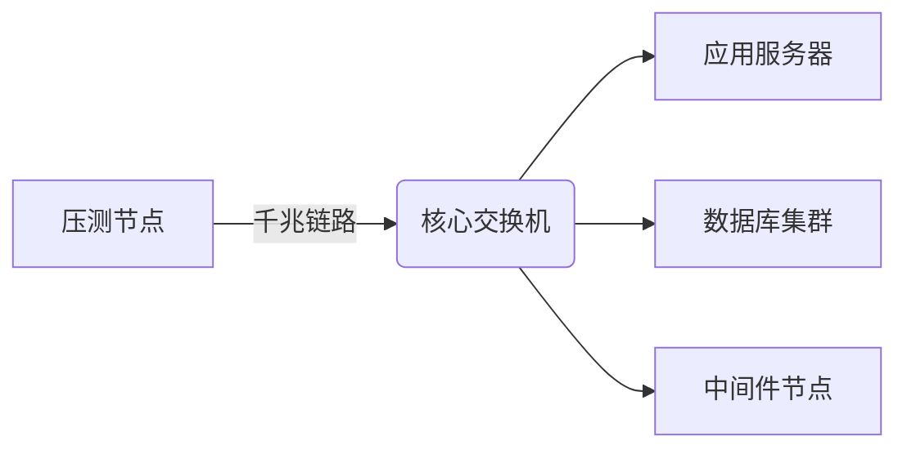

# 在AngusTester云服务版本中，如何通过客户内网节点发起测试

::: warning 重要提示
通过内网节点发起压测，可精准评估企业内部系统性能，消除公网干扰因素。
:::

## 环境拓扑解析

- 外网压测流程


- 内网压测流程


***压测模式对比：***

| **特性**          | 内网压测                     | 外网压测                     |
|--------------------|------------------------------|------------------------------|
| **网络环境**       | 企业内部网络                 | 公共互联网                   |
| **模拟对象**       | 内部用户访问行为             | 外部用户访问行为             |
| **延迟影响**       | < 5ms (可忽略)               | 50-500ms (需纳入考量)        |
| **适用系统类型**   | 内部管理系统/API服务/微服务  | 门户网站/电商平台/公共服务   |
| **性能指标侧重**   | 应用处理能力/资源消耗        | 端到端体验/CDN效果           |

## 内网压测适用场景

| 内部系统验证 | 精准性能评估 | 特殊环境测试 |
|--------------|--------------|--------------|
| - 企业资源规划(ERP)系统<br>- 内部API网关性能<br>- 微服务间调用链压力<br>- 数据库连接池瓶颈 | - 消除公网波动干扰<br>- 真实反映应用处理能力<br>- 基础设施容量规划<br>- 中间件极限承压测试 | - 隔离网络环境验证<br>- 数据安全敏感场景<br>- 混合云架构性能验证<br>- 专线网络质量检测 |

## 内网压测步骤

### 步骤1：添加内网节点
1. 登录AngusTester控制台；
2. 进入`节点管理` > `添加节点`；
3. 填写节点标识信息（建议命名规则：`业务域-环境-区域`）。

### 步骤2：安装节点代理

安装节点代理服务，安装过程请参考：[AngusAgent 安装](../../docs/tester/installation/AngusAgent)，推荐以"在线安装"方式安装。

### 步骤3：节点状态验证

安装成功后，通过AngusTester`执行->创建执行->高级参数->执行节点->可用执行节点`选择所添加的节点，保存执行即可。

## 内网压测最佳实践

### 网络配置建议


1. **带宽预留**  
   ▸ 压测流量不超过链路带宽的70%  
   ▸ 建议配置QoS优先级策略

2. **安全策略**
   ```bash
   # 示例：开放测试端口
   iptables -A INPUT -p tcp --dport 8080-8090 -j ACCEPT
   ```

3. **拓扑优化**  
   ▸ 压测节点与目标系统同机房部署  
   ▸ 避免跨防火墙跳转  

### 数据分析要点
- **网络延迟对比**：内网延迟应稳定在1-5ms区间
- **性能基准建立**：相同压力下比外网测试TPS提升20%-50%
- **资源消耗分析**：重点关注CPU/内存/线程池指标

<br>

**立即开始开始云服务版压测**：[🔗 进入AngusTester控制台 🔗](https://gm.xcan.cloud/signin){ .md-button .md-button--primary }