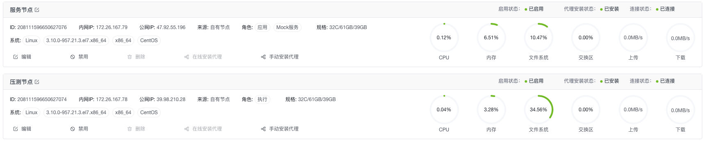
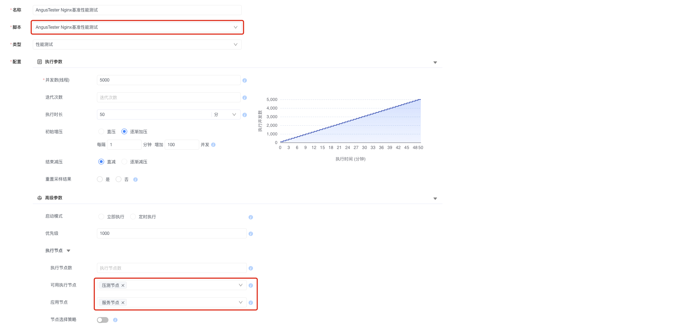
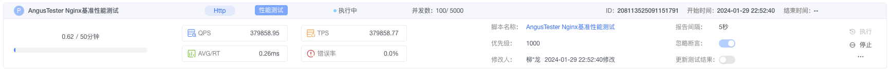
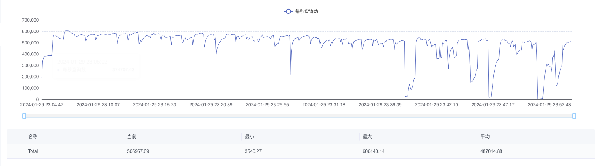
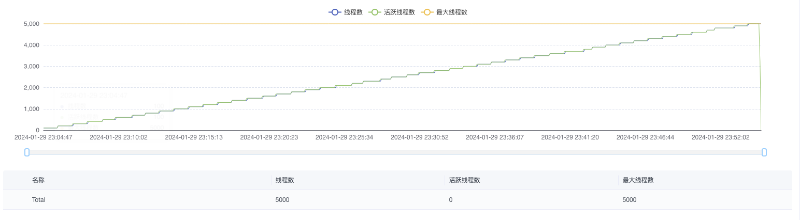
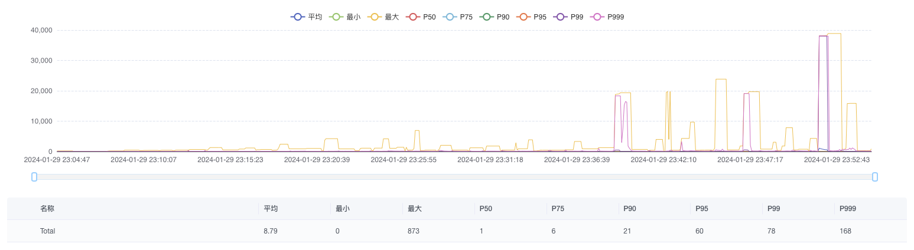
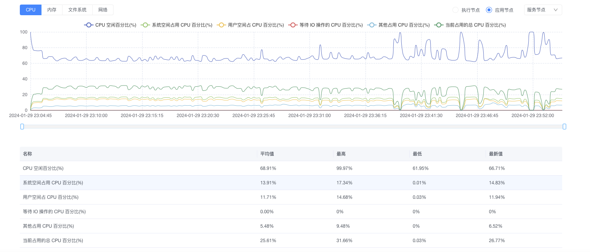
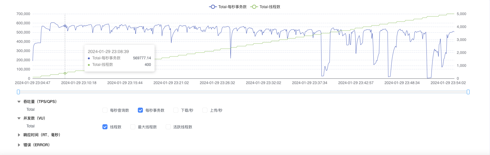

# AngusTester单机每秒60万+吞吐量测试

::: tip 测试目的
> 1. 验证 AngusTester 在 HTTP 协议基准测试(最小延迟小于1毫秒)时的性能表现。
> 2. 演示 AngusTester 图形化界面(GUI)测试的一般步骤。命令行(CLI)方式测试过程和结果请查看：[AngusTester和JMeter HTTP基准测试结果比较](104-Nginx-Benchmark-AngusTester-vs-Jmeter)
:::

## 一、测试环境

为了测试准确性，本次测试使用 Nginx 作为 Http 服务器，并将测试机和 Nginx 服务器分开部署。

### 1. 节点配置

| 节点   | 系统              | 规格                                                     | IP            | 应用          |
|------|-----------------|--------------------------------------------------------|---------------|-------------|
| 压测节点 | CentOS 7.6 64 位 | 32 核(vCPU) 3.1 GHz 主频的 Intel® Xeon® Platinum 64GiB(内存) | 172.26.167.78 | AngusTester |
| 服务节点 | CentOS 7.6 64 位 | 32 核(vCPU) 3.1 GHz 主频的 Intel® Xeon® Platinum 64GiB(内存) | 172.26.167.79 | Nginx       |

### 2. 测试软件

- 测试服务：nginx-1.21.3
- 测试工具：AngusTester-1.0.0

### 3. Nginx 配置

```ini
worker_processes  24;
worker_rlimit_nofile 200000;

events {
    worker_connections  4096;
    use epoll;
    multi_accept on;
}

http {
    include       mime.types;
    default_type  application/octet-stream;

    access_log off;

    sendfile       on;
    tcp_nopush     on;
    tcp_nodelay    on;

    keepalive_timeout  65;
    keepalive_requests 100000;
    reset_timedout_connection on;

    server {
        listen       80;
        server_name  localhost;

        open_file_cache max=200000 inactive=20s;
        open_file_cache_valid 30s;
        open_file_cache_min_uses 2;
        open_file_cache_errors on;

        location / {
            root   html;
            index  index.html index.htm;
        }
    }
}
```

### 4. 测试接口

```bash
curl -i http://172.26.167.79:80
HTTP/1.1 200 OK
Server: nginx/1.21.3
Date: Mon, 29 Jan 2024 01:31:46 GMT
Content-Type: text/html
Content-Length: 75
Last-Modified: Mon, 29 Jan 2024 01:29:49 GMT
Connection: keep-alive
ETag: "65b6ff8d-4b"
Accept-Ranges: bytes

<!DOCTYPE html>
<html>
<body>
<p><em>Hello,World!</em></p>
</body>
</html>
```

## 二、测试过程

### 1. 添加测试节点

在 AngusTester `节点`中添加上面两台测试节点并安装代理：



> 注意："服务节点"用于部署 Nginx 服务。

### 2. 创建测试脚本

进入`脚本`创建名称为"AngusTester Nginx基准性能测试"的脚本。

测试过程使用 AngusTester 标准模型进行，即每隔1分钟增加100个线程，最大5000线程，运行总时长为50分钟，具体脚本内容如下：

```yaml
specification: angus/1.0.0
type: TEST_PERFORMANCE
plugin: Http
configuration:
  duration: 50min
  thread:
    threads: 5000
    rampUpInterval: 1min
    rampUpThreads: 100
  onError:
    sampleError: false
  priority: 1000
task:
  pipelines:
  - target: HTTP
    request:
      method: GET
      url: http://172.26.167.79:80
```

### 3. 配置执行任务

在`执行`中创建执行，选择第二步创建的名称为"AngusTester Nginx基准性能测试"脚本，并选择执行节点和应用节点。



### 4. 监控任务状态

查看创建执行任务结果，在执行列表可以看到测试任务已经自动进入"执行中"状态。



## 三、测试结果

#### 1. 查看聚合结果(Summary)

聚合结果是 AngusTester 针对最后一次采样中关键指标汇总后结果。


#### 2. 查看吞吐量(TPS)

吞吐量是系统在单位时间内处理业务的能力，这个值的高低，说明了系统处理能力的高低。



#### 3. 查看线程(Threads)

线程是执行测试的基本单位，用于来模拟多用户并发访问，以评估目标系统在负载下的性能。



#### 4. 查看响应时间(RT)

响应时间是指从发送请求到接收到响应的时间间隔，通常以毫秒（ms）为单位。短的响应时间意味着更快的系统处理速度和用户体验。



#### 5. 查看节点资源(CPU)

通过监测CPU、内存、磁盘和网络等资源的使用率，可以迅速识别系统中是否存在资源不足或瓶颈，为性能问题的定位提供重要线索。



#### 6. 叠加分析(Overlay)

勾选"每秒事务数"和"线程数"，可以看到随机并发线程数增加，吞吐量TPS变化趋势。



<br>

**立即体验性能优化测试**：[🔗 进入AngusTester控制台 🔗](https://gm.xcan.cloud/signin){ .md-button .md-button--primary }
