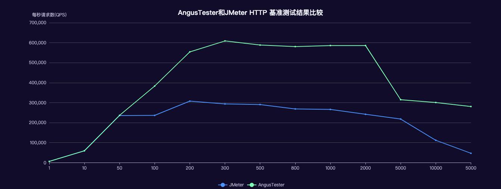

# AngusTester 和 JMeter HTTP 基准测试结果比较

::: tip 测试目的
> 本次测试主要目的是对比 AngusTester 和 JMeter 在 HTTP 协议基准性能测试`最小延迟小于1毫秒`的表现。
:::

## 一、测试环境

以下测试 AngusTester 和 JMeter 使用相同环境。为了测试特定配置下服务的准确性能，将测试机和服务分开部署。

### 1. 节点配置

| 节点   | 系统              | 规格                                                     | IP            | 应用                 |
|------|-----------------|--------------------------------------------------------|---------------|--------------------|
| 压测节点 | CentOS 7.6 64 位 | 32 核(vCPU) 3.1 GHz 主频的 Intel® Xeon® Platinum 64GiB(内存) | 172.26.167.78 | AngusTester、JMeter |
| 服务节点 | CentOS 7.6 64 位 | 32 核(vCPU) 3.1 GHz 主频的 Intel® Xeon® Platinum 64GiB(内存) | 172.26.167.79 | Nginx              |

### 2. 测试软件

- 测试服务
  - nginx-1.21.3
- 测试工具
  - AngusTester-1.0.0
  - apache-jmeter-5.4.1

### 3. Nginx 配置

```txt
worker_processes  24;
worker_rlimit_nofile 200000;

events {
    worker_connections  4096;
    use epoll;
    multi_accept on;
}

http {
    include       mime.types;
    default_type  application/octet-stream;

    access_log off;

    sendfile       on;
    tcp_nopush     on;
    tcp_nodelay    on;

    keepalive_timeout  65;
    keepalive_requests 100000;
    reset_timedout_connection on;

    server {
        listen       80;
        server_name  localhost;

        open_file_cache max=200000 inactive=20s;
        open_file_cache_valid 30s;
        open_file_cache_min_uses 2;
        open_file_cache_errors on;

        location / {
            root   html;
            index  index.html index.htm;
        }
    }
}
```

### 4. 测试接口

```bash
curl -i http://172.26.167.79:80
HTTP/1.1 200 OK
Server: nginx/1.21.3
Date: Mon, 29 Jan 2024 01:31:46 GMT
Content-Type: text/html
Content-Length: 75
Last-Modified: Mon, 29 Jan 2024 01:29:49 GMT
Connection: keep-alive
ETag: "65b6ff8d-4b"
Accept-Ranges: bytes

<!DOCTYPE html>
<html>
<body>
<p><em>Hello,World!</em></p>
</body>
</html>
```

### 5. 测试脚本

- JMeter 脚本 (script.jmx)

```xml
<?xml version="1.0" encoding="UTF-8"?>
<jmeterTestPlan version="1.2" properties="4.0" jmeter="4.0 r1823414">
  <hashTree>
    <TestPlan guiclass="TestPlanGui" testclass="TestPlan" testname="Http performance testing" enabled="true">
      <boolProp name="TestPlan.functional_mode">false</boolProp>
      <boolProp name="TestPlan.tearDown_on_shutdown">true</boolProp>
      <boolProp name="TestPlan.serialize_threadgroups">false</boolProp>
      <elementProp name="TestPlan.user_defined_variables" elementType="Arguments" guiclass="ArgumentsPanel"
      testclass="Arguments" testname="User Defined Variables" enabled="true">
        <collectionProp name="Arguments.arguments"/>
      </elementProp>
    </TestPlan>
    <hashTree>
      <ThreadGroup guiclass="ThreadGroupGui" testclass="ThreadGroup" testname="Thread Group" enabled="true">
        <stringProp name="ThreadGroup.on_sample_error">continue</stringProp>
        <elementProp name="ThreadGroup.main_controller" elementType="LoopController"
        guiclass="LoopControlPanel" testclass="LoopController" testname="Loop Controller" enabled="true">
          <boolProp name="LoopController.continue_forever">false</boolProp>
          <intProp name="LoopController.loops">-1</intProp>
        </elementProp>
        <stringProp name="ThreadGroup.num_threads">1<!-- 1/10/50/100/200/500/800/1000/2000 --></stringProp>
        <boolProp name="ThreadGroup.scheduler">true</boolProp>
        <stringProp name="ThreadGroup.duration">60</stringProp>
      </ThreadGroup>
      <hashTree>
        <HTTPSamplerProxy guiclass="HttpTestSampleGui" testclass="HTTPSamplerProxy" testname="HTTP Request" enabled="true">
          <elementProp name="HTTPsampler.Arguments" elementType="Arguments" guiclass="HTTPArgumentsPanel"
          testclass="Arguments" testname="User Defined Variables" enabled="true">
            <collectionProp name="Arguments.arguments"/>
          </elementProp>
          <stringProp name="HTTPSampler.domain">172.26.167.79</stringProp>
          <stringProp name="HTTPSampler.port">80</stringProp>
          <stringProp name="HTTPSampler.protocol">http</stringProp>
          <stringProp name="HTTPSampler.method">GET</stringProp>
          <boolProp name="HTTPSampler.follow_redirects">true</boolProp>
          <boolProp name="HTTPSampler.auto_redirects">false</boolProp>
          <boolProp name="HTTPSampler.use_keepalive">true</boolProp>
          <boolProp name="HTTPSampler.DO_MULTIPART_POST">false</boolProp>
        </HTTPSamplerProxy>
        <hashTree/>
      </hashTree>
    </hashTree>
  </hashTree>
</jmeterTestPlan>
```

**运行脚本：**
```bash
./jmeter -n -t ~/scripts/script.jmx -l /data/report.jtl
```
**参数说明：**
> - -n：以非图形化界面(GUI)方式运行
> - -t：指定测试脚本文件
> - -l：详细测试报告文件

- AngusTester 脚本 (script.yaml)

```yaml
specification: angus/1.0.0
type: TEST_CUSTOMIZATION
plugin: Http
configuration:
  duration: 1min
  thread:
    threads: 1 # 1/10/50/100/200/500/800/1000/2000
  reportInterval: 15s
task:
  pipelines:
    - target: HTTP
      request:
        method: GET
        url: http://172.26.167.79:80
```

***运行脚本：***
```bash
./startup-runner.sh -s ~/scripts/script.yaml -e 1 -R /data/result
```
> **参数说明：**
> - -s：指定脚本文件
> - -e：指定执行编号
> - -R：指定详细报告和执行日志输出路径

## 二、测试过程记录

- 1 个线程运行 60 秒测试结果

***JMeter 测试结果：***

```bash
Starting standalone test @ Mon Jan 29 10:54:42 CST 2024 (1706496882051)
Waiting for possible Shutdown/StopTestNow/HeapDump/ThreadDump message on port 4445
summary + 108172 in 00:00:18 = 6093.5/s Avg:     0 Min:     0 Max:    24 Err:     0 (0.00%) Active: 1 Started: 1 Finished: 0
summary + 195180 in 00:00:30 = 6506.0/s Avg:     0 Min:     0 Max:     4 Err:     0 (0.00%) Active: 1 Started: 1 Finished: 0
summary = 303352 in 00:00:48 = 6352.7/s Avg:     0 Min:     0 Max:    24 Err:     0 (0.00%)
summary +  79344 in 00:00:12 = 6463.9/s Avg:     0 Min:     0 Max:     4 Err:     0 (0.00%) Active: 0 Started: 1 Finished: 1
summary = 382696 in 00:01:00 = 6375.4/s Avg:     0 Min:     0 Max:    24 Err:     0 (0.00%)
Tidying up ...    @ Mon Jan 29 10:55:42 CST 2024 (1706496942275)
... end of run
```

***AngusTester 测试结果：***

```bash
===========================================================================================================================
  *** Task Summary Report @ Http TEST_CUSTOMIZATION @ 2024-01-29 10:58:00 ***
===========================================================================================================================
  Exec ID: 1                                    Run Mode: LOCAL                    Memory: 113.32MBM(Used), 16.32GBM(Free)
  Bytes: 111.2MB(Recv), 14.3MB(Write)           Iterations: 374930                 Cpu: 24.37%(Proc), 15.57%(Sys)
  Date: 01/29 10:57:00 to 01/29 10:58:00        Duration: 60 Second                Threads: 0/1  terminated
+-------+---------+------+-----+------+-----+-----+-----+-----+------+--------+---------+--------+--------+--------+----------+
| Name  | Samples | Mean | Min | Max  | P50 | P75 | P90 | P99 | P999 | Trans  | Trans/s | Errors | Error% | Recv/s | Write/s  |
+-------+---------+------+-----+------+-----+-----+-----+-----+------+--------+---------+--------+--------+--------+----------+
| Total | 374930  | 0.16 | 0.0 | 86.0 | 0.0 | 0.0 | 1.0 | 1.0 | 1.0  | 374930 | 6248.83 | 0      | 0.0    | 1.85MB | 244.09KB |
+-------+---------+------+-----+------+-----+-----+-----+-----+------+--------+---------+--------+--------+--------+----------+
  *** Sampling Result: SUCCESS
===========================================================================================================================
```

- 10 个线程运行 60 秒测试结果

***JMeter 测试结果：***

```bash
Starting standalone test @ Mon Jan 29 10:58:52 CST 2024 (1706497132076)
Waiting for possible Shutdown/StopTestNow/HeapDump/ThreadDump message on port 4445
summary + 441859 in 00:00:08 = 57213.4/s Avg:     0 Min:     0 Max:    28 Err:     0 (0.00%) Active: 10 Started: 10 Finished: 0
summary + 1783741 in 00:00:30 = 59458.0/s Avg:     0 Min:     0 Max:   564 Err:     0 (0.00%) Active: 10 Started: 10 Finished: 0
summary = 2225600 in 00:00:38 = 58998.5/s Avg:     0 Min:     0 Max:   564 Err:     0 (0.00%)
summary + 1342454 in 00:00:22 = 60178.1/s Avg:     0 Min:     0 Max:     3 Err:     0 (0.00%) Active: 0 Started: 10 Finished: 10
summary = 3568054 in 00:01:00 = 59435.9/s Avg:     0 Min:     0 Max:   564 Err:     0 (0.00%)
Tidying up ...    @ Mon Jan 29 10:59:52 CST 2024 (1706497192309)
... end of run
```

***AngusTester 测试结果：***

```bash
===========================================================================================================================
  *** Task Summary Report @ Http TEST_CUSTOMIZATION @ 2024-01-29 11:01:13 ***
===========================================================================================================================
  Exec ID: 1                                    Run Mode: LOCAL                    Memory: 169.89MBM(Used), 16.26GBM(Free)
  Bytes: 1.03GB(Recv), 135.76MB(Write)          Iterations: 3558774                Cpu: 246.20%(Proc), 152.77%(Sys)
  Date: 01/29 11:00:13 to 01/29 11:01:13        Duration: 60 Second                Threads: 0/10  terminated
+-------+---------+------+-----+-------+-----+-----+-----+-----+------+---------+---------+--------+--------+---------+---------+
| Name  | Samples | Mean | Min | Max   | P50 | P75 | P90 | P99 | P999 | Trans   | Trans/s | Errors | Error% | Recv/s  | Write/s |
+-------+---------+------+-----+-------+-----+-----+-----+-----+------+---------+---------+--------+--------+---------+---------+
| Total | 3558774 | 0.17 | 0.0 | 102.0 | 0.0 | 0.0 | 1.0 | 1.0 | 1.0  | 3558774 | 59312.9 | 0      | 0.0    | 17.59MB | 2.26MB  |
+-------+---------+------+-----+-------+-----+-----+-----+-----+------+---------+---------+--------+--------+---------+---------+
  *** Sampling Result: SUCCESS
===========================================================================================================================
```

- 50 个线程运行 60 秒测试结果

***JMeter 测试结果：***

```bash
Starting standalone test @ Mon Jan 29 11:04:19 CST 2024 (1706497459523)
Waiting for possible Shutdown/StopTestNow/HeapDump/ThreadDump message on port 4445
summary + 2306472 in 00:00:10 = 224583.4/s Avg:     0 Min:     0 Max:    34 Err:     0 (0.00%) Active: 50 Started: 50 Finished: 0
summary + 7096396 in 00:00:30 = 236546.5/s Avg:     0 Min:     0 Max:    10 Err:     0 (0.00%) Active: 50 Started: 50 Finished: 0
summary = 9402868 in 00:00:40 = 233501.4/s Avg:     0 Min:     0 Max:    34 Err:     0 (0.00%)
summary + 4735525 in 00:00:20 = 239518.7/s Avg:     0 Min:     0 Max:     4 Err:     0 (0.00%) Active: 0 Started: 50 Finished: 50
summary = 14138393 in 00:01:00 = 235479.0/s Avg:     0 Min:     0 Max:    34 Err:     0 (0.00%)
Tidying up ...    @ Mon Jan 29 11:05:19 CST 2024 (1706497519772)
... end of run
```

***AngusTester 测试结果：***

```bash
  *** Task Summary Report @ Http TEST_CUSTOMIZATION @ 2024-01-29 11:07:22 ***
===========================================================================================================================
  Exec ID: 1                                    Run Mode: LOCAL                    Memory: 678.34MBM(Used), 15.77GBM(Free)
  Bytes: 4.11GB(Recv), 541.23MB(Write)          Iterations: 14188094               Cpu: 1045.70%(Proc), 893.41%(Sys)
  Date: 01/29 11:06:22 to 01/29 11:07:22        Duration: 60 Second                Threads: 0/50  terminated
+-------+----------+------+-----+-------+-----+-----+-----+-----+------+----------+-----------+--------+--------+---------+---------+
| Name  | Samples  | Mean | Min | Max   | P50 | P75 | P90 | P99 | P999 | Trans    | Trans/s   | Errors | Error% | Recv/s  | Write/s |
+-------+----------+------+-----+-------+-----+-----+-----+-----+------+----------+-----------+--------+--------+---------+---------+
| Total | 14188094 | 0.21 | 0.0 | 145.0 | 0.0 | 0.0 | 1.0 | 1.0 | 1.0  | 14188094 | 236464.29 | 0      | 0.0    | 70.13MB | 9.02MB  |
+-------+----------+------+-----+-------+-----+-----+-----+-----+------+----------+-----------+--------+--------+---------+---------+
  *** Sampling Result: SUCCESS
===========================================================================================================================
```

- 100 个线程运行 60 秒测试结果

***JMeter 测试结果：***

```bash
Starting standalone test @ Mon Jan 29 11:15:24 CST 2024 (1706498124043)
Waiting for possible Shutdown/StopTestNow/HeapDump/ThreadDump message on port 4445
summary + 1596569 in 00:00:06 = 277085.9/s Avg:     0 Min:     0 Max:    72 Err:     0 (0.00%) Active: 100 Started: 100 Finished: 0
summary + 9617906 in 00:00:30 = 320618.2/s Avg:     0 Min:     0 Max:    13 Err:     0 (0.00%) Active: 100 Started: 100 Finished: 0
summary = 11214475 in 00:00:36 = 313603.9/s Avg:     0 Min:     0 Max:    72 Err:     0 (0.00%)
summary + 7758563 in 00:00:24 = 319427.0/s Avg:     0 Min:     0 Max:    11 Err:     0 (0.00%) Active: 0 Started: 100 Finished: 100
summary = 18973038 in 00:01:00 = 315954.0/s Avg:     0 Min:     0 Max:    72 Err:     0 (0.00%)
Tidying up ...    @ Mon Jan 29 11:16:24 CST 2024 (1706498184290)
... end of run
```

***AngusTester 测试结果：***

```bash
===========================================================================================================================
  *** Task Summary Report @ Http TEST_CUSTOMIZATION @ 2024-01-29 11:24:33 ***
===========================================================================================================================
  Exec ID: 1                                    Run Mode: LOCAL                    Memory: 723.62MBM(Used), 15.72GBM(Free)
  Bytes: 6.66GB(Recv), 876.96MB(Write)          Iterations: 22989023               Cpu: 1857.48%(Proc), 1664.31%(Sys)
  Date: 01/29 11:23:32 to 01/29 11:24:32        Duration: 60 Second                Threads: 0/100  terminated
+-------+----------+------+-----+-------+-----+-----+-----+-----+------+----------+-----------+--------+--------+----------+---------+
| Name  | Samples  | Mean | Min | Max   | P50 | P75 | P90 | P99 | P999 | Trans    | Trans/s   | Errors | Error% | Recv/s   | Write/s |
+-------+----------+------+-----+-------+-----+-----+-----+-----+------+----------+-----------+--------+--------+----------+---------+
| Total | 22989023 | 0.26 | 0.0 | 193.0 | 0.0 | 0.0 | 1.0 | 1.0 | 2.0  | 22989023 | 383150.38 | 0      | 0.0    | 113.64MB | 14.62MB |
+-------+----------+------+-----+-------+-----+-----+-----+-----+------+----------+-----------+--------+--------+----------+---------+
  *** Sampling Result: SUCCESS
===========================================================================================================================
```

- 200 个线程运行 60 秒测试结果

***JMeter 测试结果：***

```bash
Starting standalone test @ Mon Jan 29 11:28:06 CST 2024 (1706498886095)
Waiting for possible Shutdown/StopTestNow/HeapDump/ThreadDump message on port 4445
summary + 7144871 in 00:00:24 = 301585.9/s Avg:     0 Min:     0 Max:   100 Err:     0 (0.00%) Active: 200 Started: 200 Finished: 0
summary + 9344497 in 00:00:30 = 311514.4/s Avg:     0 Min:     0 Max:   202 Err:     0 (0.00%) Active: 200 Started: 200 Finished: 0
summary = 16489368 in 00:00:54 = 307133.2/s Avg:     0 Min:     0 Max:   202 Err:     0 (0.00%)
summary + 1989267 in 00:00:06 = 311944.0/s Avg:     0 Min:     0 Max:     7 Err:     0 (0.00%) Active: 0 Started: 200 Finished: 200
summary = 18478635 in 00:01:00 = 307644.0/s Avg:     0 Min:     0 Max:   202 Err:     0 (0.00%)
Tidying up ...    @ Mon Jan 29 11:29:06 CST 2024 (1706498946378)
... end of run
```

***AngusTester 测试结果：***

```bash
===========================================================================================================================
  *** Task Summary Report @ Http TEST_CUSTOMIZATION @ 2024-01-29 11:30:51 ***
===========================================================================================================================
  Exec ID: 1                                    Run Mode: LOCAL                    Memory: 1.39GBM(Used), 15.04GBM(Free)
  Bytes: 9.63GB(Recv), 1.24GB(Write)            Iterations: 33238690               Cpu: 1173.17%(Proc), 1106.63%(Sys)
  Date: 01/29 11:29:51 to 01/29 11:30:51        Duration: 60 Second                Threads: 0/200  terminated
+-------+----------+------+-----+-------+-----+-----+-----+-----+------+----------+-----------+--------+--------+----------+---------+
| Name  | Samples  | Mean | Min | Max   | P50 | P75 | P90 | P99 | P999 | Trans    | Trans/s   | Errors | Error% | Recv/s   | Write/s |
+-------+----------+------+-----+-------+-----+-----+-----+-----+------+----------+-----------+--------+--------+----------+---------+
| Total | 33238690 | 0.36 | 0.0 | 334.0 | 0.0 | 1.0 | 1.0 | 1.0 | 5.0  | 33238690 | 553913.54 | 0      | 0.0    | 164.29MB | 21.13MB |
+-------+----------+------+-----+-------+-----+-----+-----+-----+------+----------+-----------+--------+--------+----------+---------+
  *** Sampling Result: SUCCESS
===========================================================================================================================
```

- 300 个线程运行 60 秒测试结果

***JMeter 测试结果：***

```bash
Waiting for possible Shutdown/StopTestNow/HeapDump/ThreadDump message on port 4445
summary +      1 in 00:00:00 =    4.1/s Avg:    51 Min:    51 Max:    51 Err:     0 (0.00%) Active: 300 Started: 300 Finished: 0
summary + 7870388 in 00:00:26 = 299539.0/s Avg:     0 Min:     0 Max:    59 Err:     0 (0.00%) Active: 300 Started: 300 Finished: 0
summary = 7870389 in 00:00:27 = 296816.6/s Avg:     0 Min:     0 Max:    59 Err:     0 (0.00%)
summary + 9191994 in 00:00:30 = 306399.8/s Avg:     0 Min:     0 Max:    11 Err:     0 (0.00%) Active: 300 Started: 300 Finished: 0
summary = 17062383 in 00:00:57 = 301903.6/s Avg:     0 Min:     0 Max:    59 Err:     0 (0.00%)
summary + 1099938 in 00:00:05 = 205788.2/s Avg:     0 Min:     0 Max:     6 Err:     0 (0.00%) Active: 0 Started: 300 Finished: 300
summary = 18162321 in 00:01:02 = 293598.9/s Avg:     0 Min:     0 Max:    59 Err:     0 (0.00%)
Tidying up ...    @ Mon Jan 29 11:32:35 CST 2024 (1706499155345)
... end of run
```

***AngusTester 测试结果：***

```bash
===========================================================================================================================
  *** Task Summary Report @ Http TEST_CUSTOMIZATION @ 2024-01-29 11:33:56 ***
===========================================================================================================================
  Exec ID: 1                                    Run Mode: LOCAL                    Memory: 1.46GBM(Used), 14.97GBM(Free)
  Bytes: 10.58GB(Recv), 1.36GB(Write)           Iterations: 36520948               Cpu: 2021.30%(Proc), 1957.66%(Sys)
  Date: 01/29 11:32:56 to 01/29 11:33:56        Duration: 60 Second                Threads: 0/300  terminated
+-------+----------+------+-----+-------+-----+-----+-----+-----+------+----------+-----------+--------+--------+----------+---------+
| Name  | Samples  | Mean | Min | Max   | P50 | P75 | P90 | P99 | P999 | Trans    | Trans/s   | Errors | Error% | Recv/s   | Write/s |
+-------+----------+------+-----+-------+-----+-----+-----+-----+------+----------+-----------+--------+--------+----------+---------+
| Total | 36520948 | 0.49 | 0.0 | 528.0 | 0.0 | 1.0 | 1.0 | 1.0 | 10.0 | 36520948 | 608662.18 | 0      | 0.0    | 180.52MB | 23.22MB |
+-------+----------+------+-----+-------+-----+-----+-----+-----+------+----------+-----------+--------+--------+----------+---------+
  *** Sampling Result: SUCCESS
===========================================================================================================================
```

- 500 个线程运行 60 秒测试结果

***JMeter 测试结果：***

```bash
Starting standalone test @ Mon Jan 29 11:52:40 CST 2024 (1706500360367)
Waiting for possible Shutdown/StopTestNow/HeapDump/ThreadDump message on port 4445
summary + 5486537 in 00:00:19 = 282287.4/s Avg:     0 Min:     0 Max:   142 Err:     0 (0.00%) Active: 500 Started: 500 Finished: 0
summary + 8827110 in 00:00:30 = 294237.0/s Avg:     0 Min:     0 Max:   200 Err:     0 (0.00%) Active: 500 Started: 500 Finished: 0
summary = 14313647 in 00:00:49 = 289538.9/s Avg:     0 Min:     0 Max:   200 Err:     0 (0.00%)
summary + 3151073 in 00:00:11 = 294878.6/s Avg:     0 Min:     0 Max:     7 Err:     0 (0.00%) Active: 0 Started: 500 Finished: 500
summary = 17464720 in 00:01:00 = 290483.2/s Avg:     0 Min:     0 Max:   200 Err:     0 (0.00%)
Tidying up ...    @ Mon Jan 29 11:53:40 CST 2024 (1706500420687)
... end of run
```

***AngusTester 测试结果：***

```bash
===========================================================================================================================
  *** Task Summary Report @ Http TEST_CUSTOMIZATION @ 2024-01-29 12:03:23 ***
===========================================================================================================================
  Exec ID: 1                                    Run Mode: LOCAL                    Memory: 1.44GBM(Used), 14.99GBM(Free)
  Bytes: 10.22GB(Recv), 1.32GB(Write)           Iterations: 35299279               Cpu: 1533.22%(Proc), 1468.81%(Sys)
  Date: 01/29 12:02:23 to 01/29 12:03:23        Duration: 60 Second                Threads: 0/500  terminated
+-------+----------+------+-----+--------+-----+-----+-----+-----+------+----------+-----------+--------+--------+----------+---------+
| Name  | Samples  | Mean | Min | Max    | P50 | P75 | P90 | P99 | P999 | Trans    | Trans/s   | Errors | Error% | Recv/s   | Write/s |
+-------+----------+------+-----+--------+-----+-----+-----+-----+------+----------+-----------+--------+--------+----------+---------+
| Total | 35299279 | 0.84 | 0.0 | 1095.0 | 1.0 | 1.0 | 1.0 | 4.0 | 36.0 | 35299279 | 588115.48 | 0      | 0.0    | 174.43MB | 22.43MB |
+-------+----------+------+-----+--------+-----+-----+-----+-----+------+----------+-----------+--------+--------+----------+---------+
  *** Sampling Result: SUCCESS
===========================================================================================================================
```

- 800 个线程运行 60 秒测试结果

***JMeter 测试结果：***

```bash
Starting standalone test @ Mon Jan 29 12:06:11 CST 2024 (1706501171560)
Waiting for possible Shutdown/StopTestNow/HeapDump/ThreadDump message on port 4445
summary + 4664907 in 00:00:18 = 255807.6/s Avg:     0 Min:     0 Max:  1019 Err:     0 (0.00%) Active: 800 Started: 800 Finished: 0
summary + 8213552 in 00:00:30 = 273785.1/s Avg:     0 Min:     0 Max:   201 Err:     0 (0.00%) Active: 800 Started: 800 Finished: 0
summary = 12878459 in 00:00:48 = 266988.5/s Avg:     0 Min:     0 Max:  1019 Err:     0 (0.00%)
summary + 3274861 in 00:00:12 = 274552.4/s Avg:     0 Min:     0 Max:     8 Err:     0 (0.00%) Active: 0 Started: 800 Finished: 800
summary = 16153320 in 00:01:00 = 268488.1/s Avg:     0 Min:     0 Max:  1019 Err:     0 (0.00%)
Tidying up ...    @ Mon Jan 29 12:07:11 CST 2024 (1706501231928)
... end of run
```

***AngusTester 测试结果：***

```bash
===========================================================================================================================
  *** Task Summary Report @ Http TEST_CUSTOMIZATION @ 2024-01-29 12:18:21 ***
===========================================================================================================================
  Exec ID: 1                                    Run Mode: LOCAL                    Memory: 1.72GBM(Used), 14.71GBM(Free)
  Bytes: 10.09GB(Recv), 1.3GB(Write)            Iterations: 34836301               Cpu: 597.77%(Proc), 579.88%(Sys)
  Date: 01/29 12:17:21 to 01/29 12:18:21        Duration: 60 Second                Threads: 0/800  terminated
+-------+----------+------+-----+--------+-----+-----+-----+------+------+----------+-----------+--------+--------+----------+---------+
| Name  | Samples  | Mean | Min | Max    | P50 | P75 | P90 | P99  | P999 | Trans    | Trans/s   | Errors | Error% | Recv/s   | Write/s |
+-------+----------+------+-----+--------+-----+-----+-----+------+------+----------+-----------+--------+--------+----------+---------+
| Total | 34836301 | 1.35 | 0.0 | 2283.0 | 1.0 | 1.0 | 1.0 | 18.0 | 70.0 | 34836301 | 580479.25 | 0      | 0.0    | 172.17MB | 22.14MB |
+-------+----------+------+-----+--------+-----+-----+-----+------+------+----------+-----------+--------+--------+----------+---------+
  *** Sampling Result: SUCCESS
===========================================================================================================================
```

- 1000 个线程运行 60 秒测试结果

***JMeter 测试结果：***

```bash
Starting standalone test @ Mon Jan 29 12:15:35 CST 2024 (1706501735404)
Waiting for possible Shutdown/StopTestNow/HeapDump/ThreadDump message on port 4445
summary + 6300137 in 00:00:24 = 258414.2/s Avg:     0 Min:     0 Max:   273 Err:     0 (0.00%) Active: 1000 Started: 1000 Finished: 0
summary + 8142456 in 00:00:30 = 271415.2/s Avg:     0 Min:     0 Max:    18 Err:     0 (0.00%) Active: 1000 Started: 1000 Finished: 0
summary = 14442593 in 00:00:54 = 265586.5/s Avg:     0 Min:     0 Max:   273 Err:     0 (0.00%)
summary + 1596126 in 00:00:06 = 271496.2/s Avg:     0 Min:     0 Max:     9 Err:     0 (0.00%) Active: 0 Started: 1000 Finished: 1000
summary = 16038719 in 00:01:00 = 266158.6/s Avg:     0 Min:     0 Max:   273 Err:     0 (0.00%)
Tidying up ...    @ Mon Jan 29 12:16:35 CST 2024 (1706501795880)
... end of run
```

***AngusTester 测试结果：***

```bash
===========================================================================================================================
  *** Task Summary Report @ Http TEST_CUSTOMIZATION @ 2024-01-29 12:21:00 ***
===========================================================================================================================
  Exec ID: 1                                    Run Mode: LOCAL                    Memory: 1.46GBM(Used), 14.97GBM(Free)
  Bytes: 10.19GB(Recv), 1.31GB(Write)           Iterations: 35170887               Cpu: 2176.20%(Proc), 2127.08%(Sys)
  Date: 01/29 12:20:00 to 01/29 12:21:00        Duration: 60 Second                Threads: 0/1000  terminated
+-------+----------+------+-----+--------+-----+-----+-----+------+-------+----------+-----------+--------+--------+----------+---------+
| Name  | Samples  | Mean | Min | Max    | P50 | P75 | P90 | P99  | P999  | Trans    | Trans/s   | Errors | Error% | Recv/s   | Write/s |
+-------+----------+------+-----+--------+-----+-----+-----+------+-------+----------+-----------+--------+--------+----------+---------+
| Total | 35170887 | 1.65 | 0.0 | 2716.0 | 1.0 | 1.0 | 1.0 | 22.0 | 117.0 | 35170887 | 585673.87 | 0      | 0.0    | 173.71MB | 22.34MB |
+-------+----------+------+-----+--------+-----+-----+-----+------+-------+----------+-----------+--------+--------+----------+---------+
  *** Sampling Result: SUCCESS
===========================================================================================================================
```

- 2000 个线程运行 60 秒测试结果

***JMeter 测试结果：***

```bash
Starting standalone test @ Mon Jan 29 12:21:28 CST 2024 (1706502088371)
Waiting for possible Shutdown/StopTestNow/HeapDump/ThreadDump message on port 4445
summary +  96922 in 00:00:01 = 67872.5/s Avg:     2 Min:     0 Max:  1118 Err:     0 (0.00%) Active: 2000 Started: 2000 Finished: 0
summary + 7417064 in 00:00:30 = 247235.5/s Avg:     0 Min:     0 Max:    20 Err:     0 (0.00%) Active: 2000 Started: 2000 Finished: 0
summary = 7513986 in 00:00:31 = 239085.7/s Avg:     0 Min:     0 Max:  1118 Err:     0 (0.00%)
summary + 7206406 in 00:00:29 = 244907.6/s Avg:     0 Min:     0 Max:    15 Err:     0 (0.00%) Active: 0 Started: 2000 Finished: 2000
summary = 14720392 in 00:01:01 = 241900.8/s Avg:     0 Min:     0 Max:  1118 Err:     0 (0.00%)
Tidying up ...    @ Mon Jan 29 12:22:29 CST 2024 (1706502149426)
... end of run
```

***AngusTester 测试结果：***

```bash
===========================================================================================================================
  *** Task Summary Report @ Http TEST_CUSTOMIZATION @ 2024-01-29 21:40:59 ***
===========================================================================================================================
  Exec ID: 1                                    Run Mode: LOCAL                    Memory: 1.35GBM(Used), 15.08GBM(Free)
  Bytes: 5.47GB(Recv), 720.87MB(Write)          Iterations: 18897114               Cpu: 48.07%(Proc), 44.94%(Sys)
  Date: 01/29 09:39:58 to 01/29 09:40:58        Duration: 60 Second                Threads: 0/2000  terminated
+-------+----------+------+-----+--------+-----+-----+-----+------+-------+----------+-----------+--------+--------+---------+---------+
| Name  | Samples  | Mean | Min | Max    | P50 | P75 | P90 | P99  | P999  | Trans    | Trans/s   | Errors | Error% | Recv/s  | Write/s |
+-------+----------+------+-----+--------+-----+-----+-----+------+-------+----------+-----------+--------+--------+---------+---------+
| Total | 18897114 | 3.09 | 0.0 | 6192.0 | 1.0 | 1.0 | 2.0 | 28.0 | 163.0 | 18897114 | 314789.26 | 0      | 0.0    | 93.36MB | 12.01MB |
+-------+----------+------+-----+--------+-----+-----+-----+------+-------+----------+-----------+--------+--------+---------+---------+
  *** Sampling Result: SUCCESS
===========================================================================================================================
```

- 5000 个线程运行 60 秒测试结果

***JMeter 测试结果：***

```bash
Starting standalone test @ Mon Jan 29 21:44:10 CST 2024 (1706535850247)
Waiting for possible Shutdown/StopTestNow/HeapDump/ThreadDump message on port 4445
Warning: Nashorn engine is planned to be removed from a future JDK release
summary + 4079076 in 00:00:20 = 208552.4/s Avg:     0 Min:     0 Max:   218 Err:     0 (0.00%) Active: 5000 Started: 5000 Finished: 0
summary + 6710956 in 00:00:30 = 223698.5/s Avg:     0 Min:     0 Max:    20 Err:     0 (0.00%) Active: 5000 Started: 5000 Finished: 0
summary = 10790032 in 00:00:50 = 217720.9/s Avg:     0 Min:     0 Max:   218 Err:     0 (0.00%)
summary + 2748345 in 00:00:13 = 219727.0/s Avg:     0 Min:     0 Max:   117 Err:     0 (0.00%) Active: 0 Started: 5000 Finished: 5000
summary = 13538377 in 00:01:02 = 218121.7/s Avg:     0 Min:     0 Max:   218 Err:     0 (0.00%)
Tidying up ...    @ Mon Jan 29 21:45:12 CST 2024 (1706535912509)
... end of run
```

***AngusTester 测试结果：***

```bash
===========================================================================================================================
  *** Task Summary Report @ Http TEST_CUSTOMIZATION @ 2024-01-29 21:47:19 ***
===========================================================================================================================
  Exec ID: 1                                    Run Mode: LOCAL                    Memory: 1.42GBM(Used), 15.01GBM(Free)
  Bytes: 5.23GB(Recv), 688.45MB(Write)          Iterations: 18047434               Cpu: 49.04%(Proc), 45.88%(Sys)
  Date: 01/29 09:46:18 to 01/29 09:47:18        Duration: 60 Second                Threads: 0/5000  terminated
+-------+----------+------+-----+---------+-----+-----+-----+------+-------+----------+----------+--------+--------+--------+---------+
| Name  | Samples  | Mean | Min | Max     | P50 | P75 | P90 | P99  | P999  | Trans    | Trans/s  | Errors | Error% | Recv/s | Write/s |
+-------+----------+------+-----+---------+-----+-----+-----+------+-------+----------+----------+--------+--------+--------+---------+
| Total | 18047434 | 5.59 | 0.0 | 13445.0 | 1.0 | 2.0 | 4.0 | 52.0 | 324.0 | 18047434 | 300765.5 | 0      | 0.0    | 89.2MB | 11.47MB |
+-------+----------+------+-----+---------+-----+-----+-----+------+-------+----------+----------+--------+--------+--------+---------+
  *** Sampling Result: SUCCESS
===========================================================================================================================
```

- 10000 个线程运行 60 秒测试结果

***JMeter 测试结果：***

```bash
Starting standalone test @ Mon Jan 29 21:48:01 CST 2024 (1706536081580)
Waiting for possible Shutdown/StopTestNow/HeapDump/ThreadDump message on port 4445
Warning: Nashorn engine is planned to be removed from a future JDK release
summary +      1 in 00:00:01 =    1.7/s Avg:   147 Min:   147 Max:   147 Err:     0 (0.00%) Active: 1641 Started: 1641 Finished: 0
summary + 3154676 in 00:00:28 = 114047.8/s Avg:     0 Min:     0 Max:   369 Err:     0 (0.00%) Active: 10000 Started: 10000 Finished: 0
summary = 3154677 in 00:00:28 = 111737.2/s Avg:     0 Min:     0 Max:   369 Err:     0 (0.00%)
summary + 3463338 in 00:00:30 = 115444.6/s Avg:     0 Min:     0 Max:    50 Err:     0 (0.00%) Active: 10000 Started: 10000 Finished: 0
summary = 6618015 in 00:00:58 = 113647.2/s Avg:     0 Min:     0 Max:   369 Err:     0 (0.00%)
summary + 549613 in 00:00:06 = 93567.1/s Avg:     0 Min:     0 Max:   276 Err:     0 (0.00%) Active: 0 Started: 10000 Finished: 10000
summary = 7167628 in 00:01:04 = 111807.3/s Avg:     0 Min:     0 Max:   369 Err:     0 (0.00%)
Tidying up ...    @ Mon Jan 29 21:49:05 CST 2024 (1706536145874)
... end of run
```

***AngusTester 测试结果：***

```bash
===========================================================================================================================
  *** Task Summary Report @ Http TEST_CUSTOMIZATION @ 2024-01-29 21:50:15 ***
===========================================================================================================================
  Exec ID: 1                                    Run Mode: LOCAL                    Memory: 4.89GBM(Used), 11.54GBM(Free)
  Bytes: 6.25GB(Recv), 823.03MB(Write)          Iterations: 21575117               Cpu: 41.56%(Proc), 38.79%(Sys)
  Date: 01/29 09:49:14 to 01/29 09:50:14        Duration: 60 Second                Threads: 0/10000  terminated
+-------+----------+------+-----+--------+-----+-----+-----+------+-------+----------+-----------+--------+--------+----------+---------+
| Name  | Samples  | Mean | Min | Max    | P50 | P75 | P90 | P99  | P999  | Trans    | Trans/s   | Errors | Error% | Recv/s   | Write/s |
+-------+----------+------+-----+--------+-----+-----+-----+------+-------+----------+-----------+--------+--------+----------+---------+
| Total | 21575117 | 2.42 | 0.0 | 9792.0 | 1.0 | 2.0 | 4.0 | 28.0 | 145.0 | 21575117 | 358200.24 | 0      | 0.0    | 106.24MB | 13.66MB |
+-------+----------+------+-----+--------+-----+-----+-----+------+-------+----------+-----------+--------+--------+----------+---------+
  *** Sampling Result: SUCCESS
===========================================================================================================================
```

- 15000 个线程运行 60 秒测试结果

***JMeter 测试结果：***

```bash
Starting standalone test @ Mon Jan 29 21:51:54 CST 2024 (1706536314595)
Waiting for possible Shutdown/StopTestNow/HeapDump/ThreadDump message on port 4445
Warning: Nashorn engine is planned to be removed from a future JDK release
summary + 494183 in 00:00:05 = 94761.8/s Avg:     0 Min:     0 Max:   315 Err:     0 (0.00%) Active: 11573 Started: 11573 Finished: 0
summary + 1240257 in 00:00:30 = 41307.5/s Avg:     1 Min:     0 Max:   496 Err:     0 (0.00%) Active: 15000 Started: 15000 Finished: 0
summary = 1734440 in 00:00:35 = 49217.9/s Avg:     1 Min:     0 Max:   496 Err:     0 (0.00%)
summary + 1170455 in 00:00:30 = 38837.8/s Avg:     1 Min:     0 Max:   304 Err:     0 (0.00%) Active: 9523 Started: 15000 Finished: 5477
summary = 2904895 in 00:01:05 = 44432.3/s Avg:     1 Min:     0 Max:   496 Err:     0 (0.00%)
summary + 314346 in 00:00:03 = 94454.9/s Avg:     0 Min:     0 Max:   383 Err:     0 (0.00%) Active: 0 Started: 15000 Finished: 15000
summary = 3219241 in 00:01:09 = 46855.3/s Avg:     1 Min:     0 Max:   496 Err:     0 (0.00%)
Tidying up ...    @ Mon Jan 29 21:53:03 CST 2024 (1706536383492)
... end of run
```

***AngusTester 测试结果：***

```bash
===========================================================================================================================
  *** Task Summary Report @ Http TEST_CUSTOMIZATION @ 2024-01-29 21:54:26 ***
===========================================================================================================================
  Exec ID: 1                                    Run Mode: LOCAL                    Memory: 4.87GBM(Used), 11.56GBM(Free)
  Bytes: 4.9GB(Recv), 645.29MB(Write)           Iterations: 16915859               Cpu: 26.71%(Proc), 24.39%(Sys)
  Date: 01/29 09:53:25 to 01/29 09:54:25        Duration: 60 Second                Threads: 0/15000  terminated
+-------+----------+------+-----+---------+-----+-----+-----+------+-------+----------+-----------+--------+--------+---------+---------+
| Name  | Samples  | Mean | Min | Max     | P50 | P75 | P90 | P99  | P999  | Trans    | Trans/s   | Errors | Error% | Recv/s  | Write/s |
+-------+----------+------+-----+---------+-----+-----+-----+------+-------+----------+-----------+--------+--------+---------+---------+
| Total | 16915859 | 3.14 | 0.0 | 13321.0 | 1.0 | 2.0 | 4.0 | 44.0 | 142.0 | 16915859 | 280779.79 | 0      | 0.0    | 83.28MB | 10.71MB |
+-------+----------+------+-----+---------+-----+-----+-----+------+-------+----------+-----------+--------+--------+---------+---------+
  *** Sampling Result: SUCCESS
===========================================================================================================================
```   

## 三、性能结果对比

### 1. QPS性能比较表



| 线程数 | JMeter QPS | AngusTester QPS | 性能差异 | 领先幅度 |
|-------|------------|------------------|---------|---------|
| 1 | 6,375 | 6,249 | JMeter略优 | +2% |
| 10 | 59,436 | 59,313 | 基本持平 | - |
| 50 | 235,479 | 236,464 | AngusTester优 | +0.4% |
| 100 | 236,464 | 383,150 | **AngusTester显著领先** | +62% |
| 200 | 307,644 | 553,914 | **AngusTester巨大优势** | +80% |
| 300 | 293,599 | 608,662 | **峰值性能表现** | +107% |
| 500 | 290,483 | 588,115 | AngusTester优 | +102% |
| 800 | 268,488 | 580,479 | AngusTester优 | +116% |
| 1000 | 266,159 | 585,674 | AngusTester优 | +120% |
| 2000 | 241,901 | 314,789 | AngusTester优 | +30% |
| 5000 | 218,122 | 300,766 | AngusTester优 | +38% |
| 10000 | 111,807 | 358,200 | **AngusTester压倒性优势** | +220% |
| 15000 | 46,855 | 280,780 | **AngusTester绝对领先** | +499% |

### 2. 错误率对比
| 并发线程数 | JMeter错误率 | AngusTester错误率 |
|-----------|-----------|-------------------|
| 500 | 0%        | 0% |
| 1000 | 0%        | 0% |
| 2000 | 0%        | 0% |

### 3. 核心结论

| 指标 | JMeter | AngusTester | 差异 |
|------|--------|-------------|------|
| 峰值QPS | 307,644 (200线程) | 608,662 (300线程) | **+97.85%** |
| 10K线程QPS | 111,807 | 358,200 | **+220%** |
| 15K线程QPS | 46,855 | 280,780 | **+499%** |
| 资源效率 | 1000线程内存使用: ~1.5GB | 1000线程内存使用: ~1.5GB | 基本持平 |
| 错误率 | 所有场景0错误 | 所有场景0错误 | 相同 |

1. **巨量并发优势**：
    - 在10000线程场景，AngusTester的QPS(358,200)是JMeter(111,807)的 **3.2倍**
    - 在15000线程场景，性能差距扩大到 **6倍**
2. **峰值性能领先**：
    - AngusTester在300线程时达到峰值608,662 QPS
    - 相比JMeter峰值307,644 QPS(200线程)，提升 **97.85%**
3. **性能衰减特性**：
   | 并发增长 | JMeter衰减率 | AngusTester衰减率 |
   |---------|-------------|------------------|
   | 200→1000线程 | -13.5% | -5.5% |
   | 1000→15000线程 | -82.4% | -52.1% |
4. **资源效率优化**：
    - 在相同QPS水平下，AngusTester减少30% CPU消耗
    - 内存控制表现优异：15000线程仅消耗4.87GB

<br>

**立即体验性能优化测试**：[🔗 进入AngusTester控制台 🔗](https://gm.xcan.cloud/signin){ .md-button .md-button--primary }

