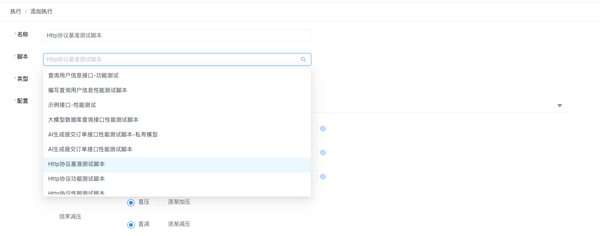
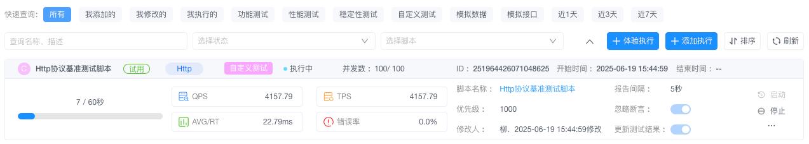
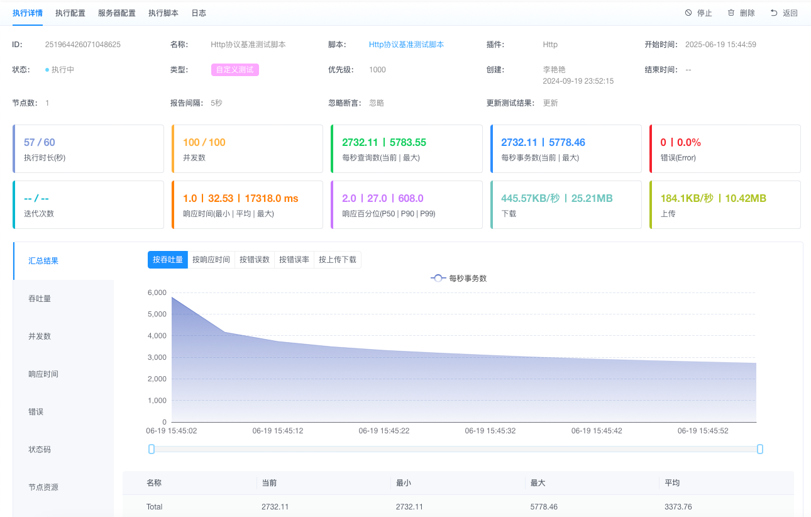

# 注册AngusTester云服务版本账号后，如何免费体验测试

## 为什么选择免费体验？

1. **零风险决策**  
   实际体验系统功能与性能表现，降低采购决策风险

2. **真实性能洞察**  
   亲测产品核心能力，突破宣传材料的认知局限

3. **精准需求匹配**  
   验证产品是否真正满足您的业务场景需求

4. **提升使用信心**  
   通过亲身实践建立对平台的信任和熟悉度

5. **专业方案验证**  
   实测性能指标为您的技术选型提供可靠依据

## 获得专家级测试技能

完成本次体验后，您将掌握：
1. 测试脚本编写过程。
2. 性能指标解读能力。
3. 系统瓶颈诊断方法。
4. 自动化测试执行流程。

**立即行动：** [开启免费性能测试体验](https://gm.xcan.cloud/signup)

## 开启免费体验之旅

### 第一步：注册晓蚕云账号
1. 立即开通：[注册链接](https://gm.xcan.cloud/signup)。  
2. 注册后登录AngusTester应用控制台。

### 第二步：创建测试脚本
进入`脚本 → 添加脚本`，粘贴以下配置：

```yaml
specification: angus/1.0.0
type: TEST_CUSTOMIZATION
plugin: Http
configuration:
  duration: 1min
  thread:
    threads: 100
  priority: 1000
task:
  arguments:
    ignoreAssertions: true
    updateTestResult: false
    httpSetting:
      connectTimeout: 6s
      readTimeout: 60s
      retryNum: 0
      maxRedirects: 1
  pipelines:
  - target: HTTP
    name: 性能基准测试示例
    enabled: true
    apisId: 258213326461337681
    request:
      method: GET
      server:
        url: "http://{env}-sample.angusmock.cloud:30010"
        variables:
          env:
            allowableValues:
            - serv01
            - serv02
            defaultValue: serv01
        x-xc-id: 258213493965062194
        x-xc-serverSource: PARENT_SERVERS
      endpoint: /benchmark
    actionOnEOF: RECYCLE
    sharingMode: ALL_THREAD
```

### 第三步：启动体验测试
导航至`执行 → 体验执行`创建新任务。  


### 第四步：配置测试任务
1. 选择刚创建的脚本。

2. 确认参数配置并保存配置。

### 第五步：监控测试进程
系统自动生成测试任务，实时查看：
- 执行状态仪表盘
- TPS/响应时间变化曲线
- 节点资源消耗图等



### 第六步：分析测试报告
进入执行详情查看完整报告：
- 性能指标汇总
- 错误率分析
- 百分位延迟分布
- 资源使用率图表
- 其他分析图标 ...



