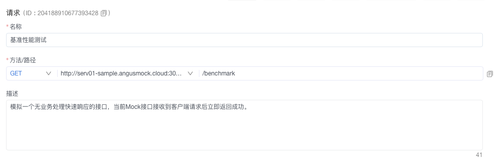
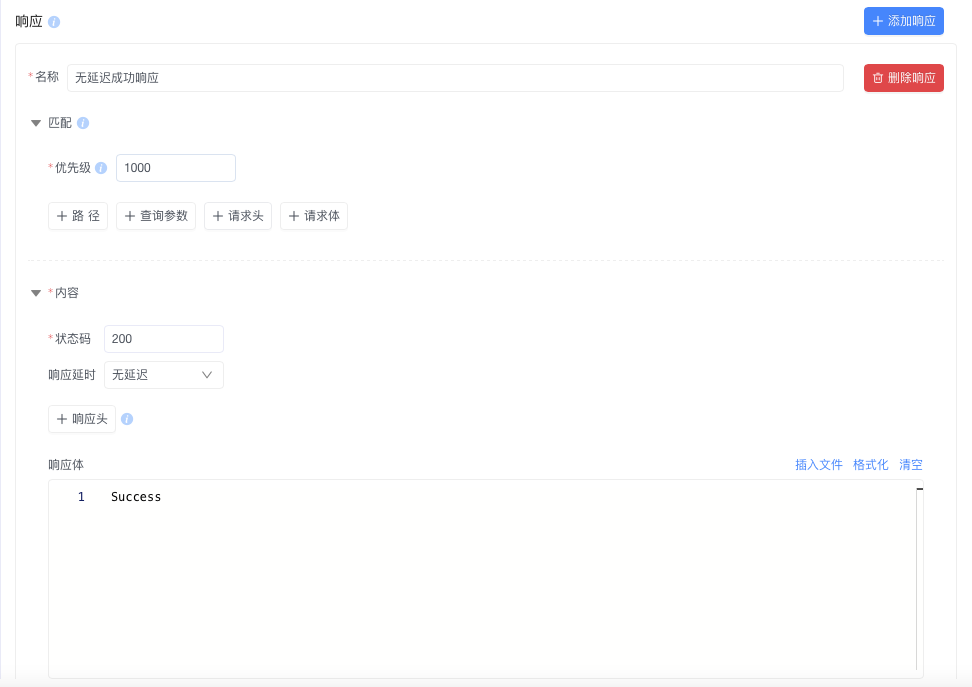
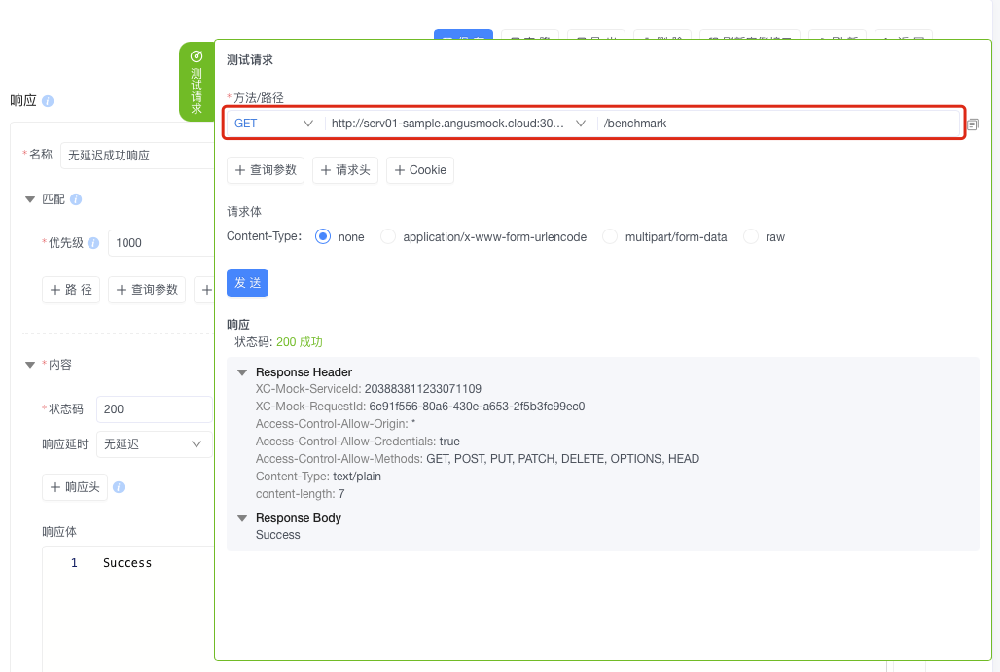

# AngusTester如何使用Mock服务生成一个性能基准测试接口

## 为什么需要性能基准测试接口

性能基准测试接口是系统健壮性验证的关键基础设施：


**核心价值矩阵**

<div class="grid grid-cols-2 gap-4">
<div class="value-card">
<h3>🚀 性能评估与优化</h3>
<ul>
<li>获取真实性能指标：响应时间、吞吐量、资源利用率</li>
<li>精准定位性能瓶颈</li>
<li>验证优化措施有效性</li>
</ul>
</div>

<div class="value-card">
<h3>📊 容量规划与SLA验证</h3>
<ul>
<li>确定系统资源需求</li>
<li>预测增长压力下的性能表现</li>
<li>确保满足服务级别协议</li>
</ul>
</div>

<div class="value-card">
<h3>🔒 稳定性与风险控制</h3>
<ul>
<li>模拟极端负载场景</li>
<li>检测内存泄漏和死锁</li>
<li>预防生产环境崩溃</li>
</ul>
</div>

<div class="value-card">
<h3>🔄 持续集成与版本验证</h3>
<ul>
<li>集成到CI/CD流水线</li>
<li>实时监测性能变化</li>
<li>验证版本升级兼容性</li>
</ul>
</div>
</div>

## 两步创建Mock基准测试接口

### 方式一：可视化界面配置（推荐）

**步骤1：创建Mock接口，配置接口名称、方法、路径和描述信息**


**步骤2：定义响应规则，设置响应名称、状态码、内容和匹配优先级**


### 方式二：脚本导入

```yaml:no-line-numbers
specification: angus/1.0.0
type: MOCK_APIS
task:
  mockApis:
  - name: 基准性能测试
    description: 模拟无业务处理的快速响应接口
    method: GET
    endpoint: /benchmark
    responses:
    - name: 无延迟成功响应
      match:
        priority: 1000  # 最高匹配优先级
      content:
        status: 200     # HTTP成功状态码
        headers:
        - name: Content-Type
          value: text/plain
        content: Success  # 固定响应内容
        delay:
          mode: NONE    # 无延迟立即响应
```

**操作步骤**：
1. 复制上方脚本到文本文件
2. 进入AngusTester控制台：`Mock服务 → 接口 → 新建接口`
3. 选择「导入接口」完成配置

## 基准接口验证方法

### 方法一：可视化调试界面

1. 进入Mock接口详情页
2. 点击右侧「测试请求」按钮
3. 发送请求验证响应



**预期结果**：
- HTTP状态码：200
- 响应体内容："Success"

### 方法二：CURL命令行验证

```bash
curl -i 'http://serv01-sample.angusmock.cloud:30010/benchmark'
```

**预期响应**：
```http:no-line-numbers
HTTP/1.1 200 OK
Content-Type: text/plain
content-length: 7

Success
```

## 基准测试接口优势特性

### 性能参数精准控制

| 参数类型 | 配置选项 | 性能意义 |
|---------|---------|---------|
| **响应延迟** | 固定/随机延迟 | 模拟真实业务处理时间 |
| **响应状态** | 200/400/500等 | 验证不同场景错误处理 |
| **吞吐量控制** | TPS限制 | 模拟系统极限承压能力 |
| **内容生成** | 动态参数 | 支持复杂数据场景测试 |

### 专业应用场景

<div class="scenario-grid">
  <div class="scenario">
    <h4>⚡ 性能基准线建立</h4>
    <ul>
      <li>创建零延迟基准测试接口</li>
      <li>获取网络层纯性能数据</li>
      <li>排除业务逻辑干扰</li>
    </ul>
  </div>

  <div class="scenario">
    <h4>🧩 复杂场景模拟</h4>
    <ul>
      <li>构建API依赖链</li>
      <li>模拟第三方服务响应</li>
      <li>创建异常响应模式</li>
    </ul>
  </div>

  <div class="scenario">
    <h4>🔁 持续集成验证</h4>
    <ul>
      <li>每日自动化性能回归</li>
      <li>版本发布前性能门禁</li>
      <li>资源变更后验证</li>
    </ul>
  </div>
</div>

::: tip 专业提示
1. 异常模拟：建议在性能测试中设置1%的随机错误响应率，模拟真实环境波动。
2. 延迟设置原则：基准延迟 = 生产环境P99延迟 × 0.8
:::

**立即创建您的基准测试接口**：[进入AngusTester控制台](https://gm.xcan.cloud/signin){ .md-button .md-button--primary }

<style>
.step-card {
  background: var(--vp-c-bg-soft);
  border-radius: 8px;
  padding: 1rem;
  margin-bottom: 1.5rem;
  border: 1px solid var(--vp-c-divider-light);
}

.step-card img {
  border-radius: 6px;
  margin: 1rem 0;
  box-shadow: var(--vp-shadow-1);
}

.scenario-grid {
  display: grid;
  grid-template-columns: repeat(auto-fit, minmax(300px, 1fr));
  gap: 1.5rem;
  margin: 2rem 0;
}

.scenario {
  background: var(--vp-c-bg-soft);
  border-radius: 8px;
  padding: 1.5rem;
  border: 1px solid var(--vp-c-divider-light);
}

.scenario h4 {
  color: var(--vp-c-brand);
  margin-bottom: 0.8rem;
}
</style>

