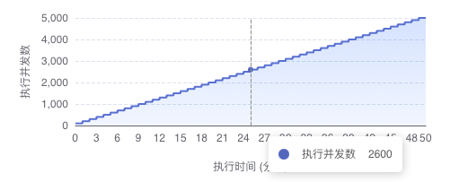
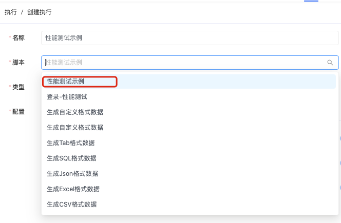
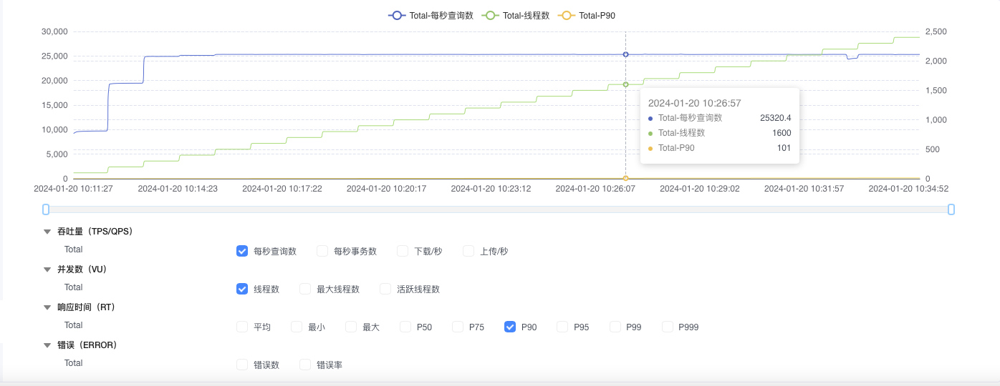

# 如何在AngusTester中通过一次执行验证出不同压力下性能表现

::: tip 传统工具的痛点
<el-icon><BottomRight /></el-icon> 测试5000个用户的性能表现需要50次配置修改、50次数据记录、累计50分钟等待时间。
:::

## 传统压测工具的局限

| 对比维度 | JMeter/AB/wrk等工具 | AngusTester |
|---------|-------------------|------------|
| **测试策略** | 手动递增线程数 | 全自动梯度增压 |
| **配置复杂度** | 多次重复配置 | 单次配置永久生效 |
| **时间成本** | 高（多轮次×执行时间） | 低（单次综合执行） |
| **数据整合** | 需人工汇总报告 | 自动生成对比报告 |
| **监控粒度** | 分段式数据采集 | 全周期持续监控 |

## 一键全梯度压力分析

### 第一步：创建智能测试脚本

```yaml:no-line-numbers
specification: angus/1.0.0
info:
  name: 全梯度压力分析示例
  description: 自动化验证不同压力下系统性能表现
type: TEST_PERFORMANCE
plugin: Http
configuration:
  duration: 50min              # 总测试时长
  thread:
    threads: 5000               # 目标最大并发数
    rampUpInterval: 1min        # 压力梯度间隔
    rampUpThreads: 100          # 每梯度新增并发数
task:
  pipelines:
    - target: HTTP
      request:
        method: GET
        url: http://serv01-sample.angusmock.cloud:30010/business?delay=10
```

- 核心参数说明

| 参数 | 作用 | 配置技巧 |
|------|------|----------|
| `threads` | 最大并发数 | 设为预期峰值120% |
| `rampUpInterval` | 压力增加间隔 | 根据业务波动特征设置 |
| `rampUpThreads` | 每次新增并发数 | 推荐系统承载量的5-10% |
| `delay=10` | 接口模拟延迟 | 设置为典型业务响应时间 |

- 工作原理示意图



::: tip 技术优势
**自动增压机制**：系统每分钟自动增加100并发用户，在50分钟内完成0→5000并发的全梯度覆盖。
:::

### 第二步：配置执行任务

1. 导航至`执行 → 添加执行`。
2. 选择创建好的智能脚本，确认参数配置后保存。



### 第三步：多维度性能分析

进入执行详情的"叠加分析"面板，实现：

- 关键指标关联观测
  1. **并发变化曲线**：实时跟踪线程数增长
  2. **TPS波动趋势**：观测系统吞吐量变化
  3. **P90响应时间**：高保障性能水位监控
- 压力拐点识别
  - 发现性能瓶颈点
  - 定位资源饱和阈值
  - 识别错误率突变区间



## 核心优势解析

### 对比测试方案价值

| 评估维度 | 传统方式 | AngusTester方案 |
|---------|---------|----------------|
| 时间成本 | 50分钟×配置次数 | 单次50分钟 |
| 人力资源 | 全程值守 | 自动执行 |
| 数据连续性 | 分段独立 | 连续关联 |
| 分析深度 | 单点数据 | 趋势对比 |

### 技术实现价值

1. **自动增压引擎**：  
   精确控制压力增长速率，模拟真实业务波动

2. **智能采样机制**：  
   毫秒级指标采集，捕捉瞬时性能波动

3. **关联分析模型**：  
   将TPS、响应时间、并发数动态关联分析

4. **自动拐点识别**：  
   通过算法自动标记性能拐点

## 典型应用场景

### <el-icon><CollectionTag /></el-icon> 系统扩容规划
- 精确识别系统承载极限
- 确定最佳性能水位线
- 制定科学扩容策略

### <el-icon><CollectionTag /></el-icon> 版本性能验证
- 发布前后性能对比
- 验证性能优化效果
- 防止性能回归

### <el-icon><CollectionTag /></el-icon> 瓶颈定位分析
- 快速识别性能拐点
- 关联资源使用率分析
- 精确定位瓶颈组件
