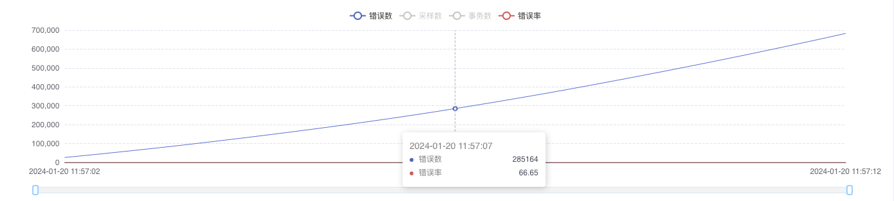
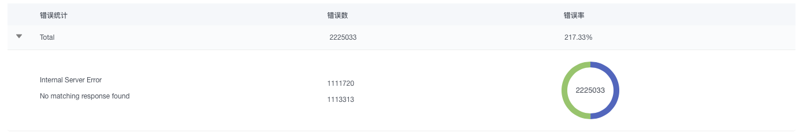
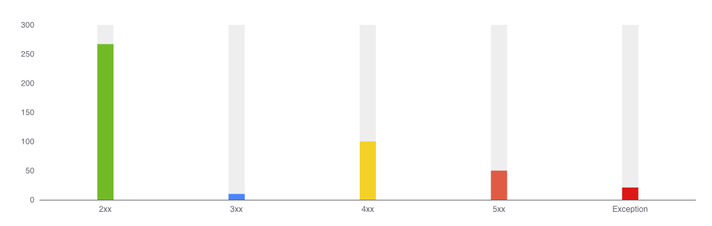
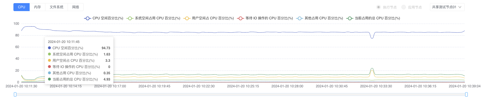
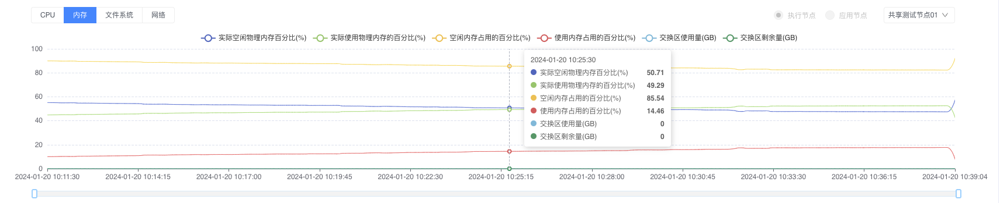
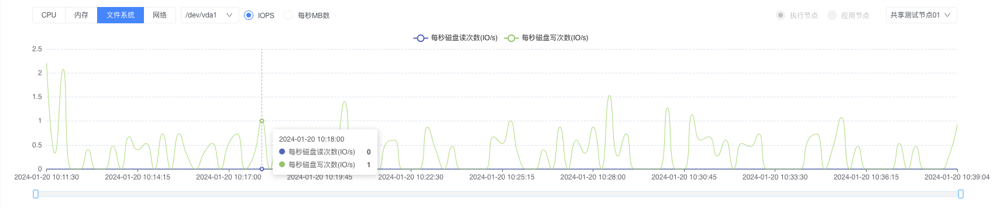
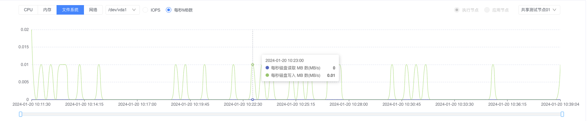
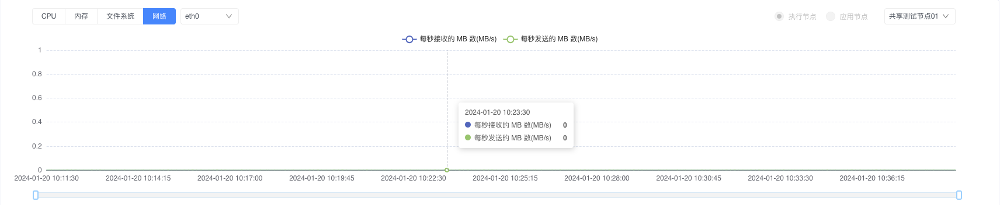

# AngusTester错误诊断与资源瓶颈定位指南

## 为什么需要分析错误与资源瓶颈

**诊断错误和资源瓶颈对于保障系统健康至关重要：**

1. **稳定性保障**：及时发现并修复潜在故障点，防止生产环境崩溃
2. **性能优化**：精准定位性能瓶颈，为优化提供数据支持
3. **成本控制**：避免资源过度配置，优化硬件投资回报率
4. **容量规划**：为系统扩容提供科学依据
5. **SLA保障**：确保服务等级协议的关键指标达标

## 诊断与分析流程

<div class="scenario-grid">
  <div class="scenario">
    <h4>⚡ 错误分析工作流</h4>
    <ol>
      <li>定位高频错误发生时段</li>
      <li>分析错误类型分布</li>
      <li>关联状态码模式</li>
      <li>追溯日志定位根因</li>
    </ol>
  </div>

  <div class="scenario">
    <h4>⚡ 性能基准线建立</h4>
    <ol>
      <li>创建零延迟基准测试接口</li>
      <li>获取网络层纯性能数据</li>
      <li>排除业务逻辑干扰</li>
    </ol>
  </div>
</div>

## 专业错误分析流程

### 1. 全局错误趋势分析



- **关键观测指标**：
    - 错误总量趋势曲线
    - 错误率变化趋势
    - 错误发生时间分布

### 2. 错误根因分类分析



**错误类型诊断矩阵**：

| 错误分类 | 典型原因 | 解决建议 |
|---------|---------|---------|
| 连接超时 | 网络中断/防火墙限制 | 检查网络配置和安全策略 |
| 拒绝服务 | 服务过载/线程池耗尽 | 扩容服务节点/调整线程池配置 |
| 协议错误 | API变更/版本不兼容 | API兼容性验证 |
| 数据校验失败 | 数据格式变化/校验逻辑变更 | 更新测试数据集 |
| 系统异常 | 内存泄漏/资源耗尽 | 资源监控与故障排查 |

### 3. HTTP状态码解析



**关键状态码诊断指南**：
- `4xx` 客户端错误：
    - `401/403`：认证授权问题
    - `404`：接口路径变更
    - `429`：限流触发
- `5xx` 服务端错误：
    - `500`：服务端未处理异常
    - `502/503`：上游服务不可用
    - `504`：服务响应超时

## 资源瓶颈精确定位

### 1. CPU资源分析



**CPU关键指标解析表**：

| 指标 | 健康范围 | 风险阈值 | 问题表征 | 优化建议 |
|------|---------|---------|---------|---------|
| 用户空间CPU | <60% | >75% | 应用逻辑消耗高 | 代码优化/线程控制 |
| 系统空间CPU | <20% | >40% | 内核调度开销大 | 系统调优/中断优化 |
| I/O等待CPU | <10% | >30% | 存储瓶颈 | SSD升级/IO调度优化 |
| 空闲CPU | >25% | <10% | 资源不足 | 节点扩容 |
| 总使用率 | <75% | >85% | 整体过载 | 服务拆分/负载均衡 |

### 2. 内存资源分析



**内存问题诊断树**：
- **高内存使用**：
    - 应用内存泄漏 → 堆分析工具定位
    - 缓存过度使用 → 缓存策略优化
- **交换区使用异常**：
    - 物理内存不足 → 扩容内存
    - 交换配置不当 → 调整swapiness

### 3. 存储性能分析

- IOPS吞吐量分析

**重点关注**：读写操作频率峰值与响应延迟关联

- 数据吞吐量分析

**关键诊断**：数据读写带宽与网络传输能力的匹配度

**存储优化矩阵**：

| 问题类型 | 检测方法 | 优化策略 |
|---------|---------|---------|
| IOPS瓶颈 | 监控读写操作频率 | SSD升级/RAID优化 |
| 吞吐瓶颈 | 检查数据传输速率 | 条带化存储/万兆网络 |
| 延迟过高 | 跟踪IO响应时间 | 缓存策略/文件系统优化 |

### 4. 网络流量分析



**网络诊断指标**：

| 指标 | 健康标准 | 问题指示 | 优化建议 |
|------|---------|---------|---------|
| 入流量 | <带宽80% | 持续超限 | 扩容带宽/CDN引入 |
| 出流量 | <带宽80% | 持续超限 | P2P优化/数据压缩 |
| 包错误率 | <0.1% | >1% | 驱动更新/硬件检查 |
| 连接数 | <最大80% | >90% | 连接池优化/端口扩展 |


## 专家级优化建议

1. **关联分析原则**：
    - 将错误突增与资源使用高峰关联分析
    - 关注错误率与响应时间的正相关性

2. **容量规划公式**：
   ```
   所需节点数 = (当前峰值TPS × 增长系数) / (单节点最大TPS × 冗余系数)
   ```
   
3. **监控报警策略**：
    - 错误率连续5分钟>0.1%触发警告
    - CPU持续10分钟>80%触发扩容警报
    - 内存使用>85%触发内存泄露检测
