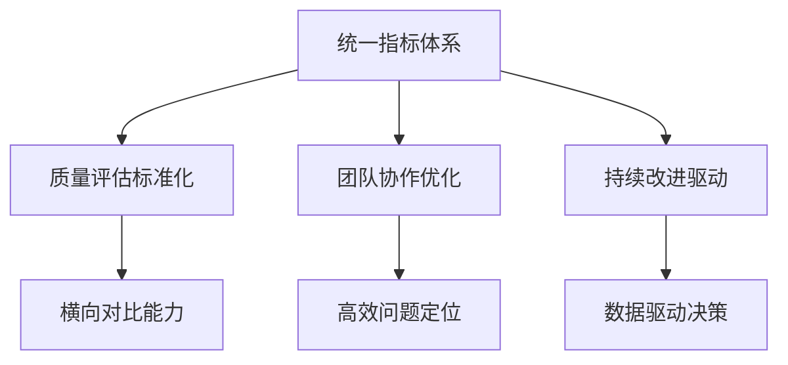
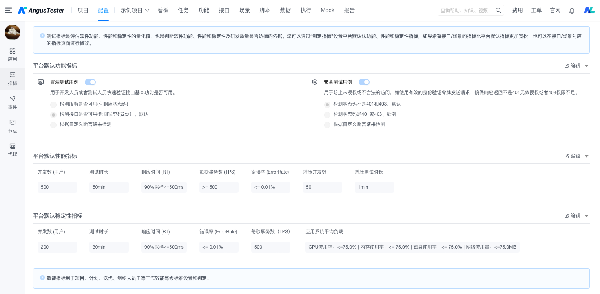
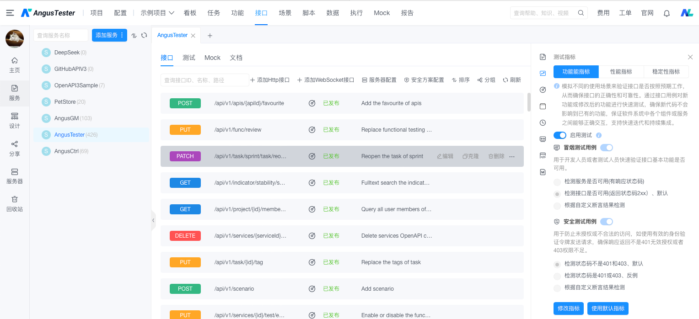

# AngusTester如何为平台业务定义统一的测试指标

## 为什么需要统一测试指标

平台业务与技术团队在性能评估中存在天然的视角差异：

| 维度 | 业务团队关注点 | 技术团队关注点 | 统一指标价值 |
|------|--------------|---------------|------------|
| 性能 | 用户体验/SLA达成率 | TPS/延迟/错误率 | 对齐业务目标与技术实现 |
| 功能 | 核心流程覆盖率 | 分支覆盖率/代码质量 | 确保功能完整性与技术严谨性 |
| 稳定 | 系统可用性 | 错误恢复时间/资源冗余 | 平衡可用性要求与系统健壮性 |

## 统一指标的核心价值

### 价值实现矩阵

<h3>🚀 一致性保障</h3>
<ul>
<li>跨团队测试结果可比对</li>
<li>版本迭代性能趋势可视化</li>
<li>消除指标解读歧义</li>
</ul>

<h3>📊 质量评估标准化</h3>
<ul>
<li>建立SLA达标评价体系</li>
<li>功能覆盖度量化分析</li>
<li>缺陷密度统一衡量</li>
</ul>

<h3>🔍 问题追踪效率</h3>
<ul>
<li>指标异常自动告警</li>
<li>根因定位时间减少50%+</li>
<li>MTTR(平均修复时间)优化</li>
</ul>

<h3>🔄 持续改进驱动</h3>
<ul>
<li>建立性能基线监控</li>
<li>识别优化关键点</li>
<li>量化验证改进效果</li>
</ul>

## 平台级标准化配置

### 全局指标设置流程

### 配置步骤说明

1. 导航至：`配置 → 指标`
2. 修改默认指标阈值
    - 每秒事务数（TPS）
    - 并发数 (用户)
    - 响应时间(P90/P95/P99)
    - 错误率上限
    - 资源使用率阈值
3. 保存设置后全平台生效

### 推荐平台级基准指标

| 指标类型 | 建议值 | 适用场景 |
|---------|-------|----------|
| 响应时间(P90) | ≤500ms | 用户交互系统 |
| 错误率 | ≤0.1% | 核心业务系统 |
| CPU峰值 | ≤75% | 计算密集型服务 |
| 内存使用率 | ≤70% | 内存敏感型系统 |

## 接口级定制方案

### 专属指标配置流程

### 配置步骤说明

1. 进入接口管理：`接口 → 目标服务 → 目标接口`
2. 导航至`测试指标`选项卡
3. 设置接口指标：
    - 每秒事务数（TPS）要求
    - 并发数 (用户)要求
    - 特殊响应时间要求
    - 特定场景错误容忍度
    - 资源使用定制规则
4. 保存后仅对当前接口生效

### 定制指标应用场景

| 场景类型 | 指标定制建议 | 业务价值 |
|---------|-------------|----------|
| 支付核心接口 | 响应时间≤200ms 错误率=0% | 保障交易成功率 |
| 大数据分析接口 | 响应时间≤5s 允许局部超时 | 平衡性能与数据完整性 |
| 定时批处理 | CPU峰值≤85% 允许瞬时高负载 | 资源利用最大化 |
| 外部依赖接口 | 错误率≤5% 超时率≤1% | 兼容第三方不稳定服务 |

**立即统一您的测试指标体系**：[🔗 进入AngusTester控制台 🔗](https://gm.xcan.cloud/signin){ .md-button .md-button--primary }

