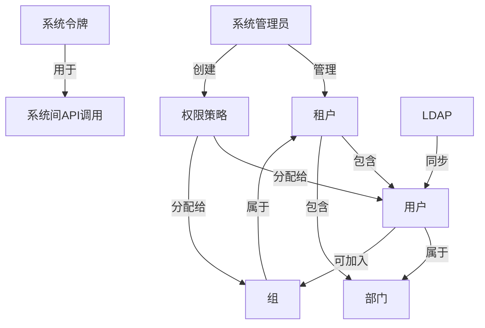

# AngusGM 核心概念

掌握这些基础概念，将帮助您更好地理解和使用 AngusGM 系统。

## 组织架构概念

### 租户
> **独立的数据空间**
>
> 代表一个独立使用系统的业务实体（个人/企业/组织）。  
> 每个租户有完全隔离的数据和资源空间  
> 例如：集团公司的不同子公司可作为独立租户

::: tip 注意
`云服务版本`和`数据中心版本`支持多租户。
:::

### 用户
> **系统的操作者**
>
> 实际使用系统的人员  
> 通过账号登录系统，执行具体操作任务  
> 每个用户都属于特定租户

### 部门
> **职能划分单元**
>
> 按业务功能划分的组织结构单元  
> 如：财务部、研发部、人力资源部  
> 用于组织管理和权限分配

### 组
> **灵活的用户集合**
>
> 跨部门的人员逻辑分组  
> 可按项目（如：项目A组）或角色（如：管理员组）创建  
> 简化批量权限管理

### 标签
> **资源的分类标记**
>
> 给用户/部门/资源添加关键词标记  
> 支持属性筛选和多维分类  
> 如："财务"、"架构师"、"QA"

## 权限与角色

| 角色类型 | 职责说明 | 权限范围                                                               |
|---------|---------|--------------------------------------------------------------------|
| **系统管理员** | 全局系统管理者 | • 全系统功能权限 • 租户资源分配 • 用户角色授权 *注册或安装时自动创建*                  |
| **应用管理员** | 特定应用负责人 | • 专属应用的管理权限 • 应用管理员用户授权 由系统管理员分配 • 应用内用户授权 *由应用管理员分配* |
| **一般用户** | 日常操作执行者 | • 基础应用操作权限 • 个人工作空间管理                                           |

## 系统管理概念

### 权限策略
> **访问控制规则**
>
> 定义用户/组对系统资源的操作权限  
> 可精确到菜单/按钮/API级控制  
> 分配给用户、部门或组后生效

### 资源配额
> **资源使用限制**
>
> 为租户设置的计算/存储资源上限  
> 防止资源过度消耗  
> 支持动态调整满足需求变化

### 系统令牌
> **API访问凭证**
>
> 用于系统间集成的安全密钥  
> 代替用户进行API调用  
> 适用于自动化脚本、CI/CD系统等场景  
> 所有操作都会被记录审计

## 系统集成

### LDAP
> **统一用户目录**
>
> 轻量目录访问协议  
> 集成企业现有用户管理系统  
> 实现：  
> • 用户信息同步  
> • 统一认证登录  
> • 避免重复账号管理  

