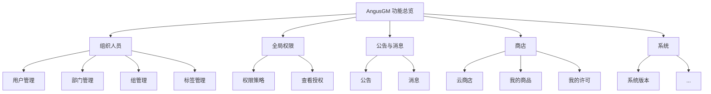
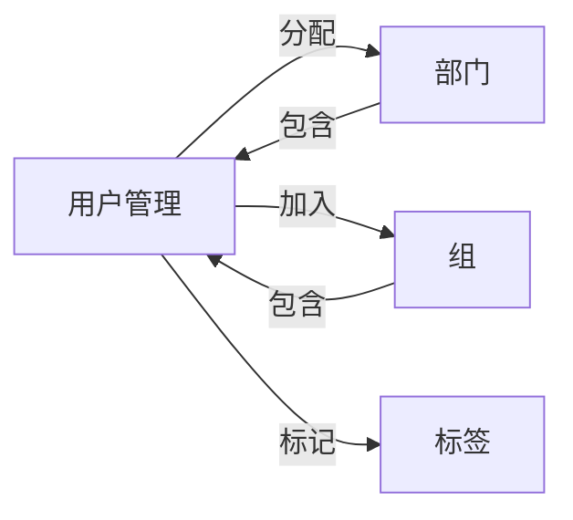
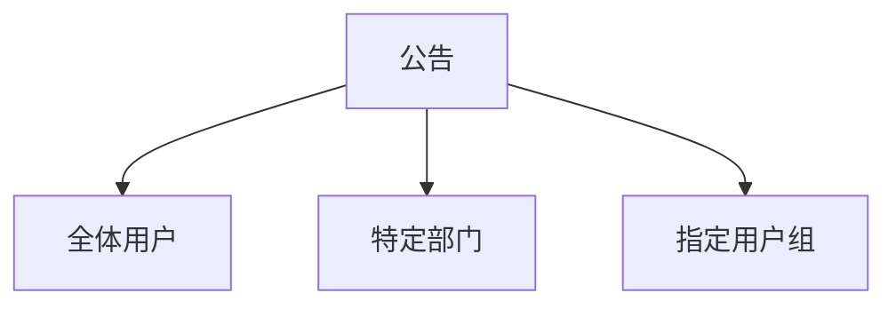
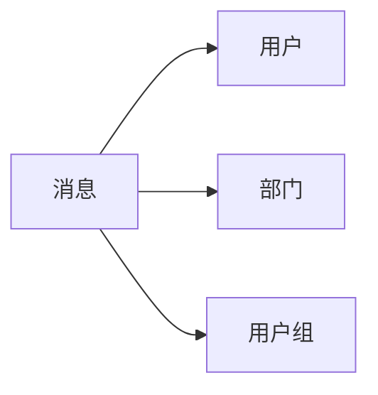

# AngusGM 功能总览

AngusGM 是一个全面的企业管理系统，包含五大核心功能模块，为企业提供高效的人员管理、权限控制、信息传递、应用商店和系统运维能力。

::: tip 核心价值
AngusGM 通过统一平台整合企业核心管理功能，简化操作流程，提升团队协作效率，保障系统安全稳定运行。
:::

## 组织人员管理

**统一的人员组织架构体系**，实现高效的用户、部门和组管理：

- **用户管理**  
  ✅ 创建和管理用户信息  
  ✅ 分配组织关系和权限  
  ✅ 支持批量导入导出操作

- **部门管理**  
  📂 建立层级化部门结构  
  🔑 每个部门独立标识便于识别  
  🔄 支持部门间灵活调整

- **组管理**  
  👥 创建跨部门功能小组  
  🔒 按组分配系统访问权限  
  ⚡ 简化用户权限管理流程

- **标签管理**  
  🏷️ 为人员和部门添加标记  
  🔍 快速筛选目标对象  
  🚀 提升业务处理效率

## 全局权限控制

**精细化的权限管理体系**，确保系统资源安全访问：

- **权限策略**  
  🔐 功能级控制（菜单/按钮/面板）  
  🌐 接口级访问权限管理  
  👑 管理员分级（系统/应用管理员）

- **查看授权**  
  👁️ 实时查看用户/部门/组权限  
  📊 可视化权限分配关系  
  ⚖️ 批量授权/取消授权操作

## 公告与消息中心

**高效的信息传递平台**，确保团队沟通畅通无阻：

::: grid

:::

- **公告系统**  
  📢 重要信息全局通知  
  🎯 精准定位目标群体  
  ⏱️ 定时发布功能

- **消息系统**  
  💬 点对点即时通讯  
  👥 部门/小组群聊  
  📎 支持附件发送

## 应用商店

**一站式应用获取与管理平台**，简化软件生命周期管理：

- **云商店**  
  🛒 安全可靠的应用市场  
  🧩 丰富插件资源库  
  🚀 开发者发布平台

- **我的商品**  
  📦 已购应用统一管理  
  ⬆️ 一键安装/升级  
  💾 应用下载备份

- **我的许可**  
  📄 许可证集中管理  
  🔍 查看详细授权信息  
  ⏳ 许可有效期提醒

## 系统管理

**全面的系统运维与安全管控**，保障平台稳定运行：

::: warning 注意
标有 <Badge type="warning">私有化</Badge> 的功能仅限私有部署版本
:::

| 功能模块 | 描述 | 版本 |
|---------|------|-----|
| **系统版本** | 查看应用版本和授权信息 | <Badge type="warning">私有化</Badge> |
| **实名认证** | 用户身份核验，增强安全性 | 云服务 |
| **安全设置** | 配置账户安全策略（登录/密码/注销） | 全版本 |
| **LDAP配置** | 企业目录服务集成，统一认证 | 全版本 |
| **邮箱配置** | 邮件服务器设置与管理 | <Badge type="warning">私有化</Badge> |
| **短信配置** | 短信通道和模板管理 | <Badge type="warning">私有化</Badge> |
| **事件管理** | 系统事件推送配置 | 全版本 |
| **资源配额** | 租户资源分配与限制 | 全版本 |
| **应用存储** | 存储位置查看与配置 | 全版本 |
| **审计日志** | 操作/系统/请求日志记录 | 全版本 |
| **在线用户** | 实时查看在线用户和设备 | <Badge type="warning">私有化</Badge> |
| **站点信息** | 应用部署详情查看 | 全版本 |
| **系统令牌** | API调用凭证管理 | 全版本 |

### 关键功能亮点

- **安全体系**  
  🔒 多层防护保障系统安全  
  📝 完整审计追溯能力  
  👤 企业级身份认证

- **资源管理**  
  ⚖️ 合理分配系统资源  
  💾 灵活存储配置方案  
  🔑 安全的API访问控制

- **监控维护**  
  👀 实时系统状态监控  
  🚨 即时事件通知  
  🖥️ 全面部署信息展示

AngusGM 通过这五大功能模块的有机结合，为企业提供了一站式管理解决方案，显著提升组织效率和系统安全性。