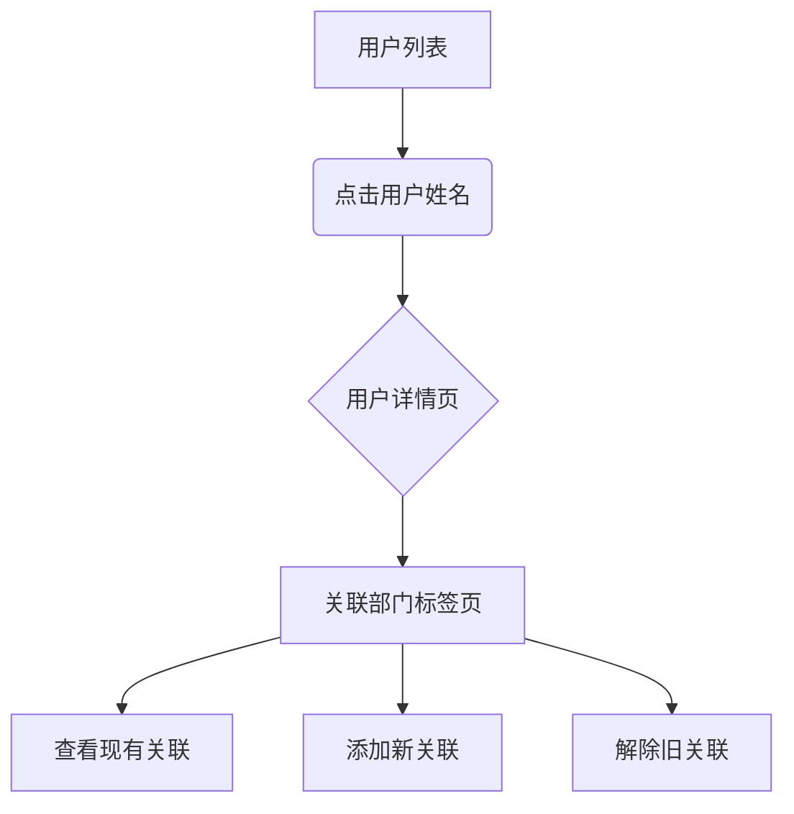

# 关联用户部门

> **关联用户部门** 用于建立用户与部门之间的从属关系，实现以下目的：
> - **人员组织**：结构化管理企业人员架构
> - **权限控制**：支撑基于部门的访问权限体系
> - **信息共享**：促进部门内部协作效率

## 操作指南

### 1. 进入用户详情页
1. 登录系统控制台
2. 访问 `AngusGM → 组织人员 → 用户`
3. 在用户列表中点击目标用户 **姓名**

### 2. 管理部门关联
在用户详情页底部标签栏：
1. 切换至 **「关联部门」** 标签页
2. 查看当前已关联部门列表

### 3. 新增关联
- 点击右上角 **「关联部门」** 按钮
- 在弹出窗口勾选目标部门（支持多选）
- 确认选择后点击 **「确认」**

### 4. 解除关联
- 在已关联部门列表中找到目标记录
- 点击记录右侧 **「取消关联」** 按钮
- 二次确认后完成操作

> ⚠️ 注意：解除关联将同步移除该部门的权限继承

***操作示意图***

## 配额说明

不同版本的用户数量限制如下：
| 版本类型   | 默认配额 | 扩展方式                                              |
|------------|------|---------------------------------------------------|
| 云服务版   | `5个` | 提交[工单申请](https://wo.xcan.cloud/workorders/create) |
| 私有部署版 | `5个` | 系统管理员可以直接按需求修改配额                                 |

> 提示：实时配额可在[资源配额页面](../../introduction/quotas.md)查看`用户关联部门数`。