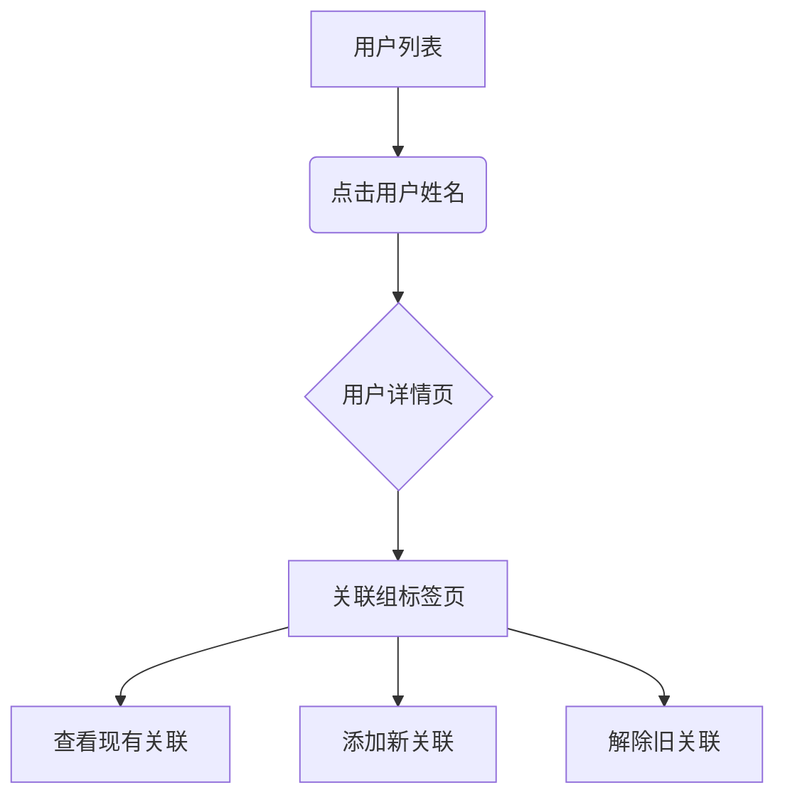

# 关联用户组

> **关联用户组** 用于建立用户与组之间的逻辑关联，实现以下目的：
> - **批量管理**：对具有相同属性（角色/权限/职能）的用户进行分组管理
> - **权限继承**：组成员自动获取组内配置的权限策略
> - **高效协作**：简化跨团队协作的权限配置流程

## 操作指南

### 1. 进入用户详情页
1. 登录系统控制台
2. 访问 `AngusGM → 组织人员 → 用户`
3. 在用户列表中点击目标用户 **姓名**

### 2. 管理组关联
在用户详情页底部标签栏：
1. 切换至 **「关联组」** 标签页
2. 查看当前已关联组列表

### 3. 新增关联
- 点击右上角 **「关联组」** 按钮
- 在弹出窗口勾选目标组（支持多选）
- 确认选择后点击 **「确认」**

### 4. 解除关联
- 在已关联组列表中找到目标记录
- 点击记录右侧 **「取消关联」** 按钮
- 二次确认后完成操作

> ⚠️ 注意：解除关联将同步移除该组的权限继承

***操作示意图***

## 配额说明

不同版本的用户数量限制如下：
| 版本类型   | 默认配额   | 扩展方式                                              |
|------------|--------|---------------------------------------------------|
| 云服务版   | `200个` | 提交[工单申请](https://wo.xcan.cloud/workorders/create) |
| 私有部署版 | `200个` | 系统管理员可以直接按需求修改配额                                 |

> 提示：实时配额可在[资源配额页面](../../introduction/quotas)查看`用户关联组数`。