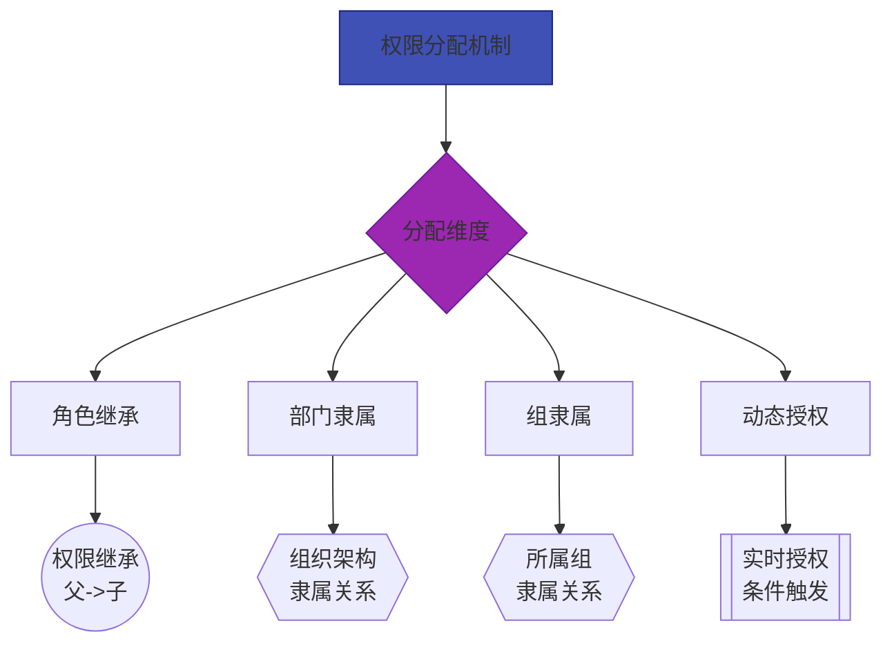

# 用户管理

::: tip 重要提示
> **用户管理** 是企业对组织成员进行系统化管理的关键功能，支持管理员高效创建、维护和监控用户账户生命周期，保障系统安全性与合规性。
:::

## 账户全周期管理

### 1. **统一用户档案**  
集中管理用户基础信息、联系方式及组织关系，支持：
  - 批量导入/导出用户数据
  - LDAP目录同步集成
  - 多因素身份认证配置

### 2. **动态权限体系**

### 3. **实时状态追踪**  
   | 监控维度       | 检测指标                  | 告警机制         |
   |----------------|---------------------------|------------------|
   | 登录安全       | 异常登录地点/次数         | 实时账户锁定     |
   | 权限变更       | 敏感权限分配记录           | 操作日志告警     |
   | 会话状态       | 在线时长/闲置超时         | 自动登出         |
   | 密码安全       | 弱密码/过期密码           | 强制重置提醒     |

## 关键功能介绍

### 1. 统一身份管理
- **自动化流程**：预设岗位模板实现一键创建账户
- **组织架构映射**：自动同步部门调整至用户职位
- **合规审计**：完整记录账户操作轨迹（创建/修改/删除）

### 2. 精细权限控制
- **权限热图**：可视化展示用户权限分布
- **权限继承矩阵**：部门→岗位→用户三级继承关系
- **敏感操作拦截**：关键权限变更需二次验证

### 3. 全景审计追踪
- 操作行为留存：记录关键操作（权限变更/数据导出）
- 风险操作标记：标记高敏感操作（密码重置/角色变更）
- 时间轴追溯：按时间序列展示用户行为轨迹

## 用户信息

| 参数                 | 类型         | 必填 | 长度限制 | 说明                     |
|----------------------|--------------|------|----------|------------------------|
| **ID**                   | `bigint`     | **条件** | /        | 唯一标识符； 系统自动生成； 修改时必须    |
| **名称**             | `string`     | **是** | ≤100     | 用户名字， 如：云婷         |
| **姓氏**             | `string`     | **是** | ≤100     | 用户姓氏， 如：王          |
| **姓名**             | `string`     | **是** | ≤100     | 用户全名（名字+姓氏）， 如：王云婷 |
| **用户名**           | `string`     | **是** | ≤100     | 系统登录唯一标识               |
| **手机号**           | `string`     | **是** | ≤16      | 用户手机号                  |
| 座机号               | `string`     | 否   | ≤40      | 用户座机号                  |
| **邮箱**             | `string`     | **是** | ≤100     | 用户电子邮箱地址               |
| 性别                 | `string`     | 否   | ≤10      | 用户性别                   |
| 职务                 | `string`     | 否   | ≤100     | 用户担任的职务                |
| 地址                 | `string`     | 否   | ≤200     | 用户联系地址                 |
| **系统身份**         | `int`        | **是** | /        | 用户默认角色权限               |
| **锁定状态**         | `boolean`    | **是** | /        | 账户是否被锁定                |
| **启用状态**         | `boolean`    | **是** | /        | 用户状态； 默认启用             |
| 来源                 | `string`     | 只读 | /        | 用户来源                   |
| 在线状态             | `boolean`    | 只读 | /        | 用户当前是否在线               |
| 最近上线             | `datetime`   | 只读 | /        | 用户最近上线时间               |
| 下线时间             | `datetime`   | 只读 | /        | 用户上次下线时间               |
| 添加人               | `bigint`     | 只读 | /        | 添加用户操作人                |
| 加入时间             | `datetime`   | 只读 | /        | 用户加入或创建时间              |
| 最后修改人           | `bigint`     | 只读 | /        | 最后修改用户信息操作人            |
| 最后修改时间         | `datetime`   | 只读 | /        | 最后修改用户信息时间             |
| 国际电话区号         | `string`     | 否   | ≤8       | 国际电话区号                 |
| 国家编码             | `string`     | 否   | ≤16      | 国家编码                   |
| 注册账号类型         | `string`     | 只读 | /        | 注册账号类型                 |
| 注册账号             | `string`     | 只读 | /        | 租户注册账号                 |
| 注册设备ID           | `string`     | 只读 | /        | 注册设备ID                 |
| 租户ID               | `bigint`     | 只读 | /        | 所属租户ID                 |
| 租户名称             | `string`     | 只读 | /        | 租户名称                   |
| 头像地址             | `string`     | 只读 | /        | 用户头像地址                 |
| 用户目录ID           | `bigint`     | 只读 | /        | 用户目录ID                 |
| 主部门ID             | `bigint`     | 否   | /        | 主部门ID                  |
| 部门负责人           | `boolean`    | 否   | /        | 是否部门负责人                |
| 到期标记             | `boolean`    | 只读 | /        | 到期标记                   |
| 到期时间             | `datetime`   | 否   | /        | 到期时间                   |
| 禁用原因             | `string`     | 否   | ≤200     | 禁用原因                   |
| 删除状态             | `boolean`    | 只读 | /        | 删除状态                   |
| 最后锁定时间         | `datetime`   | 否   | /        | 最后锁定时间                 |
| 锁定开始时间         | `datetime`   | 否   | /        | 锁定开始时间                 |
| 锁定结束时间         | `datetime`   | 否   | /        | 锁定结束时间                 |
| 最后密码修改时间     | `datetime`   | 只读 | /        | 最后修改密码的时间              |
