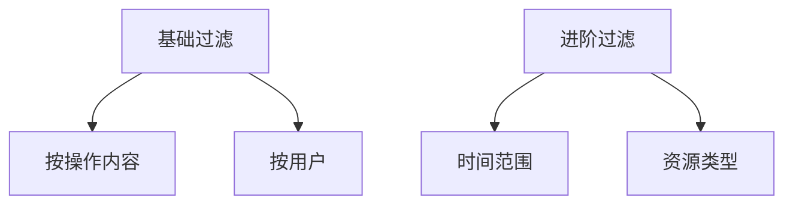

# 操作日志

> **操作日志** 是企业的数字行为「黑匣子」，实时记录用户操作轨迹与资源变更全生命周期，为安全分析、问题定位提供核心数据支撑。以下是系统功能详解：

## 核心功能

### 1. 时间筛选
- **精确时段定位**：支持从分钟级到月级跨度检索
- **快捷预设**：一键切换今日/7天/30天高频区间
- **历史回溯**：默认保存完整日志30天

### 2. 数据可视化看板

- 操作趋势分析
  - 实时展示每小时操作峰值（如显示15:00-18:00为高峰）
  - 异常流量自动标记（如3分钟内连续失败登录）

- 资源分布热图
  - 用户登录占主导（如占比85%）
  - 关键操作分类聚合统计

### 3. 精准日志检索系统

**筛选场景示例**：
- `操作人：张三 + 时间：近1天` → 定位特定用户当天操作
- `操作内容：登录失败` → 快速筛选异常认证事件

### 4. 详细操作记录清单
| 字段         | 说明                  | 案例记录                  |  
|--------------|-----------------------|--------------------------|  
| **操作人**   | 执行者标识            | 张三、李四              |  
| **操作内容** | 行为描述              | "用户登录系统失败，原因：账号或密码错误" |  
| **操作资源** | 被操作对象类型        | 用户、权限策略、部门       |  
| **资源名称** | 具体资源标识          | 张三、测试部            |  
| **操作时间** | 精确到秒的时间戳      | 2025-06-20 15:32:18      |  

## 典型应用场景

| 场景类型       | 实现路径                     | 业务价值                  |  
|----------------|------------------------------|--------------------------|  
| 安全事件调查   | 筛选“登录失败”操作           | 识别暴力破解尝试          |  
| 误操作恢复     | 按时间+用户定位删除操作       | 快速恢复误删资源          |  
| 合规审计       | 导出指定时段完整日志          | 满足等保2.0审计要求       |  
| 用户行为分析   | 聚合操作类型分布              | 优化系统功能设计          |  
