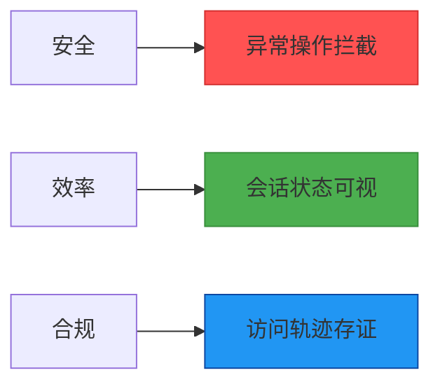

# 在线用户

> `在线用户`可以随时随地掌握用户的实时动态，实现更强大、更智能的用户在线信息管理，这些信息包括在线用户、设备、IP、在线状态等。

## 核心目的
通过实时监控用户会话状态，构建系统安全态势感知中枢，实现：
1. **动态安全防护**：识别非常规IP登录/多设备并发访问等风险行为
2. **资源合规管控**：确保授权用户按规范访问系统资源
3. **系统性能优化**：根据实时负载动态调整资源配置

## 核心价值

### 安全价值
- ⚠️ 实时阻断异常登录（如3秒内IPv4/IPv6双栈登录）
- 🔒 设备指纹识别（精确到Chrome 137.0.0.0）
- 🛡️ IP黑白名单联动（区分0:0:0:0:0:0:1与127.0.0.1）

### 运维价值
- ⏱️ 精确会话追踪（时间戳精确至秒级）
- 📊 256+历史记录分析（识别活跃高峰）
- ⚡ 即时强制下线（通过”退出登录“功能）

### 合规价值
- 📜 完整会话存证（含设备/IP/时长）
- 🔍 三要素追溯（用户+时间+地点）
- 📁 日志自动归档（支持180+天留存）

