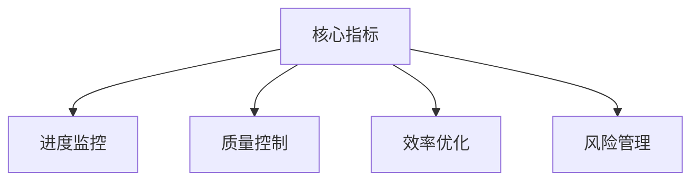

# 研发管理指标指南

> AngusTester研发管理的关键指标，可以帮助团队**量化研发效能、识别改进机会、提升交付质量**。基于数据驱动决策，实现研发过程的可预测、可衡量、可优化。

点击查看 [研发指标功能介绍](../ui/task/analysisManagement.md)

## 核心价值
- **实时项目洞察**：精准掌握进度与风险
- **资源优化配置**：科学分配人力与时间
- **质量持续提升**：降低缺陷率，保障交付质量
- **效能持续改进**：优化流程与协作效率

## 进度指标
> 💡 **项目进展的量化视图**，评估完成度、预测交付时间

| **指标**             | 描述                                         | 参数名称              | 计算公式                     |
|----------------------|----------------------------------------------|-----------------------|------------------------------|
| **总任务数**         | 项目/迭代中所有已计划的任务总数              | `totalNum`            | N/A                          |
| **完成任务数**       | 已完成的任务数量                             | `completedNum`        | N/A                          |
| **完成任务占比**     | 已完成任务在总任务中的百分比                 | `completedRate`       | `(完成任务数/总任务数)×100%` |
| **总工作量**         | 任务评估所需的总工作量（工时/故事点）        | `evalWorkload`        | N/A                          |
| **完成工作量**       | 已完成任务的实际工作量总和                   | `completedWorkload`   | N/A                          |
| **完成工作量占比**   | 已完成工作量在总工作量中的百分比             | `completedWorkloadRate`| `(完成工作量/总工作量)×100%` |

## 燃尽图指标
> 💡 **项目进展的可视化工具**，直观展示剩余工作量

### 任务数燃尽指标
| **指标**       | 描述                     | 参数名称      | 计算公式              |
|----------------|--------------------------|---------------|-----------------------|
| **总任务数**   | 项目/迭代中所有任务总数  | `total`       | N/A                   |
| **完成任务数** | 已经完成的任务数量       | `completed`   | N/A                   |
| **剩余任务数** | 尚未完成的任务数量       | `remained`    | `总任务数 - 完成任务数`   |

### 任务工作量燃尽指标
| **指标**       | 描述                         | 参数名称      | 计算公式              |
|----------------|------------------------------|---------------|-----------------------|
| **总工作量**   | 完成所有任务预计需要的工作量 | `total`       | N/A                   |
| **完成工作量** | 已完成任务所耗费的实际工作量 | `completed`   | N/A                   |
| **剩余工作量** | 完成剩余任务预计需要的工作量 | `remained`    | `总工作量 - 完成工作量`   |

## 工作量指标
> 💡 **研发效能的核心度量**，优化资源分配与估算精度

| **指标**           | 描述                                         | 参数名称              | 计算公式                         |
|--------------------|----------------------------------------------|-----------------------|----------------------------------|
| **评估工作量**     | 任务开始时预估的工作量                       | `evalWorkload`        | N/A                              |
| **实际工作量**     | 任务执行过程中实际花费的工作量               | `actualWorkload`      | N/A                              |
| **完成工作量**     | 已完成任务的实际工作量                       | `completedWorkload`   | N/A                              |
| **工作量完成率**   | 已完成工作量占评估工作量的比例               | `completedWorkloadRate`| `(完成工作量/评估工作量)×100%` |
| **节省工作量**     | 评估工作量与实际工作量的差值（正值表示节省） | `savingWorkload`      | `评估工作量 - 工作量完成率`  |
| **工作量节省率**   | 节省工作量占评估工作量的比例                 | `savingWorkloadRate`  | `(节省工作量/评估工作量)×100%` |

## 逾期评估指标
> 💡 **项目风险的预警系统**，识别延迟任务

| **指标**                           | 描述                                                     | 参数名称                        | 计算公式                                     |
|------------------------------------|----------------------------------------------------------|---------------------------------|----------------------------------------------|
| **逾期风险等级**                   | 基于进度评估的逾期可能性                                 | `riskLevel`                     | 综合评估                                     |
| **总任务数**                       | 项目/迭代中所有任务总数                                  | `totalNum`                      | N/A                                          |
| **工作量**                         | 完成所有任务估计的总工作量                               | `totalWorkload`                 | N/A                                          |
| **逾期数**                         | 超过预定完成时间的任务数量                               | `overdueNum`                    | N/A                                          |
| **逾期率**                         | 逾期任务占总任务的比例                                   | `overdueRate`                   | `(逾期数/总任务数)×100%`                 |
| **逾期工作量**                     | 逾期任务对应的工作量总和                                 | `overdueWorkload`               | 工作量                           |
| **工作量逾期率**                   | 逾期工作量占总工作量的比例                               | `overdueWorkloadRate`           | `(逾期工作量/工作量)×100%`       |
| **每天平均处理工作量**             | 团队每日完成的平均工作量                                 | `dailyProcessedWorkload`        | `总完成工作量/工作天数`                        |
| **逾期时长(小时)**                 | 所有逾期任务的累计逾期时间                               | `overdueTime`                   | `逾期时间总和`                                 |
| **逾期工作量预计处理时长(小时)**   | 处理所有逾期工作量预计需要的时间                         | `overdueWorkloadProcessingTime`| `逾期工作量/每天平均处理工作量`     |

**逾期风险等级标准**：
- 🟢 无风险：无逾期任务
- 🟡 低风险：逾期工作量≤3天
- 🔴 高风险：逾期工作量>3天

## 缺陷评估指标
> 💡 **软件质量的核心度量**，全面评估缺陷状况

| **指标**               | 描述                                     | 参数名称                | 计算公式                          |
|------------------------|------------------------------------------|-------------------------|-----------------------------------|
| **总任务数**           | 项目/迭代中所有任务总数                  | `totalNum`              | N/A                               |
| **总工作量**           | 完成所有任务估计的总工作量               | `totalWorkload`         | N/A                               |
| **总缺陷数**           | 测试过程中发现的所有缺陷数量             | `bugNum`                | N/A                               |
| **缺陷率**             | 每个任务平均的缺陷数                     | `bugRate`               | `总缺陷数/总任务数`              |
| **有效缺陷数**         | 被确认为真实问题的缺陷数量               | `validBugNum`           | N/A                               |
| **缺陷有效率**         | 有效缺陷在总缺陷中的占比                 | `validBugRate`          | `(有效缺陷数/总缺陷数)×100%`       |
| **缺陷一次性通过数**   | 第一次修复后即通过验证的缺陷数           | `oneTimePassedBugNum`   | N/A                               |
| **缺陷一次性通过率**   | 一次性通过缺陷占通过缺陷的比例           | `oneTimePassedBugRate`  | `(缺陷一次性通过数/通过缺陷数)×100%`|

**缺陷等级标准**：
- ⚠️ 致命：系统崩溃/核心功能失效
- 🔥 严重：重要功能失效，需优先处理
- ⚙️ 一般：功能缺陷但不影响主流程
- 📝 轻微：拼写错误等低优先级问题

## 处理效率指标
> 💡 **工作流效能量化评估**，识别流程瓶颈

| **指标**             | 描述                               | 参数名称             | 计算公式                           |
|----------------------|------------------------------------|----------------------|------------------------------------|
| **总任务数**         | 项目/迭代中所有任务总数            | `totalNum`           | N/A                                |
| **完成任务数**       | 已完成的任务数量                   | `completedNum`       | N/A                                |
| **任务完成率**       | 完成任务占总任务的比例             | `completedRate`      | `(完成任务数/总任务数)×100%`       |
| **一次性完成数**     | 无需返工直接完成的任务数           | `oneTimePassedNum`    | N/A                                |
| **一次性完成率**     | 一次性完成任务占完成任务的比例     | `oneTimePassedRate`   | `(一次性完成数/完成任务数)×100%`   |

## 核心KPI指标
> 💡 **项目健康度的综合仪表盘**

| **指标**           | 描述                           | 参数名称              | 计算公式                       |
|--------------------|--------------------------------|-----------------------|--------------------------------|
| **总任务数**       | 项目中所有任务的数量           | `totalNum`            | N/A                            |
| **完成任务数**     | 已完成的任务数量               | `completedNum`        | N/A                            |
| **完成率**         | 已完成任务占总任务的比例       | `completedRate`       | `(完成任务数/总任务数)×100%`   |
| **总工作量**       | 所有任务预估所需的工作量       | `evalWorkload`        | N/A                            |
| **完成工作量**     | 已完成任务的实际工作量         | `completedWorkload`   | N/A                            |
| **工作量完成率**   | 已完成工作量占总工作量的比例   | `completedWorkloadRate`| `(完成工作量/总工作量)×100%`   |
| **总逾期数**       | 超过预定完成时间的任务数量     | `overdueNum`          | N/A                            |
| **逾期率**         | 逾期任务占总任务的比例         | `overdueRate`         | `(总逾期数/总任务数)×100%`     |
| **完成逾期数**     | 已完成的逾期任务数量           | `completedOverdueNum` | N/A                            |
| **逾期完成率**     | 已完成的逾期任务占总逾期任务的比例 | `completedOverdueRate`| `(完成逾期数/总逾期数)×100%`   |
| **总缺陷数**       | 项目中发现的所有缺陷数量       | `bugNum`              | N/A                            |
| **缺陷率**         | 平均每个任务的缺陷数           | `bugRate`             | `总缺陷数/总任务数`            |
| **完成缺陷数**     | 已修复的缺陷数量               | `completedBugNum`    | N/A                            |
| **缺陷完成率**     | 已修复缺陷占总缺陷的比例       | `completedBugRate`   | `(完成缺陷数/总缺陷数)×100%`   |

## 故障指标
> 💡 **系统稳定性的关键度量**

| **指标**             | 描述                           | 参数名称               | 计算公式                         |
|----------------------|--------------------------------|------------------------|----------------------------------|
| **总故障数**         | 系统运行中出现的所有故障数量   | `failureNum`           | N/A                              |
| **一次性故障数**     | 一次修复即解决的故障数量       | `oneTimeFailureNum`    | N/A                              |
| **一次性故障率**     | 一次修复成功的故障比例         | `oneTimeFailureRate`   | `(一次性故障数/总故障数)×100%`   |
| **故障完成数**       | 已修复的故障数量               | `failureCompletedNum` | N/A                              |
| **故障完成率**       | 已修复故障占总故障的比例       | `failureCompletedRate` | `(故障完成数/总故障数)×100%`     |
| **故障逾期数**       | 超过预定修复时间的故障数量     | `failureOverdueNum`    | N/A                              |
| **故障逾期率**       | 逾期修复的故障比例             | `failureOverdueRate`   | `(故障逾期数/总故障数)×100%`     |
| **故障总时间**       | 所有故障修复所花费的总时间     | `failureTotalTime`     | 所有故障修复时间之和             |
| **平均故障时间**     | 每个故障平均修复时间           | `failureAvgTime`       | `故障总时间/总故障数`            |
| **最小故障时间**     | 修复最快的故障所用时间         | `failureMinTime`       | N/A                              |
| **最大故障时间**     | 修复最慢的故障所用时间         | `failureMaxTime`       | N/A                              |

> **故障等级分布**：通过`failureLevelCount`和`failureLevelRate`字段可获取各等级故障的数量和占比

## 积压任务指标
> 💡 **待办工作量的量化分析**

| **指标**                 | 描述                             | 参数名称                | 计算公式                          |
|--------------------------|----------------------------------|-------------------------|-----------------------------------|
| **每天平均处理任务数**   | 团队每天平均完成的任务数量       | `dailyProcessedNum`     | `完成的任务数/工作天数`          |
| **每天平均处理工作量**   | 团队每天平均完成的工作量         | `dailyProcessedWorkload`| `完成的工作量/工作天数`          |
| **积压任务数**           | 当前未完成的任务数量             | `backloggedNum`         | `总任务数-已完成任务数`           |
| **积压率**               | 积压任务占总任务的比例           | `backloggedRate`        | `(积压任务数/总任务数)×100%`      |
| **积压工作量**           | 未完成任务的估计工作量           | `backloggedWorkload`   | `总工作量-已完成工作量`          |
| **工作量积压率**         | 积压工作量占总工作量的比例       | `backloggedWorkloadRate`| `(积压工作量/总工作量)×100%`      |
| **预计耗时(小时)**       | 处理完所有积压任务预计需要的时间 | `backloggedCompletionTime`| `积压工作量/每天平均处理工作量`  |

## 近期交付量指标
> 💡 **交付效率与质量的快照**

| **指标**                   | 描述                               | 参数名称                | 计算公式                               |
|----------------------------|------------------------------------|-------------------------|----------------------------------------|
| **交付数**                 | 已交付的任务数量                   | `completedNum`          | N/A                                    |
| **交付率**                 | 已交付任务占总任务的比例           | `completedRate`         | `(交付数/总任务数)×100%`               |
| **总交付工作量**           | 已交付任务的实际工作量             | `completedWorkload`     | N/A                                    |
| **总交付工作量占比**       | 已交付工作量占总工作量的比例       | `completedWorkloadRate` | `(总交付工作量/总工作量)×100%`         |
| **总节省工作量**           | 实际交付工作量与预估工作量的差值   | `savingWorkload`        | `预估工作量-总交付工作量`              |
| **总节省工作量占比**       | 节省工作量占总工作量的比例         | `savingWorkloadRate`    | `(总节省工作量/总工作量)×100%`         |
| **交付逾期数**             | 已交付但逾期的任务数量             | `overdueNum`            | N/A                                    |
| **交付逾期率**             | 逾期交付任务占总交付任务的比例     | `overdueRate`           | `(交付逾期数/交付数)×100%`             |
| **交付逾期工作量**         | 逾期交付任务的实际工作量           | `overdueWorkload`       | N/A                                    |
| **交付逾期工作量占比**     | 逾期交付工作量占总交付工作量的比例 | `overdueWorkloadRate`   | `(交付逾期工作量/总交付工作量)×100%`   |

## 交付周期指标
> 💡 **任务处理效能的深度分析**

| **指标**             | 描述                       | 参数名称              | 计算公式               |
|----------------------|----------------------------|-----------------------|------------------------|
| **平均处理时长**     | 所有任务的平均完成时间     | `avgProcessingTime`   | `总处理时长/完成任务数`|
| **P50 (中位数)**     | 50%任务完成时间            | `p50ProcessingTime`   | 时间序列中位数         |
| **P90**              | 90%任务完成时间            | `p90ProcessingTime`   | 时间序列90百分位       |
| **最大处理时长**     | 完成最慢的任务所用时间     | `maxProcessingTime`   | N/A                    |

> 其他百分位数指标（P75, P95, P99）可根据需要添加

## 计划外工作指标
> 💡 **突发性工作负载的量化管理**

| **指标**                     | 描述                                       | 参数名称                         | 计算公式                                 |
|------------------------------|--------------------------------------------|----------------------------------|------------------------------------------|
| **计划外任务数**             | 未在原计划中包含的任务数量                 | `unplannedNum`                   | N/A                                      |
| **计划外任务占比**           | 计划外任务在总任务中的比例                 | `unplannedRate`                  | `(计划外任务数/总任务数)×100%`           |
| **计划外任务完成数**         | 已完成的计划外任务数量                     | `unplannedCompletedNum`          | N/A                                      |
| **计划外任务完成率**         | 已完成的计划外任务占总计划外任务的比例     | `unplannedCompletedRate`         | `(计划外任务完成数/计划外任务数)×100%`   |
| **计划外工作量**             | 计划外任务预估所需的工作量                 | `unplannedWorkload`              | N/A                                      |
| **计划外工作量占比**         | 计划外工作量在总工作量中的比例             | `unplannedWorkloadRate`          | `(计划外工作量/总工作量)×100%`           |
| **计划外完成工作量**         | 已完成的计划外任务实际工作量               | `unplannedWorkloadCompleted`     | N/A                                      |
| **计划外完成工作量占比**     | 已完成的计划外工作量占总计划外工作量的比例 | `unplannedWorkloadCompletedRate` | `(计划外完成工作量/计划外工作量)×100%`   |
| **计划外任务预计耗时**       | 完成所有计划外任务预计需要的时间           | `unplannedWorkloadProcessingTime`| `计划外工作量/每天平均处理工作量`        |

## 任务增长趋势
> 💡 **项目规模演变的追踪**

| **指标**         | 描述                 | 参数名称        | 计算公式                                                    |
|------------------|----------------------|-----------------|-------------------------------------------------------------|
| **总需求**       | 项目中所有需求的数量 | `requirementNum`| N/A                                                         |
| **总故事**       | 用户故事的总数       | `storyNum`      | N/A                                                         |
| **总任务**       | 所有开发任务的数量   | `taskNum`       | N/A                                                         |
| **总缺陷**       | 发现的所有缺陷数量   | `bugNum`        | N/A                                                         |
| **总接口测试**   | 接口测试用例的数量   | `apiTestNum`    | N/A                                                         |
| **总场景测试**   | 场景测试用例的数量   | `scenarioTestNum`| N/A                                                        |
| **总计**         | 所有类型任务的总和   | `totalNum`      | `总需求+总故事+总任务+总缺陷+总接口测试+总场景测试`        |

## 使用原则
1. **目标导向**：指标用于过程改进而非绩效考核
2. **平衡视角**：兼顾数量与质量指标
3. **上下文关联**：结合项目特性解读数据
4. **持续演进**：定期审视指标有效性
5. **透明共享**：建立团队共同指标语言

> 通过科学应用这些指标，您的团队将实现研发过程的可视化、可量化、可优化。