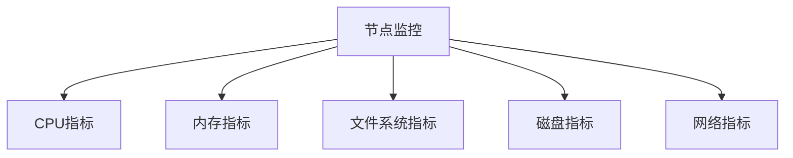

# 节点监控指标

> 在性能测试中，全面监控压测节点和被压节点的资源使用情况至关重要。这不仅能帮助您准确识别系统瓶颈，优化资源配置，还能提高测试结果的可信度。通过本指南，您将掌握AngusTester提供的核心监控指标及其应用场景。

## CPU 指标

评估系统CPU使用情况，识别计算瓶颈和优化资源分配。

| 指标名称       | 参数名称 | 描述                         | 关键作用                  | 计算公式                   |
| -------------- | -------- | ---------------------------- | ------------------------- | -------------------------- |
| **空闲率**     | `idle`   | CPU空闲时间百分比            | 反映CPU闲置程度           | (空闲时间/总时间)×100%     |
| **系统使用率** | `sys`    | CPU处理系统任务的时间百分比  | 评估操作系统开销          | (系统时间/总时间)×100%     |
| **用户使用率** | `user`   | CPU处理用户进程的时间百分比  | 评估应用程序CPU占用       | (用户时间/总时间)×100%     |
| **等待率**     | `wait_`  | CPU等待I/O操作的时间百分比   | 识别I/O瓶颈               | (等待时间/总时间)×100%     |
| **其他使用率** | `other`  | CPU处理其他任务的时间百分比  | 评估额外CPU开销           | (其他时间/总时间)×100%     |
| **总使用率**   | `total`  | CPU总体使用率                | 评估整体CPU负载           | 100% - 空闲率              |

> 💡 **分析建议**：当用户使用率持续>70%时，表明应用程序可能成为性能瓶颈；等待率>20%提示需要检查I/O系统性能。

## 内存指标

评估系统内存使用情况，识别内存瓶颈和优化内存分配。

### 物理内存指标

| 指标名称             | 参数名称         | 描述                     | 关键作用               |
| -------------------- | ---------------- | ------------------------ | ---------------------- |
| **空闲内存**         | `free`           | 未使用的物理内存量       | 评估可用内存资源       |
| **已用内存**         | `used`           | 已使用的物理内存量       | 评估内存占用情况       |
| **空闲内存百分比**   | `freePercent`    | 空闲物理内存的百分比     | 快速判断内存充足度     |
| **已用内存百分比**   | `usedPercent`    | 已用物理内存的百分比     | 评估内存压力           |

### 虚拟内存（交换区）指标

| 指标名称         | 参数名称     | 描述                 | 关键作用               |
| ---------------- | ------------ | -------------------- | ---------------------- |
| **空闲交换区**   | `swapFree`   | 未使用的交换区大小   | 评估虚拟内存可用资源   |
| **已用交换区**   | `swapUsed`   | 已使用的交换区大小   | 评估虚拟内存使用情况   |

### 总内存（物理+虚拟）指标

| 指标名称               | 参数名称           | 描述                       | 关键作用                 |
| ---------------------- | ------------------ | -------------------------- | ------------------------ |
| **实际空闲内存**       | `actualFree`       | 物理+虚拟内存的总空闲量    | 评估整体可用内存         |
| **实际已用内存**       | `actualUsed`       | 物理+虚拟内存的总使用量    | 评估整体内存使用情况     |
| **实际空闲内存百分比** | `actualFreePercent`| 总空闲内存占比             | 快速判断整体内存充足度   |
| **实际已用内存百分比** | `actualUsedPercent`| 总已用内存占比             | 评估整体内存压力         |

> ⚠️ **关键阈值**：当物理内存使用率>80%且交换区使用持续增长时，表明存在内存瓶颈，需要优化或扩容。

## 文件系统指标

监控存储空间使用情况，规划容量和预防存储瓶颈。

| 指标名称       | 参数名称       | 描述                     | 关键作用                 | 计算公式                   |
| -------------- | -------------- | ------------------------ | ------------------------ | -------------------------- |
| **空闲空间**   | `free`         | 文件系统未使用空间       | 评估剩余存储容量         | -                          |
| **已用空间**   | `used`         | 文件系统已使用空间       | 评估存储使用情况         | -                          |
| **可用空间**   | `avail`        | 文件系统实际可用空间     | 评估实际可用存储容量     | -                          |
| **使用率**     | `usedPercent`  | 文件系统使用百分比       | 快速判断存储压力         | (已用空间/总空间)×100%     |

> 📌 **配置说明**：AngusTester默认监控代理程序所在文件设备。

## 磁盘 I/O 指标

评估存储设备性能，识别I/O瓶颈。

| 指标名称         | 参数名称         | 描述                 | 关键作用              | 计算公式                |
| ---------------- | ---------------- | -------------------- | --------------------- | ----------------------- |
| **总操作数**     | `total`          | 磁盘读写操作总数     | 评估整体I/O负载       | 读操作数+写操作数       |
| **读取速率**     | `readsRate`      | 每秒读取操作数       | 评估读取性能          | 读操作数/采样间隔       |
| **写入速率**     | `writesRate`     | 每秒写入操作数       | 评估写入性能          | 写操作数/采样间隔       |
| **读取字节速率** | `readBytesRate`  | 每秒读取字节数       | 评估读取吞吐量        | 读取字节数/采样间隔     |
| **写入字节速率** | `writeBytesRate` | 每秒写入字节数       | 评估写入吞吐量        | 写入字节数/采样间隔     |

> 💡 **性能分析**：当读取/写入速率接近磁盘最大IOPS时，表明磁盘可能成为性能瓶颈。

## 网络指标

评估网络性能和带宽使用情况，识别网络瓶颈。

| 指标名称         | 参数名称         | 描述                 | 关键作用              | 计算公式                    |
| ---------------- | ---------------- | -------------------- | --------------------- | --------------------------- |
| **接收字节数**   | `rxBytes`        | 网络接收总字节数     | 评估网络接收流量      | -                           |
| **接收字节速率** | `rxBytesRate`    | 每秒接收字节数       | 评估网络接收性能      | 接收字节变化量/采样间隔     |
| **接收错误数**   | `rxErrors`       | 网络接收错误总数     | 评估网络接收质量      | -                           |
| **发送字节数**   | `txBytes`        | 网络发送总字节数     | 评估网络发送流量      | -                           |
| **发送字节速率** | `txBytesRate`    | 每秒发送字节数       | 评估网络发送性能      | 发送字节变化量/采样间隔     |

## 最佳实践指南

1. **基准测试**：在正式压测前记录各指标基线值
2. **关联分析**：当CPU等待率升高时，同步检查磁盘I/O指标
3. **预警设置**：
    - 内存使用率 > 80%
    - 磁盘使用率 > 85%
    - 网络错误率 > 0.1%
4. **容量规划**：根据峰值资源使用预留30%余量
