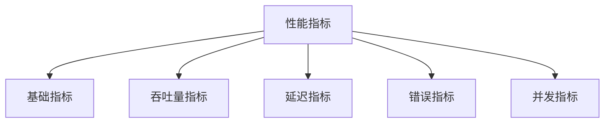

# 性能测试指标

> 深入理性能测试指标不仅能帮助您全面评估系统性能，还能为优化决策提供可靠依据。本指南将系统化介绍AngusTester的核心性能指标，帮助您快速掌握各项指标的意义和用法。

## 基础计数指标

量化测试过程的核心操作和数据流转，为性能分析提供基础依据。

| 指标名称 | 参数名称 | 描述 | 关键作用 | 计算逻辑 |
|---------|---------|------|---------|---------|
| **迭代次数** | `iterations` | 测试任务执行次数 | 衡量测试覆盖度 | 累加执行次数 |
| **采样数** | `n` | 有效数据采集点数量 | 评估数据有效性 | 统计有效采样点 |
| **操作次数** | `operations` | 执行的请求操作总数 | 评估系统处理能力 | 累计操作次数 |
| **事务数** | `transactions` | 完成的业务事务数量 | 评估业务处理能力 | 累计成功事务 |
| **读取字节数** | `readBytes` | 数据读取总量 | 评估网络/存储读取负载 | 累计读取字节 |
| **写入字节数** | `writeBytes` | 数据写入总量 | 评估网络/存储写入负载 | 累计写入字节 |

> 💡 **应用建议**：基础指标需结合时间维度分析才能体现性能特征

## 吞吐量指标

反映系统在单位时间内处理能力的关键指标。

### 请求吞吐量

| 指标名称 | 参数名称 | 描述 | 关键作用 | 计算公式 |
|---------|---------|------|---------|----------|
| **每秒操作数** | `ops` | 每秒处理的请求数 | 评估系统处理能力 | 操作次数/测试时长 |
| **每秒事务数** | `tps` | 每秒完成的事务数 | 评估业务处理能力 | 事务数/测试时长 |

> 💡 **重要提示**：单接口测试场景时QPS测试结果和TPS值相等。

### 网络吞吐量

| 指标名称 | 参数名称 | 描述 | 关键作用 | 计算公式 |
|---------|---------|------|---------|----------|
| **每秒读取字节数** | `brps` | 每秒数据读取量 | 评估网络接收能力 | 读取字节数/测试时长 |
| **每秒写入字节数** | `bwps` | 每秒数据写入量 | 评估网络发送能力 | 写入字节数/测试时长 |

> ⚠️ **关键阈值**：当吞吐量达到系统理论峰值的80%时，表明可能接近性能瓶颈

## 延迟指标

衡量系统响应速度的核心指标，直接影响用户体验。

| 指标名称 | 参数名称 | 描述 | 关键作用 | 计算逻辑 |
|---------|---------|------|---------|---------|
| **平均响应时间** | `tranMean` | 平均事务响应时间 | 反映系统整体性能 | 响应时间总和/事务数 |
| **最小响应时间** | `tranMin` | 最佳响应时间 | 展示最优性能表现 | 取最小值 |
| **最大响应时间** | `tranMax` | 最差响应时间 | 暴露性能瓶颈点 | 取最大值 |
| **P50响应时间** | `tranP50` | 50%请求的响应时间 | 反映典型响应性能 | 排序后50%位置 |
| **P75响应时间** | `tranP75` | 75%请求的响应时间 | 反映良好性能表现 | 排序后75%位置 |
| **P90响应时间** | `tranP90` | 90%请求的响应时间 | 评估高质量性能 | 排序后90%位置 |
| **P95响应时间** | `tranP95` | 95%请求的响应时间 | 评估高服务水平 | 排序后95%位置 |
| **P99响应时间** | `tranP99` | 99%请求的响应时间 | 评估极端情况性能 | 排序后99%位置 |
| **P999响应时间** | `tranP999` | 99.9%请求的响应时间 | 评估极限性能 | 排序后99.9%位置 |

## 错误指标

评估系统稳定性和可靠性的核心指标。

| 指标名称 | 参数名称 | 描述 | 关键作用 | 计算公式 |
|---------|---------|------|---------|----------|
| **错误数** | `errors` | 错误发生次数 | 评估系统稳定性 | 累加错误数 |
| **错误率** | `errorRate` | 错误发生比例 | 评估系统可靠性 | (错误数/操作数)×100% |
| **错误原因分布** | `errorCauseCounter` | 错误类型分布 | 诊断问题根源 | 按错误类型分组统计 |

> 🔍 **诊断建议**：错误类型中连接超时和5xx错误需要优先处理

## 线程(并发)指标

反映系统并发处理能力和资源利用效率。

| 指标名称 | 参数名称 | 描述 | 关键作用 | 状态说明 |
|---------|---------|------|---------|---------|
| **线程池大小** | `threadPoolSize` | 当前线程池容量 | 评估系统并发容量 | - |
| **活跃线程数** | `threadPoolActiveSize` | 正在工作的线程数 | 评估资源利用率 | - |
| **最大线程池容量** | `threadMaxPoolSize` | 最大线程支持数 | 评估系统扩展上限 | - |
| **运行中线程状态** | `threadRunning` | 线程是否运行 | 监控线程状态 | true=运行中 |
| **线程终止状态** | `threadTerminated` | 线程是否终止 | 监控线程状态 | true=已终止 |

## 时间标记字段

| 字段名称 | 参数名称 | 描述 |
|---------|---------|------|
| **服务器时间戳** | `timestamp` | 服务器记录时间 |
| **运行器时间戳** | `timestamp0` | 采样任务记录时间 |
| **采样任务名称** | `name` | 采样任务标识 |
| **测试时长** | `duration` | 总体执行时间 |
| **采样时长** | `duration0` | 单次采样时间 |
| **开始时间** | `startTime` | 测试启动时间点 |
| **结束时间** | `endTime` | 测试结束时间点 |

## 关键注意事项

1. **指标关联性**：延迟升高时需同步检查错误率和吞吐量变化
2. **环境因素**：
    - 网络延迟对响应时间有直接影响
    - 测试数据规模影响吞吐量表现
3. **场景差异化**：
    - 电商系统需重点关注P99延迟
    - 金融系统需确保0错误率
4. **监控策略**：
    - 建立性能基线作为对比参考
    - 设置阈值自动报警（如错误率>0.5%）
5. **趋势分析**：环比历史数据识别性能退化情况
