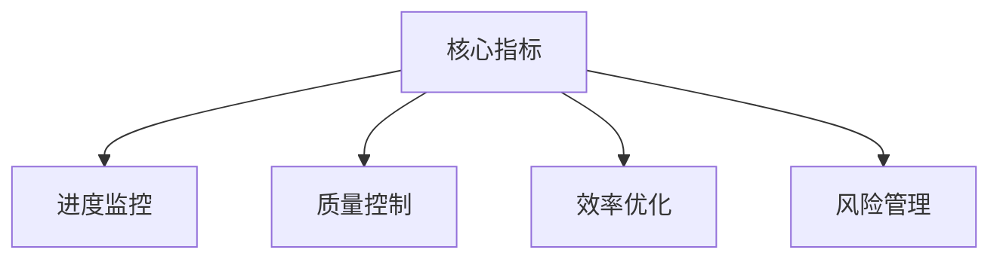

# 测试管理指标指南

> - AngusTester测试管理的关键指标，帮助团队**量化测试效能、提升软件质量、优化测试流程**。
> - 基于数据驱动决策，实现测试过程的可预测、可衡量、可优化。

点击查看 [测试指标功能介绍](../ui/function/analysisManagement)

## 核心价值
- **质量可视化**：实时掌握缺陷分布与修复进度
- **资源优化**：精准分配测试人力与时间
- **效能提升**：缩短测试周期，提高测试效率
- **风险控制**：提前识别质量风险与进度偏差

## 进度指标
> 💡 **测试进展的量化视图**

| 指标             | 描述                                         | 参数名称              | 计算公式                     |
|------------------|----------------------------------------------|-----------------------|------------------------------|
| 总用例数         | 项目/测试计划中所有测试用例的数量            | totalNum              | N/A                          |
| 完成用例数       | 已执行完成的测试用例数量                     | completedNum          | N/A                          |
| 完成用例占比     | 已完成测试用例占总用例的比例                 | completedRate         | (完成用例数/总用例数)×100%   |
| 总工作量         | 测试活动预估的总工作量（工时/故事点）        | evalWorkload          | N/A                          |
| 完成工作量       | 已投入的实际测试工作量                       | completedWorkload     | N/A                          |
| 完成工作量占比   | 已完成工作量占总工作量的比例                 | completedWorkloadRate | (完成工作量/总工作量)×100%   |

## 燃尽图指标
> 💡 **测试进展的可视化工具**

### 用例数燃尽指标
| 指标       | 描述                     | 参数名称 | 计算公式              |
|------------|--------------------------|----------|-----------------------|
| 总用例数   | 项目/计划中所有用例总数  | total    | N/A                   |
| 完成用例数 | 已经完成的用例数量       | completed| N/A                   |
| 剩余用例数 | 尚未完成的用例数量       | remained | 总用例数-完成用例数   |

### 用例工作量燃尽指标
| 指标       | 描述                         | 参数名称 | 计算公式              |
|------------|------------------------------|----------|-----------------------|
| 总工作量   | 完成所有用例预计需要的工作量 | total    | N/A                   |
| 完成工作量 | 已完成用例所耗费的实际工作量 | completed| N/A                   |
| 剩余工作量 | 完成剩余用例预计需要的工作量 | remained | 总工作量-完成工作量   |

## 工作量指标
> 💡 **测试效能的核心度量**

| 指标           | 描述                                         | 参数名称              | 计算公式                         |
|----------------|----------------------------------------------|-----------------------|----------------------------------|
| 评估工作量     | 用例开始时预估的工作量                       | evalWorkload          | N/A                              |
| 实际工作量     | 用例执行过程中实际花费的工作量               | actualWorkload        | N/A                              |
| 完成工作量     | 已完成用例的实际工作量                       | completedWorkload     | N/A                              |
| 工作量完成率   | 已完成工作量占评估工作量的比例               | completedWorkloadRate | (完成工作量/评估工作量)×100%     |
| 节省工作量     | 评估工作量与实际工作量的差值（正值表示节省） | savingWorkload        | 评估工作量-实际工作量            |
| 工作量节省率   | 节省工作量占评估工作量的比例                 | savingWorkloadRate    | (节省工作量/评估工作量)×100%     |

## 逾期评估指标
> 💡 **测试风险的预警系统**

| 指标                           | 描述                                                     | 参数名称                        | 计算公式                                     |
|--------------------------------|----------------------------------------------------------|---------------------------------|----------------------------------------------|
| 逾期风险等级                   | 基于进度评估的逾期可能性                                 | riskLevel                       | 综合评估                                     |
| 总用例数                       | 项目/计划中所有用例总数                                  | totalNum                        | N/A                                          |
| 工作量                         | 完成所有用例估计的总工作量                               | totalWorkload                   | N/A                                          |
| 逾期数                         | 超过预定完成时间的用例数量                               | overdueNum                      | N/A                                          |
| 逾期率                         | 逾期用例占总用例的比例                                   | overdueRate                     | (逾期数/总用例数)×100%                       |
| 逾期工作量                     | 逾期用例对应的工作量总和                                 | overdueWorkload                 | 逾期用例工作量总和                           |
| 工作量逾期率                   | 逾期工作量占总工作量的比例                               | overdueWorkloadRate             | (逾期工作量/总工作量)×100%                   |
| 每天平均处理工作量             | 团队每日完成的平均工作量                                 | dailyProcessedWorkload          | 总完成工作量/工作天数                        |
| 逾期时长(小时)                 | 所有逾期用例的累计逾期时间                               | overdueTime                     | 逾期时间总和                                 |
| 逾期工作量预计处理时长(小时)   | 处理所有逾期工作量预计需要的时间                         | overdueWorkloadProcessingTime   | 逾期工作量/每天平均处理工作量                |

**逾期风险等级标准**：
- 🟢 无风险：无逾期用例
- 🟡 低风险：逾期工作量≤3天
- 🔴 高风险：逾期工作量>3天

## 提交缺陷指标
> 💡 **软件质量的核心度量**

| 指标               | 描述                                     | 参数名称                | 计算公式                          |
|--------------------|------------------------------------------|-------------------------|-----------------------------------|
| 总缺陷数           | 测试过程中发现的所有缺陷数量             | bugNum                  | N/A                               |
| 缺陷率             | 缺陷类型任务占总任务的规模               | bugRate                 | 总缺陷数/总任务数                 |
| 有效缺陷数         | 被确认为真实问题的缺陷数量               | validBugNum             | N/A                               |
| 缺陷有效率         | 有效缺陷在总缺陷中的占比                 | validBugRate            | (有效缺陷数/总缺陷数)×100%        |
| 缺陷一次性通过数   | 首次修复后通过验证的缺陷数量             | oneTimePassedBugNum     | N/A                               |
| 缺陷一次性通过率   | 一次性通过缺陷占通过缺陷的比例           | oneTimePassedBugRate    | (缺陷一次性通过数/通过总缺陷数)×100% |
| 测试命中数         | 测试用例中实际触发缺陷的数量             | -                       | N/A                               |
| 测试命中率         | 测试用例中触发缺陷的比例                 | -                       | 测试命中数/总用例数×100%          |

**缺陷等级标准**：
- ⚠️ 致命：系统崩溃/核心功能失效
- 🔥 严重：重要功能失效，需优先处理
- ⚙️ 一般：功能缺陷但不影响主流程
- 📝 轻微：拼写错误等低优先级问题

以下是根据要求优化后的测试管理指标文档，已进行用户视角优化、逻辑结构调整、错误修正和美观性设计：

## 测试效率分析
> 💡 **评估测试执行效率与软件稳定性**，帮助团队了解测试有效性。

| 指标             | 描述                                 | 参数名称              | 计算公式                             |
|------------------|--------------------------------------|----------------------|--------------------------------------|
| 总用例数         | 项目或测试计划中所有测试用例的数量   | `totalNum`           | N/A                                  |
| 通过用例数       | 执行后成功通过的测试用例数量         | `passedTestNum`      | N/A                                  |
| 通过率           | 通过的测试用例占总用例的比例         | `passedTestRate`     | (通过用例数 / 总用例数) × 100%       |
| 一次性通过数     | 首次执行就通过的测试用例数量         | `oneTimePassedNum`   | N/A                                  |
| 一次性通过率     | 一次性通过的用例占总用例的比例       | `oneTimePassedRate`  | (一次性通过数 / 总用例数) × 100%     |
| 两次性通过数     | 经过一次修复后通过的测试用例数量     | `twoTimePassedNum`   | N/A                                  |
| 两次性通过率     | 两次性通过的用例占总用例的比例       | `twoTimePassedRate`  | (两次性通过数 / 总用例数) × 100%     |
| 一次性未通过数   | 首次执行未通过的测试用例数量         | `oneTimeNotPassedNum`| 通过用例数 - 一次性通过数            |
| 一次性未通过率   | 一次性未通过的用例占总用例的比例     | `oneTimeNotPassedRate`| (一次性未通过数 / 总用例数) × 100%  |

## 核心KPI指标
> 💡 **评估团队工作效率与质量的关键指标**，助力数据驱动决策。

| 指标             | 描述                                 | 参数名称                 | 计算公式                       |
|------------------|--------------------------------------|-------------------------|-------------------------------|
| 总用例数         | 项目或测试计划中所有测试用例的数量   | `totalNum`              | N/A                           |
| 完成用例数       | 已完成的测试用例数量                 | `completedNum`          | N/A                           |
| 完成率           | 已完成测试用例占总用例的比例         | `completedRate`         | (完成用例数 / 总用例数) × 100%|
| 总工作量         | 测试活动预估的总工作量               | `evalWorkload`          | N/A                           |
| 完成工作量       | 已投入的实际测试工作量               | `completedWorkload`     | N/A                           |
| 工作量完成率     | 已完成工作量占总工作量的比例         | `completedWorkloadRate` | (完成工作量 / 总工作量) × 100%|
| 总逾期数         | 超出计划完成时间的测试用例数量       | `overdueNum`            | N/A                           |
| 逾期率           | 逾期用例占总用例的比例               | `overdueRate`           | (总逾期数 / 总用例数) × 100%  |
| 完成逾期数       | 已完成的逾期用例数量                 | `completedOverdueNum`   | N/A                           |
| 逾期完成率       | 已完成的逾期用例占总逾期用例的比例   | `completedOverdueRate`  | (完成逾期数 / 总逾期数) × 100%|
| 总评审数         | 需要进行评审的用例数量               | `reviewNum`             | N/A                           |
| 评审率           | 需评审用例占总用例的比例             | `reviewRate`            | (总评审数 / 总用例数) × 100%  |
| 通过评审数       | 通过评审的用例数量                   | `completedReviewNum`    | N/A                           |
| 评审通过率       | 通过评审的用例占总评审用例的比例     | `completedReviewRate`   | (通过评审数 / 总评审数) × 100%|

## 评审效率指标
> 💡 **评估测试用例质量与评审效率**，提升用例开发质量。

| 指标             | 描述                                 | 参数名称                     | 计算公式                           |
|------------------|--------------------------------------|-----------------------------|-----------------------------------|
| 总用例数         | 提交或开启评审的测试用例总数         | `totalNum`                  | N/A                               |
| 通过用例数       | 经评审后被认可的测试用例数量         | `passedReviewNum`           | N/A                               |
| 通过率           | 通过评审的用例占总用例的比例         | `passedReviewRate`          | (通过用例数 / 总用例数) × 100%   |
| 一次性通过数     | 首次评审就通过的测试用例数量         | `oneTimePassedReviewNum`    | N/A                               |
| 一次性通过率     | 一次性通过的用例占总用例的比例       | `oneTimePassedReviewRate`   | (一次性通过数 / 总用例数) × 100% |
| 两次性通过数     | 经过一次修改后通过评审的用例数量     | `twoTimePassedReviewNum`    | N/A                               |
| 两次性通过率     | 两次评审通过的用例占总用例的比例     | `twoTimePassedReviewRate`   | (两次性通过数 / 总用例数) × 100% |

## 积压用例指标
> 💡 **管理测试积压工作与资源分配**，优化处理效率。

| 指标               | 描述                               | 参数名称                  | 计算公式                              |
|--------------------|------------------------------------|--------------------------|---------------------------------------|
| 总用例数           | 项目或测试计划中所有测试用例的数量 | `totalNum`               | N/A                                   |
| 总工作量           | 执行所有测试用例的预估总工作量     | `totalWorkload`          | N/A                                   |
| 每天平均处理用例数 | 团队每天能处理的平均用例数量       | `dailyProcessedNum`      | 过去N天完成用例数 / 工作天数          |
| 每天平均处理工作量 | 团队每天能处理的平均工作量         | `dailyProcessedWorkload` | 过去N天完成工作量 / 工作天数          |
| 积压用例数         | 未开始或未完成的测试用例数量       | `backloggedNum`          | 总用例数 - 已完成用例数               |
| 积压率             | 积压用例占总用例的比例             | `backloggedRate`         | (积压用例数 / 总用例数) × 100%        |
| 积压工作量         | 积压用例对应的预估工作量           | `backloggedWorkload`     | 总工作量 - 已完成工作量               |
| 工作量积压率       | 积压工作量占总工作量的比例         | `backloggedWorkloadRate` | (积压工作量 / 总工作量) × 100%       |
| 预计耗时（小时）   | 处理完积压用例的预估时间           | `backloggedCompletionTime`| 积压工作量 / 每天平均处理工作量       |

## 近期交付量指标
> 💡 **评估项目交付效率与资源利用率**，优化交付流程。

| 指标               | 描述                             | 参数名称                | 计算公式                               |
|--------------------|----------------------------------|------------------------|---------------------------------------|
| 总用例数           | 项目中所有测试用例数量           | `totalNum`             | N/A                                   |
| 交付数             | 已交付的用例数量                 | `completedNum`         | N/A                                   |
| 交付率             | 已交付用例占总用例的比例         | `completedRate`        | (交付数 / 总用例数) × 100%            |
| 总工作量           | 所有用例预估总工作量             | `totalWorkload`        | N/A                                   |
| 总交付工作量       | 已交付用例的实际工作量           | `completedWorkload`    | N/A                                   |
| 总交付工作量占比   | 交付工作量占总工作量的比例       | `completedWorkloadRate`| (总交付工作量 / 总工作量) × 100%      |
| 总节省工作量       | 预估与实耗工作量的差值           | `savingWorkload`       | 预估工作量 - 总交付工作量             |
| 总节省工作量占比   | 节省工作量占总工作量的比例       | `savingWorkloadRate`   | (总节省工作量 / 总工作量) × 100%      |
| 总逾期数           | 超过预定完成时间的用例总数       | `totalOverdueNum`      | N/A                                   |
| 交付逾期数         | 已交付但逾期的用例数量           | `overdueNum`           | N/A                                   |
| 交付逾期率         | 逾期交付用例占总交付用例的比例   | `overdueRate`          | (交付逾期数 / 交付数) × 100%          |
| 交付逾期工作量     | 逾期交付用例的实际工作量         | `overdueWorkload`      | N/A                                   |
| 交付逾期工作量占比 | 逾期工作量占总交付工作量的比例   | `overdueWorkloadRate`  | (交付逾期工作量 / 总交付工作量) × 100%|

## 交付周期指标
> 💡 **分析用例处理效率与时间分布**，识别效率瓶颈。

| 指标             | 描述                           | 参数名称               | 计算公式                     |
|------------------|--------------------------------|-----------------------|-----------------------------|
| 总处理时长       | 所有已完成用例的总处理时间     | `totalProcessingTime`| 所有用例处理时间之和        |
| 每人平均处理时长 | 团队成员的平均用例处理时间     | `userAvgProcessingTime`| 总处理时长 / 团队成员数     |
| 平均处理时长     | 所有用例的平均完成时间         | `avgProcessingTime`  | 总处理时长 / 完成用例数     |
| 最小处理时长     | 完成最快的用例所用时间         | `minProcessingTime`  | N/A                         |
| 最大处理时长     | 完成最慢的用例所用时间         | `maxProcessingTime`  | N/A                         |
| P50 (中位数)     | 50%用例的完成时间              | `p50ProcessingTime`  | 处理时间排序后的中间值      |
| P75              | 75%用例的完成时间              | `p75ProcessingTime`  | 处理时间排序后的第75百分位  |
| P90              | 90%用例的完成时间              | `p90ProcessingTime`  | 处理时间排序后的第90百分位  |
| P95              | 95%用例的完成时间              | `p95ProcessingTime`  | 处理时间排序后的第95百分位  |
| P99              | 99%用例的完成时间              | `p99ProcessingTime`  | 处理时间排序后的第99百分位  |

## 计划外工作指标
> 💡 **监控未预期工作对项目的影响**，优化预测准确性。

| 指标                 | 描述                               | 参数名称                         | 计算公式                                 |
|----------------------|------------------------------------|---------------------------------|-----------------------------------------|
| 总用例数             | 项目中所有测试用例数量             | `totalNum`                      | N/A                                     |
| 总工作量             | 所有用例预估总工作量               | `totalWorkload`                 | N/A                                     |
| 计划外用例数         | 未在原计划中包含的用例数量         | `unplannedNum`                  | N/A                                     |
| 计划外用例占比       | 计划外用例在总用例中的比例         | `unplannedRate`                 | (计划外用例数 / 总用例数) × 100%        |
| 计划外用例完成数     | 已完成的计划外用例数量             | `unplannedCompletedNum`         | N/A                                     |
| 计划外用例完成率     | 完成的计划外用例占比               | `unplannedCompletedRate`        | (计划外完成数 / 计划外用例数) × 100%    |
| 计划外工作量         | 计划外用例预估工作量               | `unplannedWorkload`             | N/A                                     |
| 计划外工作量占比     | 计划外工作量在总工作量中的比例     | `unplannedWorkloadRate`         | (计划外工作量 / 总工作量) × 100%        |
| 计划外完成工作量     | 已完成的计划外用例实际工作量       | `unplannedWorkloadCompleted`    | N/A                                     |
| 计划外完成工作量占比 | 完成的计划外工作量占比             | `unplannedWorkloadCompletedRate`| (计划外完成工作量 / 计划外工作量) × 100%|
| 计划外用例预计耗时   | 完成计划外工作的预估时间           | `unplannedWorkloadProcessingTime`| 计划外工作量 / 团队日平均工作量         |

## 用例增长趋势
> 💡 **监控项目规模演变与工作负载分布**。

| 指标       | 描述                         | 参数名称   | 计算公式 |
|------------|------------------------------|-----------|----------|
| 总用例数   | 项目中所有测试用例数量       | `totalNum`| N/A      |

## 使用原则
1. **指导改进**：指标应用于优化流程，非单纯绩效考核
2. **质量平衡**：避免为提高数量指标牺牲测试质量
3. **项目适配**：结合项目特性解读指标数据
4. **关联分析**：关注指标间的相关性（如积压率与交付逾期率）
5. **透明文化**：鼓励团队诚实上报数据，建立开放沟通机制

> 通过科学分析这些指标，测试团队可精准定位效率瓶颈，优化资源分配，持续提升软件质量与交付效率。
