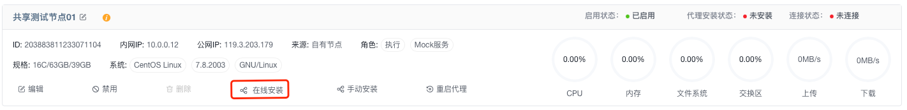

# AngusAgent 安装与配置指南

> AngusAgent **作为AngusTester分布式测试系统的核心组件**，提供三大核心能力：
> 1. **任务执行引擎**：启动并管理脚本执行任务。
> 2. **服务模拟平台**：运行和管理 Mock 服务。
> 3. **节点监控中心**：实时采集并上报节点资源指标。

## 一、前置要求

- 确保目标端口 `6807` 可用。
- 操作系统：支持 Linux / MacOS / Windows Server。
- Java环境：非容器方式安装时，确保已安装JDK17+以上版本。

## 二、在线安装（推荐）

1. 登录 AngusTester 控制台。
2. 进入：`配置 -> 节点 → 添加节点`。
3. 填写节点信息（IP/账号/密码）。
4. 点击 **"在线安装代理"** 按钮。



> ⚠️ **安装要求**：
> - 只允许系统管理员和AngusTester应用管理员配置安装。
> - 节点 SSH 端口开放（默认 22）。
> - 账户具备 sudo 权限。
> - 网络互通无防火墙阻隔。

> 🛠️ 安装失败处理：  
> 若在线安装失败，请使用下方脚本安装方式。

## 三、脚本安装

### Linux/MacOS 安装步骤

```bash
# 创建安装目录
mkdir -p /opt/AngusAgent && cd /opt/AngusAgent

# 获取并执行安装脚本（复制控制台生成的命令）
curl -s "https://bj-c1-prod-files.xcan.cloud/storage/pubapi/v1/file/install-agent.sh?fid=297761877096660998" | bash -s 1.0.0 299082246680215554 \ 
  'https://bj-c1-prod-apis.xcan.cloud/tester/openapi2p/v1/ctrl' \ 
  aWpbSRQ4OwXiOA1_8AJFVgQY8cDBkJUq4PSLwIb9D3lFoWJOR1hsFUG_EyhWUq5CNu-E7K1X29ZffzbhnVZylXTMFnFBMWKXX-EcMohOoMplWVbA78S0WayLuzsaPF6k \ 
  1 203883811233071104
```

## 四、手动配置安装

1. 运行下面命令或点击[下载安装包](https://nexus.xcan.cloud/repository/release/package/AngusAgent-Full-1.0.0.zip)
   ```bash
    curl -LO https://nexus.xcan.cloud/repository/release/package/AngusAgent-Full-1.0.0.zip
   ```
2. 下载安装包后，解压至目标目录（如 `/opt/AngusAgent`）
   ```bash
   # 解压安装包至目标目录
   mkdir -p /opt/AngusAgent
   unzip -qo AngusAgent-Full-1.0.0.zip -d /opt/AngusAgent

   # 进入到安装目录
   cd /opt/AngusAgent
   ```
3. 配置核心参数：
   ```properties
   # vi conf/agent.properties
   angusagent.principal.tenantId=您的租户ID
   angusagent.principal.deviceId=节点唯一ID
   
   # vi conf/remoting.properties
   remoting.ctrlUrlPrefix=控制器地址
   remoting.ctrlAccessToken=您的节点授权访问令牌
   ```
> **参数获取方式**：  
> 在`配置->节点`界面点击节点"安装配置信息"查看参数。
> 
4. 运行代理
   ```bash
   ./startup-agent.sh
   ```
::: tip 注意
默认提供的完整安装包中，包含下面组件：
- plugins（测试插件）
- AngusRunner（执行器）
- MockService（接口模拟服务）
- AngusAgent（节点代理）
- AngusProxy（请求代理）
:::
   
## 五、容器化部署

### Docker 快速启动

```bash
docker run -d \
  --name angus-agent \
  -p 6807:6807 \
  -e TENANT_ID=您的租户ID \
  -e DEVICE_ID=节点唯一ID \
  -e ACCESS_TOKEN=您的访问令牌 \
  anguscloud/angus-agent:1.0.0
```

### Docker Compose 配置启动

```bash
# 创建 Compose 文件
cat > agent.yaml<< EOF
version: '3'
services:
  angus-agent:
    image: anguscloud/angus-agent:1.0.0
    ports:
      - "6807:6807"
    environment:
      - TENANT_ID=您的租户ID
      - DEVICE_ID=节点唯一ID
      - ACCESS_TOKEN=您的访问令牌
    volumes:
      - ./config:/app/conf
EOF

# 启动 Agent
docker compose -f agent.yaml up -d
```

## 六、验证安装

### 健康检查
```bash
curl -i http://localhost:6807

# 预期响应：
HTTP/1.1 200 OK
Content-Type: application/json

{
  "app": "AngusAgent",
  "version": "1.0.0",
  "health": {"status": "UP"},  # 关键状态指标
  "principal": {
    "tenantId": "1",
    "deviceId": "205198142092607130"
  }
}
```

### 控制台验证
1. 访问 AngusTester 控制台。
2. 进入：`节点管理 → 节点列表`。
3. 检查目标节点状态：
    - ✅ **连接状态**：应为`已连接`。
    - ⏱️ **最后心跳**：2分钟内更新。

> ⏳ 状态同步延迟约 2 分钟，若长时间未连接请检查网络和配置。

## 七、服务管理

- Linux/MacOS
```bash
# 启动服务
./startup-agent.sh
# 停止服务
./shutdown-agent.sh
# 查看日志
tail -f logs/agent.log
```

- Docker 
```bash
# 启动服务
docker start angus-agent
# 停止服务
docker stop angus-agent
# 查看日志
docker logs angus-agent
```

- Docker Compose
```bash
# 启动服务
docker compose -f agent.yaml up -d
# 停止服务
docker compose -f agent.yaml stop
# 查看日志
docker compose -f agent.yaml logs
```

## 八、参数参考

- 代理服务配置(agent.properties)

```ini
#-----------------------------------------------------------------------------------
# AngusAgent 服务配置
#-----------------------------------------------------------------------------------
## 代理服务绑定的 IP 地址，默认 0.0.0.0 (监听所有网络接口)
angusagent.serverIp=0.0.0.0
## 代理服务绑定的端口号，默认 6807
angusagent.serverPort=6807
## 在 netty HTTP 服务器上启用 SSL 选项，默认 false
angusagent.useSsl=false
## 启用 netty 日志记录。建议仅在调试模式下开启，默认 false
angusagent.enableNettyLog=false
## 配置请求日志信息级别，包含四个选项：NONE, BASIC, HEADERS 和 FULL
### - NONE：不记录日志
### - BASIC：仅记录请求方法、URL、响应状态码和执行时间（默认值）
### - HEADERS：记录基本信息及请求/响应头信息
### - FULL：记录请求和响应的头信息、正文及元数据
angusagent.requestLogLevel=FULL
## 代理服务处理请求的线程名前缀，默认 AngusAgent-Thread
angusagent.threadNamePrefix=AngusAgent-Thread
#-----------------------------------------------------------------------------------
# AngusAgent 服务管理配置
#-----------------------------------------------------------------------------------
## 代理服务管理端点的基本路径，固定为 /actuator
#angusagent.management.endpointsBasePath=/actuator
## 允许代理服务管理端点跨域访问，默认 false
angusagent.management.endpointsAllowCors=false
#-----------------------------------------------------------------------------------
# 身份认证配置
#-----------------------------------------------------------------------------------
## 代理服务的租户ID，私有化部署环境需手动设置，默认为空
angusagent.principal.tenantId=
## 代理服务的设备(节点)ID，私有化部署环境需手动设置，默认为空
angusagent.principal.deviceId=
#-----------------------------------------------------------------------------------
# 数据推送配置
#-----------------------------------------------------------------------------------
# JVM 指标推送时间间隔，默认 15 秒
angusagent.jvmMetrics.pushIntervalInSecond=15
# 代理主机信息注册推送时间间隔，默认 300 秒
angusagent.nodeInfo.pushIntervalInSecond=300
# 代理主机使用情况注册推送时间间隔，默认 15 秒
angusagent.nodeUsage.pushIntervalInSecond=15
```

- 数据交换器配置(remoting.properties)

```ini
#-----------------------------------------------------------------------------------
# 远程客户端配置
#-----------------------------------------------------------------------------------
# 远程服务器主机地址，直接连接模式仅用于测试环境，默认为127.0.0.1:5035
remoting.serverHost=
# AngusTester控制器服务发现URL前缀。如果未配置或存在连接问题，将使用serverHost的值作为控制器连接地址
remoting.ctrlUrlPrefix=
## 配置访问AngusCtrl API所需的访问令牌，私有化部署环境需要手动启动此项配置，默认为空
remoting.ctrlAccessToken=
## 发送心跳消息的时间间隔（必须小于serverMaxAllowHeartbeat），默认10000毫秒
remoting.heartbeatInterval=10000
# 是否允许断开后重新连接，默认为true
remoting.allowReconnect=true
# 断开连接后的重连间隔
remoting.reconnectInterval=5000
#-----------------------------------------------------------------------------------
# 远程服务端与客户端通用配置
#-----------------------------------------------------------------------------------
# 发送同步消息的超时时间。超过此时限后，系统将停止等待响应消息，默认为60000毫秒
remoting.sendTimeout=60000
#-----------------------------------------------------------------------------------
```

