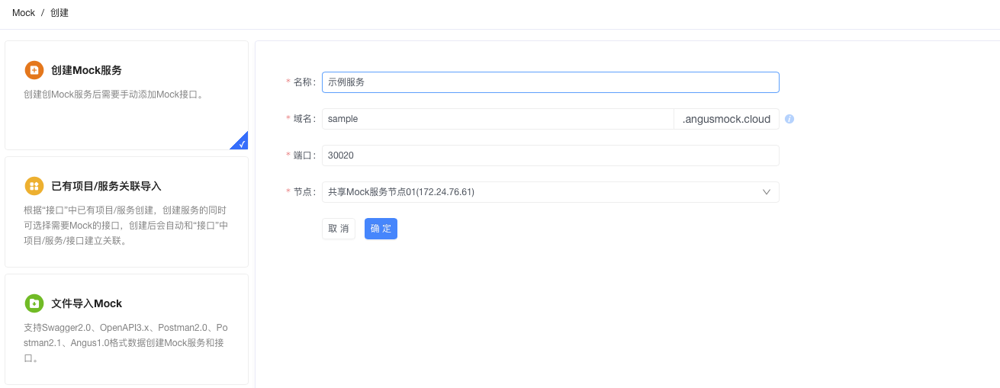
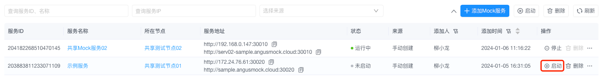

# 安装 AngusMockService

> AngusMockService **作为AngusTester测试系统的核心组件**，提供了一个虚拟测试环境，提供两大核心能力：
> 让您能够模拟不同的接口响应、状态码和数据，快速生成并模拟您所依赖的API，使开发和测试先行。
> 通过Mock服务和接口数据避免直接与生产系统联调造成的脏数据问题。

关于Mock服务更多介绍，请查看：[模拟服务](../mock/service.md) 。

## 一、安装

登录AngusTester应用后，在菜单`Mock`下找到**创建Mock服务**并完成创建，如下图：



创建完成Mock服务后，在服务列表找到新创建Mock服务并启动，系统会在第一次启动时自动在Mock节点安装服务。



## 二、验证

1. 启动完成后如果Mock服务状态为"运行中"表示服务已成功运行。
2. 也可以通过手动验证方式，在列表中复制**服务地址**，复制后访问服务地址，如果返回health状态为`UP`表示服务已成功运行。
    ```bash
    curl -i 'http://serv01-sample.angusmock.cloud:30010'
    HTTP/1.1 200 OK
    XC-Mock-ServiceId: 203883811233071109
    XC-Mock-RequestId: 99063eb8-6c77-4fdf-b6d7-97af3a88eda2
    Access-Control-Allow-Origin: *
    Access-Control-Allow-Credentials: true
    Access-Control-Allow-Methods: GET,POST,PUT,PATCH,DELETE,OPTIONS,HEAD
    Content-Type: application/json
    content-length: 1325
    
    {
      "app" : "AngusMockService",
      "version" : "1.0.0",
      "health" : {
        "status" : {
          "status" : "UP"
        }
      },
      "uptime" : "434691",
      "home" : "/opt/AngusAgent/",
      "principal" : {
        "angusmock.principal.deviceId" : "203883980884279296",
        "angusmock.principal.mockServiceId" : "203883811233071109",
        "angusmock.principal.tenantId" : "1"
      },
      "server" : {
        "port" : 30020,
        "ip" : "0.0.0.0"
      },
      "diskSpace" : {
        "total" : "63278391296",
        "used" : "4764565504"
      },
      "info" : {
        "id" : "203883811233071109",
        "name" : "示例服务",
        "nodeId" : "203883980884279296",
        "serviceDomainUrl" : "http://sample.angusmock.cloud:30020",
        "auth" : true,
        "apisCors" : {
          "allowCorsOrigin" : "*",
          "allowCorsCredentials" : true,
          "allowCorsRequestMethods" : "GET, POST, PUT, PATCH, DELETE, OPTIONS, HEAD",
          "enabled" : true
        },
        "setting" : {
          "useSsl" : false,
          "workThreadNum" : 256,
          "enableNettyLog" : false,
          "logFileLevel" : {
            "value" : "NONE",
            "message" : "None"
          },
          "sendRequestLog" : false,
          "maxContentLength" : 1048576000,
          "workPushbackThreadNum" : 8,
          "maxPushbackConnectTimeout" : 5000,
          "maxPushbackRequestTimeout" : -1
        }
      }
    }
    ```

## 三、配置服务

1. 通过Web界面方式修改配置：进入AngusTester应用`mock`菜单，点击服务名进入`设置`页面，根据文案提示完成修改。
2. 手动修改配置文件中默认配置：进入 AngusAgent 安装目录，在`conf`目录中找到`mockservice.properties`进行修改，配置参数查看下面`参数参考`说明。

## 四、参数参考

```properties
## Mock服务绑定的IP地址，默认0.0.0.0
angusmock.serverIp=0.0.0.0
## Mock服务绑定的端口号，默认30010
angusmock.serverPort=30010
## 在Netty HTTP服务器上启用SSL选项，默认false
angusmock.useSsl=false
## 处理请求的线程数，最大值10000，默认256
angusmock.workThreadNum=256
## Mock服务处理请求的线程前缀，默认AngusMock-Thread
angusmock.threadNamePrefix=AngusMock-Thread
## 启用Netty日志建议仅在调试模式下开启，默认false
angusmock.enableNettyLog=false
## 配置日志文件中请求信息的记录级别，包括四个选项：NONE、BASIC、HEADERS 和 FULL
### - NONE：不记录日志
### - BASIC：仅记录请求方法、URL以及响应状态码和执行时间（默认值）
### - HEADERS：记录基本信息及请求头和响应头
### - FULL：记录请求和响应的头部、正文和元数据
angusmock.logFileLevel=NONE
## 是否向服务器端发送模拟请求日志，默认true
angusmock.sendRequestLog=true
## 允许的最大请求大小，默认1000 * 1024 * 1024 (1000MB)
angusmock.maxContentLength=1048576000
## 处理回推请求的线程数，默认8
angusmock.pushbackThreadNum=8
## 最大回推连接超时时间（单位毫秒），默认5000
angusmock.maxPushbackConnectTimeout=5000
## 最大回推请求超时时间（单位毫秒），默认-1表示不超时
angusmock.maxPushbackReadTimeout=-1
## 启用Mock服务的CORS(跨域资源共享)配置，默认false。注意：服务端配置优先级高于属性文件配置
angusmock.allowCors=false
## Access-Control-Allow-Origin：指定允许参与跨域资源共享的网站，默认*
angusmock.allowCorsOrigin=*
## Access-Control-Allow-Credentials：指定第三方站点是否可执行特权操作及获取敏感信息，默认true
angusmock.allowCorsCredentials=true
## Access-Control-Allow-Headers：指定客户端允许使用的HTTP请求头，默认为空
angusmock.allowCorsRequestHeaders=*
## Access-Control-Allow-Methods：指定允许的HTTP方法，默认GET、POST、PUT、PATCH、DELETE、OPTIONS、HEAD
angusmock.allowCorsRequestMethods=GET,POST,PUT,PATCH,DELETE,OPTIONS,HEAD
## Access-Control-Expose-Headers：指定允许访问响应中非默认可访问头字段，默认空
angusmock.allowCorsExposeHeaders=*
#-----------------------------------------------------------------------------------
# Angus Mock服务管理配置
#-----------------------------------------------------------------------------------
## Mock服务管理端点的基本路径，固定为/actuator
# angusmock.management.endpointsBasePath=/actuator
## Mock服务管理端点允许跨域访问，默认true
angusmock.management.endpointsAllowCors=true
#-----------------------------------------------------------------------------------
# 主应用程序(AngusTester)访问配置
#-----------------------------------------------------------------------------------
## 配置AngusTester服务器URL用于查询模拟API信息
angusmock.angusTester.apisServerUrl=
## 配置访问主应用API所需的访问令牌，手动启动私有版本环境时需要提供，默认为空
angusmock.angusTester.accessToken=
#-----------------------------------------------------------------------------------
# 身份认证配置
#-----------------------------------------------------------------------------------
## Mock服务的租户ID，手动启动私有版本环境时需要提供，默认为空
angusmock.principal.tenantId=
## Mock服务ID，手动启动私有版本环境时需要提供，默认为空
angusmock.principal.mockServiceId=
## Mock服务的设备(节点)ID，手动启动私有版本环境时需要提供，默认为空
angusmock.principal.deviceId=
#-----------------------------------------------------------------------------------
# 推送器配置
#-----------------------------------------------------------------------------------
# 推送JVM指标的时间间隔，默认15秒
angusmock.jvmMetrics.pushIntervalInSecond=15
```

::: info 注意
> AngusMockService身份认证配置和AngusAgent需保持一致。  
> **参数获取方式**：在`配置->节点`界面点击节点"安装配置信息"查看参数。
:::