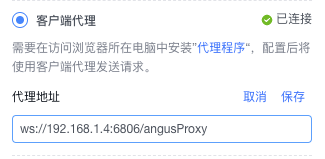

# 安装 AngusProxy

> AngusProxy **作为AngusTester请求代理程序**，提供两大核心能力：
> 1. **代理请求**：代理Http和WebSocket协议接口调试请求，解决浏览器跨域限制问题。
> 2. **请求插件化处理**：通过插件方式，对代理请求客户化处理支持，允许用户对代理请求进行二次处理，如：定制请求参数签名等。

::: tip 为了满足不同的使用环境场景，AngusTester提供了四种类型选择代理方式。
- **无代理**：通过浏览器直接请求接口，对非同源访问接口服务器端需要取消跨域限制。
- **客户端代理**：需要在访问浏览器所在用户电脑中安装`代理程序`，配置后将使用客户端代理发送请求。
- **服务端代理**：需要将`代理程序`单独安装在共享网络的服务器主机，使用服务端代理无需用户在各自电脑中安装代理程序，配置后将使用服务端代理发送请求，***推荐使用该方式***。
- **云代理**：通过AngusTester云服务版本代理请求接口，注意：不能访问到客户内网服务地址。
> 对于以上代理类型，您可以在调试接口右侧信息栏"接口代理"中根据使用场景自由选择。
:::

## 一、前置要求

- 确保目标端口 `6806` 可用。
- 操作系统：支持 Linux / MacOS / Windows Server。
- Java环境：非容器方式安装时，确保已安装JDK17+以上版本。

## 二、手动配置安装

1. 运行下面命令或点击[下载安装包](https://nexus.xcan.cloud/repository/release/package/AngusProxy-1.0.0.zip) 安装包。
   ```bash
    curl -LO https://nexus.xcan.cloud/repository/release/package/AngusProxy-1.0.0.zip
   ```
2. 下载安装包后，将安装包解压到指定目录（（如 `/opt/AngusProxy`）。
   ```bash
   # 解压安装包至目标目录
   mkdir -p /opt/AngusProxy
   unzip -qo AngusProxy-1.0.0.zip -d /opt/AngusProxy

   # 进入到安装目录
   cd /opt/AngusProxy
   ```
   > 注意：如果要修改代理地址或其他配置信息，请查看下面"配置参考"。
3. 运行请求代理
   ```bash
   ./startup-proxy.sh
   ```
   
## 三、容器化部署

### Docker快速启动

```bash
docker run -d \
  --name angus-proxy \
  -p 6806:6806 \
  anguscloud/angus-proxy:1.0.0
```

### Docker Compose配置启动

```bash
# 创建 Compose 文件
cat > proxy.yaml<< EOF
version: '3'
services:
  angus-proxy:
    image: anguscloud/angus-proxy:1.0.0
    ports:
      - "6806:6806"
    volumes:
      - ./config:/app/conf
EOF

# 启动 proxy
docker compose -f proxy.yaml up -d
```

## 四、验证安装

通过查看代理启动日志方式验证安装是否成功。

```bash
# 手动配置安装时
tail -f -n100 logs/proxy.log

# Docker安装
docker logs angus-proxy

# Docker Compose安装
docker compose -f proxy.yaml logs
```

输出日志如下，包含 `Start AngusProxy successfully` 字样则表示启动成功。

```txt
01/17 17:55:45.282 [main] INFO  Load target sample handler: cloud.xcan.angus.core.handler.HttpDynamicValueHandler
01/17 17:55:45.286 [main] INFO  Load target sample handler: cloud.xcan.angus.core.handler.HttpAssertionHandler
01/17 17:55:45.522 [nioEventLoopGroup-2-1] INFO  #############################################
 _  _ ___  __   __ _      __   __ _  ___ _  _  ____    ____ ____  __ _  _ _  _
( \/ ) __)/ _\ (  ( \___ / _\ (  ( \/ __) )( \/ ___)__(  _ (  _ \/  ( \/ | \/ )
 )  ( (__/    \/    (___)    \/    ( (_ ) \/ (\___ (___) __/)   (  O )  ( )  /
(_/\_)___)_/\_/\_)__)   \_/\_/\_)__)\___|____/(____/  (__) (__\_)\__(_/\_|__/

01/17 17:55:45.523 [nioEventLoopGroup-2-1] INFO  *** Start AngusProxy successfully and 0.0.0.0:6806 is ready [PID=70892] ***
01/17 17:55:45.525 [nioEventLoopGroup-2-1] INFO  *** Request proxy endpoint:   ws://192.168.1.4:6806/angusProxy  ***
```

## 五、配置使用代理

如果用户本地电脑安装的代理，在调试接口页面右侧信息栏`接口代理 -> 客户端代理`修改地址，配置如下图：



如果是在服务器上安装的代理，需要共享给租户下所有用户使用，在菜单`配置 -> 代理`中修改地址，配置如下图：


## 六、服务管理

- Linux/MacOS
```bash
# 启动服务
./startup-proxy.sh
# 停止服务
./shutdown-proxy.sh
# 查看日志
tail -f logs/proxy.log
```

- Docker
```bash
# 启动服务
docker start angus-proxy
# 停止服务
docker stop angus-proxy
# 查看日志
docker logs angus-proxy
```

- Docker Compose
```bash
# 启动服务
docker compose -f proxy.yaml up -d
# 停止服务
docker compose -f proxy.yaml stop
# 查看日志
docker compose -f proxy.yaml logs
```

## 七、配置参考

```properties
# 代理服务器绑定IP，默认为 0.0.0.0
angusproxy.serverIp=0.0.0.0
# 代理服务器绑定端口，默认为 6806
angusproxy.serverPort=6806
# 代理服务器代理端点，默认为 /angusProxy
angusproxy.wsPath=/angusProxy
## 在Netty HTTP服务器上启用SSL选项，默认为false
angusproxy.useSsl=false
## 启用Netty日志，建议仅在调试模式下打开，默认为false
angusproxy.enableNettyLog=false
# 允许的最大请求大小，默认为 1000 * 1024 * 1024（1000MB）
angusproxy.maxContentLength=1048576000
# 发送代理请求的HTTP客户端连接的最大数量，默认为 128
angusproxy.maxHttpConnectionNum=128
# 最大连接超时，单位为毫秒，默认为 5000
angusproxy.maxConnectTimeout=5000
# 最大请求超时时间，单位为毫秒，默认不超时
angusproxy.maxRequestTimeout=-1
# 最大读取超时时间，单位为毫秒，默认不超时
angusproxy.maxReadTimeout=-1
# 允许的最大HTTP重定向次数，默认为3
angusproxy.maxRedirects=3
# 代理服务器处理请求的线程前缀，默认为 AngusProxy-Threads
angusproxy.threadNamePrefix=AngusProxy-Thread
```