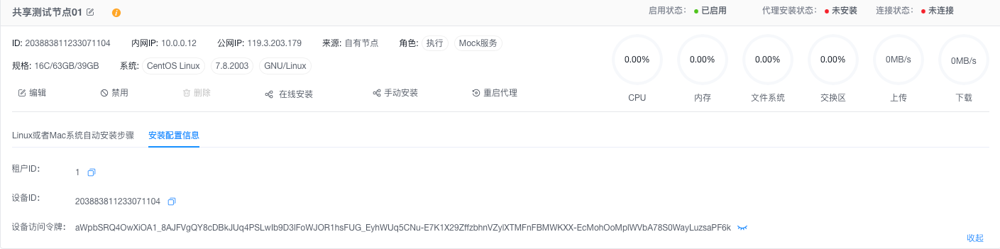

# 安装 AngusRunner

> AngusRunner **作为AngusTester分布式测试系统的任务执行器**，提供两大核心能力：
> 1. **执行远程任务**：执行控制器(AngusTester)下发给代理程序(AngusAgent)的运行测试和生成数据任务，并将测试结果发送到服务端。
> 2. **执行本地任务**：提供[AngusRunner命令行](../command/AngusRunner)方式运行本地模式(LOCAL)测试和生成数据任务，执行结果输出到控制台。

::: warning 注意
1. 默认安装 AngusAgent 时会自动包含 AngusRunner（执行器）
2. 仅需在以下场景独立安装 AngusRunner：
   - 在独立环境执行测试任务
   - 生成数据任务
:::

## 一、前置要求

- 操作系统：支持 Linux / MacOS / Windows Server。
- Java环境：非容器方式安装时，确保已安装JDK17+以上版本。

## 二、手动配置安装

1. 运行下面命令或点击[下载安装包](https://nexus.xcan.cloud/repository/release/package/AngusRunner-1.0.0.zip)
   ```bash
    curl -LO https://nexus.xcan.cloud/repository/release/package/AngusRunner-1.0.0.zip
   ```
2. 下载安装包后，解压至目标目录（如 `/opt/AngusRunner`）
   ```bash
   # 解压安装包至目标目录
   mkdir -p /opt/AngusRunner
   unzip -qo AngusRunner-1.0.0.zip -d /opt/AngusRunner

   # 进入到安装目录
   cd /opt/AngusRunner
   ```
3. 配置核心参数：
   ```properties
   # vi conf/runner.properties
   angusrunner.principal.tenantId=您的租户ID
   angusrunner.principal.deviceId=节点(设备)唯一ID
   angusrunner.principal.accessToken=您的用户访问令牌
   
   # vi conf/remoting.properties
   remoting.ctrlUrlPrefix=控制器地址
   remoting.ctrlAccessToken=您的节点(设备)授权访问令牌
   ```
> **参数获取方式**：  
> - 租户ID、节点唯一ID、节点授权访问令牌，在`配置->节点->安装配置信息`查看参数。
> 
> - 用户访问令牌，在AngusTester`个人中心->访问令牌`中查看或配置。

::: tip 注意
以上配置参数只有需要将测试结果上传到远程AngusTester服务器时需要配置，即运行AngusRunner命令行指定模式为`REMOTE`时。
:::

其他配置信息请查看下面"配置参考"说明。

## 三、运行

请查看：[AngusRunner命令行](../command/AngusRunner)。

## 四、配置参考

- 执行器配置(runner.properties)

```ini
#-----------------------------------------------------------------------------------
# AngusRunner 配置
#-----------------------------------------------------------------------------------
## 执行器线程前缀，默认值：AngusRunner-Thread。
angusrunner.threadNamePrefix=AngusRunner-Thread
#-----------------------------------------------------------------------------------
# 身份认证配置
#-----------------------------------------------------------------------------------
## 执行器所属租户ID，手动启动私有环境时必须提供，默认为空
angusrunner.principal.tenantId=
## 当前用户访问令牌，手动启动执行器时必须提供，默认为空
angusrunner.principal.accessToken=
## 设备（节点）ID，手动启动执行器时必须提供，默认为空
angusrunner.principal.deviceId=
#-----------------------------------------------------------------------------------
# 执行器运行配置
#-----------------------------------------------------------------------------------
## 执行器运行模式，包含两种选项：LOCAL（本地）和 REMOTE（远程）
### - LOCAL 模式：仅本地运行，测试结果与报告仅保存在本地
### - REMOTE 模式：测试结果与报告将同步至服务器，默认值：LOCAL
angusrunner.runner.runMode=LOCAL
#-----------------------------------------------------------------------------------
# 采样配置
#-----------------------------------------------------------------------------------
## 启用后，采样ID将写入HTTP请求头，默认启用
angusrunner.sampling.writeSampleIdToHeader=true
#-----------------------------------------------------------------------------------
# 推送器配置
#-----------------------------------------------------------------------------------
## 推送执行器JVM指标的时间间隔（单位：秒），默认15秒
angusrunner.jvmMetrics.pushIntervalInSecond=15
## 推送执行器任务注册信息的时间间隔（单位：秒），默认5秒
angusrunner.taskMetrics.pushIntervalInSecond=5
```

- 数据交换器配置(remoting.properties)

```ini
#-----------------------------------------------------------------------------------
# 远程客户端配置
#-----------------------------------------------------------------------------------
# 远程服务器主机地址，直接连接模式仅用于测试环境，默认为127.0.0.1:5035
remoting.serverHost=
# AngusTester控制器服务发现URL前缀。如果未配置或存在连接问题，将使用serverHost的值作为控制器连接地址
remoting.ctrlUrlPrefix=
## 配置访问AngusCtrl API所需的访问令牌，私有化部署环境需要手动启动此项配置，默认为空
remoting.ctrlAccessToken=
## 发送心跳消息的时间间隔（必须小于serverMaxAllowHeartbeat），默认10000毫秒
remoting.heartbeatInterval=10000
# 是否允许断开后重新连接，默认为true
remoting.allowReconnect=true
# 断开连接后的重连间隔
remoting.reconnectInterval=5000
#-----------------------------------------------------------------------------------
# 远程服务端与客户端通用配置
#-----------------------------------------------------------------------------------
# 发送同步消息的超时时间。超过此时限后，系统将停止等待响应消息，默认为60000毫秒
remoting.sendTimeout=60000
#-----------------------------------------------------------------------------------
```
