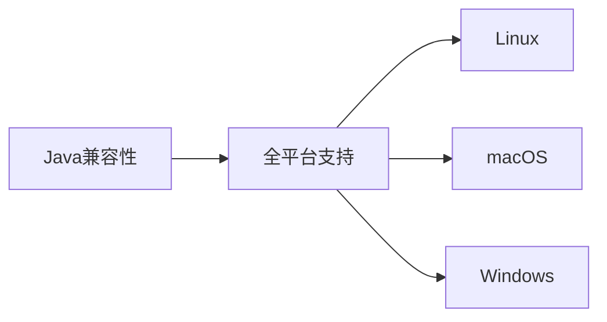
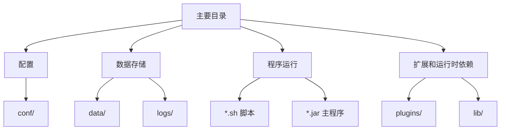

# 安装须知

## 环境要求

Angus 系列应用和服务支持跨平台部署，只需满足以下最低要求：

### Java 运行时环境

- **最低要求**：OpenJDK 17 或更高版本。
- **安装选项**：
  | 操作系统 | 官方下载链接 |
  |----------|--------------|
  | Linux | [openjdk-17 Linux x64](https://download.java.net/java/GA/jdk17.0.2/dfd4a8d0985749f896bed50d7138ee7f/8/GPL/openjdk-17.0.2_linux-x64_bin.tar.gz) |
  | macOS | [openjdk-17 macOS](https://download.java.net/java/GA/jdk17.0.2/dfd4a8d0985749f896bed50d7138ee7f/8/GPL/openjdk-17.0.2_macos-x64_bin.tar.gz) |
  | Windows | [openjdk-17 Windows](https://download.java.net/java/GA/jdk17.0.2/dfd4a8d0985749f896bed50d7138ee7f/8/GPL/openjdk-17.0.2_windows-x64_bin.zip) |

> 💡 **注意**：使用自动安装脚本或 Docker 时会自动配置 JDK 环境。  
> 🔗 [OpenJDK 官方下载](https://jdk.java.net/archive/)

### 操作系统


- **正式支持**：Linux · macOS · Windows。
- **理论兼容**：任何支持 Java 17+ 的操作系统。

## 安装包规范

Angus 系列应用遵循统一标准命名和结构规范，便于部署和维护。

### 命名规则
```
应用编码[-版本类型]-版本号[-full].zip
```

| 组件 | 说明 | 示例 |
|------|------|------|
| **应用编码** | 应用唯一标识 | `AngusTester` |
| **版本类型** | 社区版/企业版/数据中心版 | `Community` · `Enterprise` · `Datacenter` |
| **版本号** | 遵循[语义化版本 2.0](https://semver.org/lang/zh-CN/) | `1.0.0` · `2.3.1` |
| **完整包** | 包含所有依赖的完整包 | `-full` |

> **完整示例**：`AngusTester-Community-1.0.0-full.zip`

### 安装包结构

以 AngusTester 社区版为例：

```txt
AngusTester-Community-1.0.0/
├── 📁 conf/          # 所有配置文件
├── 📁 data/          # 应用数据（含执行任务日志）
├── 📁 lib/           # 依赖库
├── 📄 LICENSE        # 许可协议
├── 📁 logs/          # 主应用日志
├── 📁 plugins/       # 插件存储（商店插件时自动下载安装）
├── 📁 statics/       # Web静态资源
├── 📁 tmp/           # 临时文件（可清理）
├── 📄 README.md      # 应用说明文档
├── ⚙️ startup-tester.sh    # 启动脚本
├── ⚙️ shutdown-tester.sh    # 停止脚本
└── 🧩 AngusTester-Community-1.0.0.jar  # 主程序
```

### 主要目录说明

