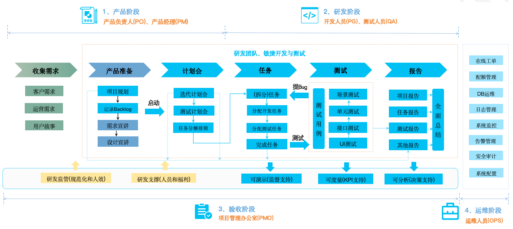
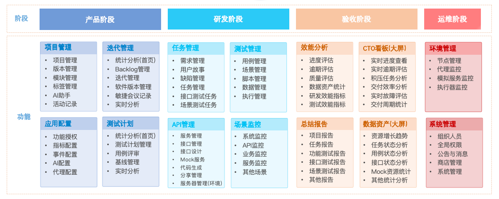

# AngusTester

**AngusTester** 是一个智能化软件研发管理与软件测试平台，可以帮助软件研发团队高效且可持续地开展软件开发与测试活动，同时可满足敏捷开发和敏捷测试的要求。

::: danger <el-icon><Promotion /></el-icon> 我们的目标
让软件交付效率提升200%！
:::

## 核心价值

AngusTester 帮助研发团队实现：
- 🚀 **敏捷响应**：适应需求快速变化
- 🧪 **质量前移**：测试左移提前发现缺陷
- 🤖 **智能辅助**：AI赋能研发与测试全流程
- 👥 **全员协同**：统一产品、开发、测试工作平台

## 用户群体

- 👔 产品经理：需求管理与进度跟踪
- 🧪 测试人员：用例设计与执行
- 💻 开发人员：接口测试与调试
- 🛠️ 运维人员：环境管理与监控
- 📊 管理者：质量数据与进度分析

## 工作流程

*图：从需求到交付的全流程协同机制*

## 功能模块

*图：功能模块关系与集成结构*

## 核心优势

### <el-icon><CollectionTag /></el-icon> 敏捷研发支持
- **需求动态管理**：适应频繁变更的需求环境
- **迭代加速**：缩短50%以上测试周期
- **持续反馈**：实时质量数据驱动开发决策

### <el-icon><CollectionTag /></el-icon> 全员协作平台
| 角色         | 核心使用场景               | 价值收益               |
|--------------|--------------------------|-----------------------|
| **产品经理** | 需求跟踪与进度管理         | 交付周期缩短30%        |
| **测试人员** | 用例设计与自动化执行       | 测试覆盖率提升90%      |
| **开发人员** | 接口调试与冒烟测试         | 缺陷减少60%            |
| **运维人员** | 环境配置与监控             | 部署效率提升70%        |
| **管理者**   | 质量数据与进度分析         | 决策准确率提升80%      |

### <el-icon><CollectionTag /></el-icon> 质量保障体系
- **缺陷预防**：通过接口测试提前发现70%以上缺陷
- **质量门禁**：自动化质量卡点确保发布标准
- **数据驱动**：测试报告指导质量改进方向

## 解决行业痛点

- **AngusTester 解决方案**
  - **测试左移**：<Badge type="warning">以测试为核心驱动</Badge>，提前发现系统交互问题
  - **持续反馈**：实时质量数据驱动开发过程
  - **质量内建**：测试融入研发全生命周期
  - **智能辅助**：降低测试技能门槛

- **传统研发模式面临挑战**
    ```mermaid
    journey
        title 传统研发流程痛点
        section 需求阶段
          需求变更频繁: 5: 产品经理
          初期定义困难: 5: 团队
        section 开发阶段
          测试滞后: 8: 质量团队
          缺陷修复成本高: 8: 开发团队
        section 交付阶段
          产品不符预期: 7: 客户
          交付周期长: 7: 业务方
    ```
