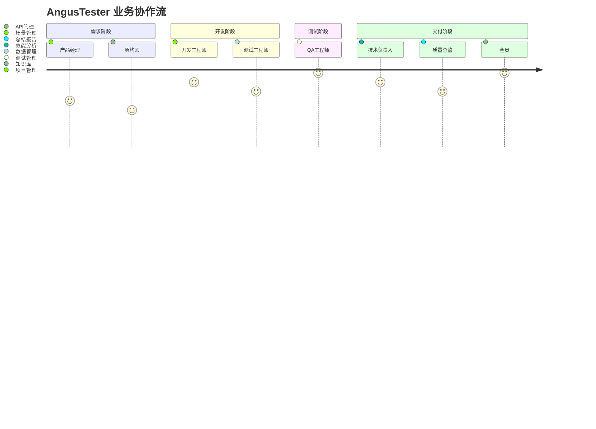

# AngusTester 业务与价值

## 核心业务

### 项目管理
> **敏捷协作引擎**  
> 支持Scrum等敏捷开发方法，提供：
> - 迭代规划与进度跟踪
> - 资源分配与风险评估
> - 实时协作看板
> - 交付质量保障机制

<el-icon><Position /></el-icon> **核心价值**：缩短30%交付周期，提升团队协作效率

### 测试管理
> **全栈质量保障**  
> 多维度测试策略：
> ```mermaid
> graph LR
>   A[功能测试] --> B[接口测试]
>   B --> C[性能测试]
>   C --> D[自动化测试]
>   D --> E[场景测试]
> ```
<el-icon><Position /></el-icon> **覆盖范围**：从单元到系统级的完整测试金字塔

### API管理
> **企业API资产中心**  
> 全生命周期管理：
> | 阶段       | 能力                |
> |------------|---------------------|
> | 设计       | OpenAPI规范支持     |
> | 开发       | 调试/Mock服务       |
> | 测试       | 自动化接口验证      |
> | 运维       | 监控/文档/SDK生成   |

<el-icon><Position /></el-icon> **核心价值**：提升API开发效率50%，降低集成成本

### 场景管理
> 可视化构建测试场景：
> - 多协议支持（HTTP/gRPC/WebSocket）
> - 异步流程测试
> - 数据一致性验证
> - 业务监控与告警

<el-icon><Position /></el-icon> **特色功能**：图形化编排复杂业务流，一键验证

### 数据管理
> 统一管理测试数据资产：
> - 变量池管理
> - 数据集版本控制
> - 数据源集成
> - 数据脱敏与生成

<el-icon><Position /></el-icon> **核心价值**：确保测试数据一致性，提升复用率80%

### 效能分析
> 实时可视化分析：
> - 项目进度热力图
> - 质量指标仪表盘
> - 资源利用率分析
> - 风险预警系统

<el-icon><Position /></el-icon> **输出价值**：量化研发效能，指导持续改进

### 总结报告
> 多维度交付物生成：
> - 测试执行报告
> - 质量评估报告
> - 效能分析报告
> - 改进建议报告

<el-icon><Position /></el-icon> **核心优势**：自动生成符合审计要求的专业报告

### 知识库
> 知识资产化管理：
> - 测试用例库
> - 解决方案库
> - 最佳实践库
> - 问题知识图谱

<el-icon><Position /></el-icon> **核心价值**：减少重复工作，加速新人培养

## 业务价值矩阵

| 业务模块 | 核心用户 | 关键指标提升 | 技术亮点 |
|----------|----------|--------------|----------|
| **项目管理** | 项目经理/Scrum Master | 交付周期↓30% | 敏捷看板/燃尽图 |
| **测试管理** | QA工程师/测试经理 | 缺陷逃逸率↓60% | 测试金字塔自动化 |
| **API管理** | 开发工程师/架构师 | 接口缺陷率↓70% | 智能Mock服务 |
| **场景管理** | 业务分析师/运维 | 场景覆盖率↑90% | 可视化编排引擎 |
| **数据管理** | 测试工程师/DBA | 数据准备时间↓80% | 智能数据工厂 |
| **效能分析** | 技术负责人/CTO | 资源利用率↑40% | 预测分析模型 |
| **总结报告** | 质量总监/客户 | 报告编制时间↓95% | 自动文档生成 |
| **知识库** | 全员 | 问题解决速度↑50% | 智能知识图谱 |

## 业务工作流


