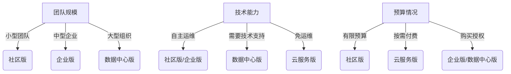

# AngusTester 版本选择指南

根据您的团队规模和使用需求，AngusTester 提供不同版本选择：

## 版本对比总览

| 特性 | 社区版 | 企业版 | 数据中心版               | 云服务版   |
|------|-------|-------|---------------------|--------|
| **定价模式** | 永久免费 | 按用户数收费 | 按用户数收费              | 按使用量付费 |
| **功能完整性** | 基础功能 | 完整功能 | 完整功能+               | 完整功能   |
| **用户规模** | 小型团队  (有限制) | 大中型企业  (有限制) | 大规模企业  (高支持)     | 弹性扩展   |
| **技术限制** | 用户数/并发数受限 | 用户数/并发数受限 | 无限制                 | 按使用量付费      |
| **额外服务** | - | - | 高可用/定制开发/上门支持/多租户支持 | 完全托管   |

## 版本选择建议

::: warning 注意
私有化时，`业务应用（AngusTester）`和`基础应用（AngusGM）`版本类型必须保持一致。
:::

## 版本详细介绍

### 社区版 (Community Edition)
> **适合**：预算有限的小型团队或个人开发者  
> **核心特点**：
> - 🆓 永久免费使用
> - ⚙️ 包含基础功能
> - 👥 支持有限用户数和并发数
> - 🏠 自主部署维护

**使用场景**：
- 初创团队试用
- 小型项目部署
- 开发测试环境

---

### 企业版 (Enterprise Edition)
> **适合**：稳定发展的中大型企业  
> **核心特点**：
> - 💳 按用户数量收费
> - ✅ 功能无限制
> - 📈 支持更大用户和并发规模
> - 🔧 自主部署维护

**使用场景**：
- 中型企业正式业务
- 需要完整功能的企业
- 有一定技术维护能力的团队

---

### 数据中心版 (DataCenter Edition)
> **适合**：对稳定性和服务有高要求的大型企业  
> **核心特点**：
> - 💳 按用户数量收费
> - 🚀 无功能和技术限制
> - 🌐 支持极高用户和并发数
> - 🛡️ 专业服务支持：
    >   - 高可用部署架构
>   - 平台集成与定制开发
>   - 专业上门维护
>   - 故障快速恢复
>   - 按需水平扩容
>   - 多租户支持

**使用场景**：
- 大型企业关键业务系统
- 高并发需求场景
- 需要专业技术支持的环境

---

### 云服务版 (CloudService Edition)
> **适合**：希望快速上线的各类团队  
> **核心特点**：
> - ☁️ 在线即开即用
> - 💰 按实际使用量付费
> - 🧩 功能无限制
> - 🚫 免基础设施维护
> - 📉 显著降低运维成本

**使用场景**：
- 快速启动项目
- 中小型业务团队
- 无专业技术运维团队的场景
- 测试和开发环境
