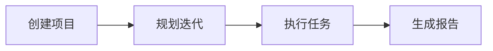

# AngusTester 核心应用场景

## 项目管理

> **集中化研发管理平台**  
> 项目作为基本管理单元，为团队提供：
> - 📋 统一计划跟踪
> - 📈 进度可视化
> - ✅ 成果验收控制

**关键操作流程**：
1. **项目创建**：建立研发管理单元
2. **迭代规划**：定义目标、负责人、时间线
3. **任务管理**：追踪开发、测试、需求工作项
4. **智能报告**：自动生成项目总结报告

<Vid src="/video/tester/introduction/project.mp4" />

## 任务协同

> **敏捷任务管理引擎**  
> 实现团队任务高效协作：
> - 👨‍💼 责任分明的工作分配
> - 🔄 实时协作与反馈
> - 📊 进度可视化监控

**核心能力**：
- 迭代排期与规划
- 跨团队任务分配
- 健康度实时分析
- 逾期风险预警

<Vid src="/video/tester/introduction/task.mp4" />

## 功能测试管理

> **全生命周期质量保障**  
> 建立用例库和测试保障机制：
> - 📝 用例设计与评审
> - 🔍 缺陷预防机制
> - 📉 质量趋势分析

**核心能力**：
- 确保测试用例100%覆盖需求文档中的所有功能点
- 端到端业务流程测试
- 自动化缺陷分类（功能/稳定性/性能）
- 测试用例版本管理和复用

<Vid src="/video/tester/introduction/case.mp4" />

## 接口测试管理

> **全栈API质量保障**  
> 企业级接口资产化管理：
> - 🧩 接口设计调试一体化
> - ⚙️ 自动化测试流水线
> - 📚 智能文档生成

**测试类型**：
| 测试类型 | 覆盖场景 | 技术特点 |
|---------|---------|----------|
| 功能测试 | 接口逻辑验证 | 参数校验/响应验证 |
| 性能测试 | 高并发场景 | 分布式压力测试 |
| 稳定性测试 | 长周期运行 | 故障注入测试 |

<Vid src="/video/tester/introduction/test.mp4" />

## 场景测试管理

> **复杂业务流验证平台**  
> 可视化编排多步骤业务流程：
> - 🧩 图形化场景构建
> - ⚡️ 一键脚本生成
> - 🚨 实时业务监控

**典型应用**：
1. 电商下单全流程
2. 支付网关验证
3. 多系统集成测试
4. 异步任务处理

<Vid src="/video/tester/introduction/scenarios.mp4" />

## 服务模拟平台

> **零侵入依赖解耦**  
> 生产级API模拟方案：
> - 🔧 动态响应配置
> - ⏱️ 网络延迟模拟
> - 🧪 异常场景构造

**核心功能**：

<Vid src="/video/tester/introduction/mock.mp4" />

## 业务全景看板

> **数据驱动决策中心**  
> 多维数据可视化平台：
> - **资产看板**：资源全景视图
> - **效能看板**：研发效率分析
> - **质量看板**：缺陷跟踪趋势

**核心指标**：
| 看板类型 | 关键指标 |
|---------|---------|
| 数据资产 | 接口数/用例数/脚本数 |
| 效能分析 | 任务完成率/缺陷修复时效 |
| 质量监控 | 缺陷密度/用例通过率 |

<Vid src="/video/tester/introduction/kanban.mp4" />

## 报告系统

> **自动化分析平台**  
> 一键生成5类专业报告：
> - 项目进度报告
> - 研发效能报告
> - 功能测试报告
> - 接口质量报告
> - 执行结果报告

**报告特点**：
- 多维度对比分析
- 可视化数据展示
- 可导出PDF格式
- 合规审计支持

<Vid src="/video/tester/introduction/report.mp4" />
