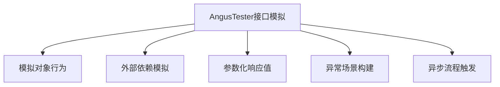

# 接口模拟

> 无需真实环境，快速构建全面的测试场景

## 什么是接口模拟？
当真实接口不可用时，AngusTester 的模拟接口功能可创建具有相同行为的虚拟接口，确保测试活动不受环境限制持续进行。您可：

✅ 模拟任何状态码响应  
✅ 自定义响应延时  
✅ 根据请求参数返回不同结果  
✅ 构建复杂的业务场景  
✅ 验证异步处理逻辑

## 核心能力详解



### 1. 行为模拟
创建虚拟对象替换真实依赖，隔离测试单元
- 模拟服务不可用状态
- 构建特定业务规则响应
- 复现边界条件场景

### 2. 依赖隔离
消除对外部系统的依赖风险
- 模拟第三方API响应
- 银行/支付网关隔离测试
- 外部认证服务虚拟化

### 3. 定制返回值
根据请求参数动态返回响应
```yaml
responses:
  - match:
      parameters:
        - name: userType
          expected: "vip"
    content:
      status: 200
      content: '{"level": "VIP", "discount": 0.8}'
```

### 4. 异常场景测试
构造各类错误条件验证系统健壮性
```yaml
content:
  status: 500
  delay:
    mode: RANDOM
    minRandomTime: 1s
    maxRandomTime: 5s
```

### 5. 异步流程验证
通过回调机制测试异步处理能力
```yaml
responses:
  - content:
      callbackUrl: http://your-system/notify
      callbackMethod: POST
```

## 模拟接口应用实例

### 基准性能测试模拟
```yaml:no-line-numbers
task:
  mockApis:
    - method: GET
      endpoint: /benchmark
      responses:
        - content:
            status: 200
            content: Success
```

### 业务延迟测试模拟
```yaml:no-line-numbers
responses:
  - match:
      parameters:
        - name: delay
          expected: "10"
    content:
      delay:
        mode: FIXED
        fixedTime: 10ms
      content: '{"msg": "10ms延迟响应"}'
```

### 用户登录业务模拟
```yaml:no-line-numbers
responses:
  - match:
      body: '{"username":"admin","password":"admin"}'
    content:
      status: 200
      content: '{"code":"S","token":"181622ea2a1f4934..."}'
  - content:
      status: 400
      content: '{"code":"E0","msg":"账号密码错误"}'
```

### 文件下载模拟
```yaml:no-line-numbers
responses:
  - content:
      status: 200
      headers:
        - name: Content-Type
          value: image/jpeg
      contentEncoding: gzip_base64
      content: <文件二进制内容>
```

## 配置流程


1. 进入 **「Mock」→「创建服务」**
2. 添加新接口或导入模拟脚本
3. 重新启动服务或刷新实例接口

