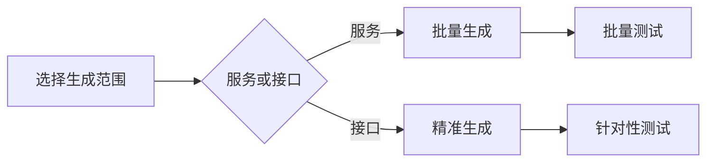

# 如何快速生成接口测试脚本

> 一键生成功能/性能/稳定性测试脚本，提升测试效率

## 生成前准备
✅ 确保接口已完成调试并通过验证  
✅ 确认服务或接口已正确配置

## 基于服务的批量生成
> **适用场景**：需要对整个服务的所有接口进行全面测试

1. **进入服务列表**
    - 导航至 **「接口」→「服务」**
    - 右键点击目标服务  
      

2. **配置测试参数**
    - 选择测试类型（功能/性能/稳定性）
    - 设置关键参数：
   

3. **确认生成**
    - 点击确认按钮执行生成
    - 系统自动为服务下所有接口创建脚本  
      

> ⚠️ 注意：此操作会生成该服务下所有接口的测试脚本

## 基于接口的精准生成
> **适用场景**：针对特定关键接口进行针对性测试

1. **定位目标接口**
    - 在服务详情页右侧接口列表中选中目标接口  
      

2. **定制测试参数**
    - 选择测试类型
    - 按需配置参数（同服务生成配置）  
      

3. **生成专属脚本**
    - 系统仅为选中的接口生成脚本  
      

## 关键参数说明

| 参数 | 功能 | 推荐值 |  
|------|------|--------|  
| 测试类型 | 功能/性能/稳定性测试 | 按需选择 |  
| 并发线程数 | 模拟用户并发量 | 5-50 |  
| 测试时长 | 持续测试时间 | 1-10min |  
| 循环次数 | 单接口重复测试次数 | 10-100 |  
