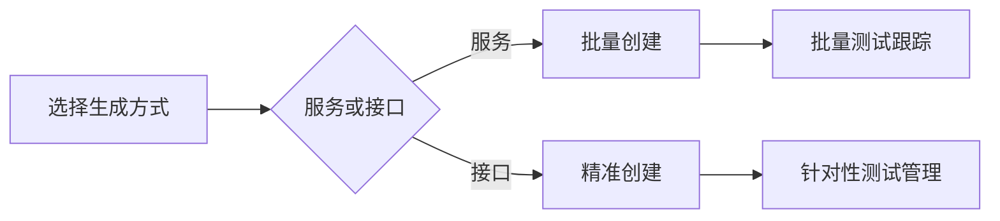

# 如何快速生成接口测试任务

> 一键创建功能/性能/稳定性测试任务，实现全流程跟踪管理



## 任务生成前准备
✅ 接口已完成测试脚本配置  
✅ 确定测试目标（功能/性能/稳定性）

## 服务级批量任务生成
> **适用场景**：对服务下所有接口进行统一测试管理

1. **进入服务列表**
    - 导航至 **「接口」→「服务」**
    - 右键点击目标服务选择 **「生成测试任务」**  
      

2. **配置任务参数**
    - 填写任务基本信息：
      ```txt
      任务名称: 服务API全面测试  
      任务类型: 性能测试  
      ```  
   

3. **自动生成任务**
    - 系统为服务下所有接口创建测试任务
    - 在任务列表查看并管理任务  
      

> 📌 注意：该操作会生成服务下所有接口的关联测试任务

## 接口级精准任务生成
> **适用场景**：针对特定关键接口进行专项测试

1. **定位目标接口**
    - 在服务详情页的接口列表中
    - 右键点击目标接口选择 **「生成测试任务」**  
      

2. **定制任务参数**
    - 配置任务专属信息：
      ```txt  
      任务名称: 支付接口性能测试  
      优先级: 高  
      预计开始时间: 2023-11-01 14:00  
      ```  
   

3. **创建专属任务**
    - 系统仅为选定接口生成测试任务
    - 在任务列表精准查看目标接口任务  
      

## 核心配置说明

| 配置项 | 功能说明 | 填写建议 |  
|--------|----------|----------|  
| 任务名称 | 任务标识名称 | 包含服务/接口名称+测试类型 |  
| 任务类型 | 功能/性能/稳定性测试 | 按测试目标选择 |  
| 优先级 | 任务处理优先级 | 高/中/低 |  
