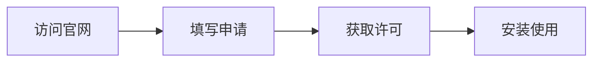

# 如何获取付费许可

> 三步完成许可证申请，解锁专业功能



## 获取流程

### 第一步：访问许可申请页面
1. 打开[晓蚕云私有化部署页面](https://www.xcan.cloud/deployment)
2. 滑动至 **「下载与安装」** 版块
3. 点击 **「获取许可」** 按钮  
   

### 第二步：填写申请信息
在表单中准确填写：
- **服务器MAC地址**（获取方法见下方）
- 企业信息
- 联系人信息
- 购买凭证  
  

> ⚠️ **MAC地址获取方法**  
> **Linux系统**：
> ```bash  
> ifconfig  
> ```  
> **macOS系统**：
> ```bash  
> ifconfig  
> ```  
> 在输出中查找`en0`或`eth0`适配器的物理地址（HWaddr）

### 第三步：获取许可证文件
提交后：  
✅ 自动发送许可证到注册邮箱  
✅ 或登录云服务版：**「全局管理」→「商店」→「我的许可」**  


## 安装说明
👉 [AngusTester安装指南](../installation/AngusTester.md)

## 常见问题

| 问题 | 解决方案 |  
|------|----------|  
| 许可证未收到 | 检查垃圾邮件箱/联系商务顾问 |  
| MAC地址错误 | 使用`ifconfig`命令重新确认 |  
| 安装失败 | 确认许可证文件是否完整 |  

> 技术支持：  
> technical_support@xcan.cloud