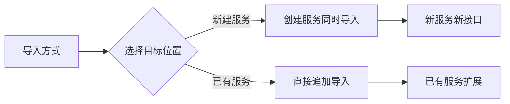

# 如何快速导入外部接口

> 支持OpenAPI/Swagger/Postman格式无缝导入，3分钟完成接口迁移

## 导入到新服务
> **适用场景**：新建服务并导入接口定义

1. **进入服务创建**
    - 导航至 **「接口」→「服务」**
    - 点击 **「创建服务」** 下拉选择 **「本地导入」**  
      

2. **上传接口文件**
    - 填写新服务名称
    - 选择支持的格式：
        - OpenAPI 3.x
        - Swagger 2.0
        - Postman Collection  
          

3. **完成导入**
    - 系统自动创建服务并导入接口
    - 在服务详情查看导入的接口列表  
      

## 导入到已有服务
> **适用场景**：为现有服务追加接口

1. **选择目标服务**
    - 在服务列表中右键点击目标服务
    - 选择 **「本地导入」**  
      

2. **配置导入策略**
    - 上传接口文件
    - 设置冲突处理策略：
        - 覆盖重名接口
        - 跳过重名接口
        - 重命名新接口  
          

3. **完成导入**
    - 在服务接口列表查看新增接口  
      

## 支持格式说明

| 格式 | 版本 | 文件示例 |  
|------|------|----------|  
| OpenAPI | 3.0.x | `openapi.yaml` |  
| Swagger | 2.0 | `swagger.json` |  
| Postman | Collection v2.1 | `postman_collection.json` |  

## 最佳实践
✅ 首次导入选择 **「覆盖重名接口」** 确保数据最新  
✅ 定期导入前进行 **「冲突检查」**  
✅ 大文件导入（>10MB）建议分批进行
