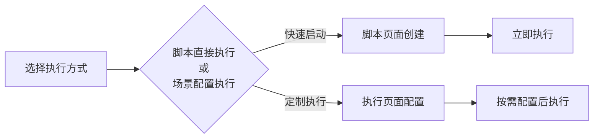

# 如何快速运行测试脚本

> 两种高效执行方式，一键启动自动化测试

## 执行方式对比

| 方式 | 适用场景 | 特点 |  
|------|----------|------|  
| 脚本直接执行 | 快速验证脚本 | 一键启动·无参数调整 |  
| 场景配置执行 | 定制化测试 | 可视化配置·参数调整 |  

## 方式一：脚本直接执行（推荐）
> **适用场景**：快速验证脚本可用性  

1. **进入脚本模块**
    - 导航至 **「脚本」**
    - 选中目标脚本  
      

2. **启动执行**
    - 点击 **「创建执行」** 按钮
    - 系统自动生成执行任务  
      

> **优势**：3秒完成执行创建，无需任何配置

## 方式二：场景配置执行
> **适用场景**：需要调整执行参数

1. **进入执行模块**
    - 导航至 **「执行」**
    - 点击 **「创建执行」**  
      

2. **配置执行参数**
    - 选择目标脚本
    - 按需调整配置：如线程模型、运行时长等
   

3. **启动执行**
    - 点击确认创建执行任务
    - 在任务列表查看执行状态  
      

## 执行监控要点
- 🟢 实时状态：执行中/已完成/已失败
- 📊 性能指标：TPS/响应时间/错误率
- 🔍 日志追踪：详细执行过程记录
