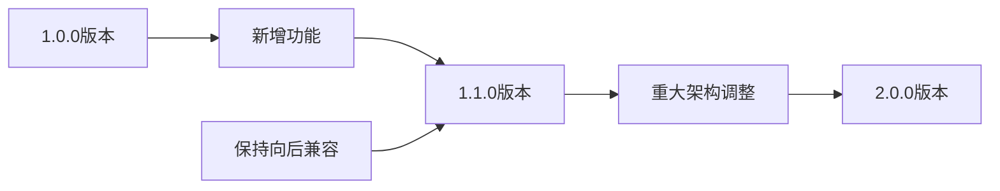

# 规范

> `规范(specification)` 是AngusTester脚本的核心标识，它承担两大关键功能：
> 1. **脚本识别** - 作为脚本解析器的识别标识
> 2. **版本控制** - 确保脚本与运行环境的兼容性

## 规范字段详解

| 组件 | 说明 | 示例值 | 固定性 |  
|------|------|--------|--------|  
| **规范标识** | AngusTester脚本的唯一标识 | `angus` | 固定不变 |  
| **版本号** | 规范迭代版本 | `1.0.0` | 随版本更新 |  

## 当前版本说明

```yaml  
## 固定规范版本号
specification: angus/1.0.0  
```  

### 版本演进机制
<br>


