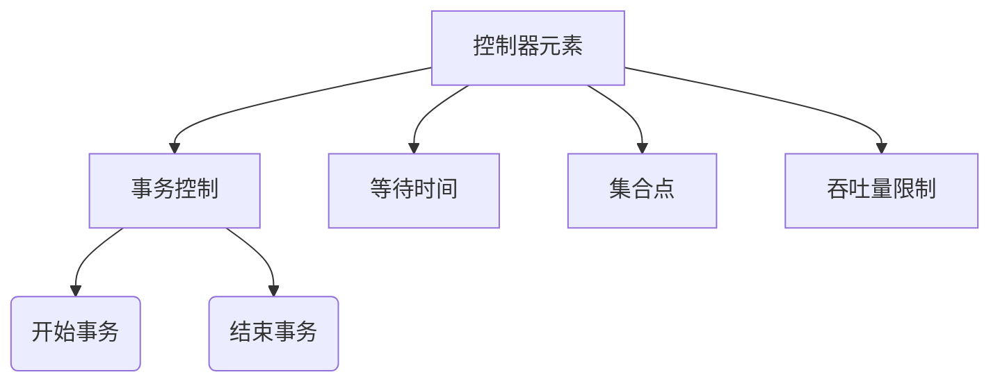

# 控制器元素

> `控制器元素` 提供了在测试脚本中控制执行流程、模拟真实用户行为、构造并发场景和流量控制的能力。



## 公共参数

| 字段 | 类型 | 必填 | 长度限制 | 说明 |  
|------|------|------|------|------|  
| `target` | enum | 是 | - | 控制器类型标识 |  
| `name` | string | 是 | ≤400字符 | 元素唯一标识名 |  
| `description` | string | 否 | ≤800字符 | 详细描述说明 |  
| `enabled` | boolean | 是 | - | 是否启用（默认true） |  
| `beforeName` | string | 否 | ≤400字符 | 前序元素位置控制 |  
| `transactionName` | string | 条件 | ≤400字符 | 所属事务名称（事务内元素必填） |  

## 事务控制

### 开始事务(TRANS_START)
**功能**：标记业务事务起点

| 专用字段 | 类型 | 必填 | 说明 |  
|----------|------|------|------|  
| `target` | enum | 是 | 固定值 `TRANS_START` |  

**配置示例**：
```yaml  
- target: TRANS_START  
  name: PaymentProcess  
  description: Payment transaction start  
  enabled: true  
  beforeName: LoginStep  
```

### 结束事务(TRANS_END)
**功能**：标记业务事务终点

| 专用字段 | 类型 | 必填 | 说明 |  
|----------|------|------|------|  
| `target` | enum | 是 | 固定值 `TRANS_END` |  

**配置示例**：
```yaml  
- target: TRANS_END  
  name: EndPayment  
  transactionName: PaymentProcess  
  enabled: true  
  beforeName: ConfirmStep  
```

## 等待时间(WAITING_TIME)
**功能**：模拟用户操作思考时间

| 专用字段 | 类型 | 必填 | 范围 | 说明 |  
|----------|------|------|------|------|  
| `target` | enum | 是 | - | 固定值 `WAITING_TIME` |  
| `minWaitTimeInMs` | integer | 否 | 1-7,200,000ms | 最小等待时间(ms) |  
| `maxWaitTimeInMs` | integer | 是 | 1-7,200,000ms | 最大等待时间(ms) |  

**使用规则**：
- 仅设置`max`：固定等待时间
- 同时设置`min+max`：随机等待区间

**配置示例**：
```yaml  
- target: WAITING_TIME  
  name: FormFillDelay  
  minWaitTimeInMs: 2000  
  maxWaitTimeInMs: 5000  
  transactionName: OrderProcess  
  beforeName: AddToCart  
```

## 集合点(RENDEZVOUS)
**功能**：模拟突发高并发场景

| 专用字段 | 类型 | 必填 | 范围 | 说明 |  
|----------|------|------|------|------|  
| `target` | enum | 是 | - | 固定值 `RENDEZVOUS` |  
| `threads` | integer | 是 | 1-10000 | 触发所需用户数 |  
| `timeoutInMs` | integer | 否 | 1-7,200,000ms | 最大等待时间(ms) |  

**注意事项**：  
⚠️ 线程数需≤测试计划总线程数

**配置示例**：
```yaml  
- target: RENDEZVOUS  
  name: FlashSaleSync  
  threads: 500  
  timeoutInMs: 300  
  transactionName: PurchaseFlow  
  beforeName: CheckInventory  
```

## 吞吐量限制器(THROUGHPUT)
**功能**：精确控制请求速率

| 专用字段 | 类型 | 必填 | 范围 | 说明 |  
|----------|------|------|------|------|  
| `target` | enum | 是 | - | 固定值 `THROUGHPUT` |  
| `permitsPerSecond` | integer | 是 | 1-20,000,000 | 每秒最大请求数 |  
| `timeoutInMs` | integer | 否 | 1-7,200,000ms | 获取令牌超时时间(ms) |  

**配置示例**：
```yaml  
- target: THROUGHPUT  
  name: APIRateLimit  
  permitsPerSecond: 800  
  timeoutInMs: 100  
  transactionName: APICallSequence  
  beforeName: GetAuthToken  
```
