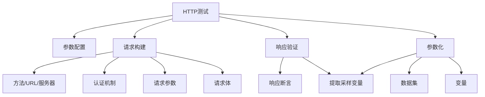

# HTTP测试任务

> `HTTP测试任务` 定义一个 Http 协议测试任务，用于 Http 功能、性能、稳定性和自定义测试。



## 主参数清单

| 参数 | 类型 | 必填 | 长度限制 | 说明                                                                    |  
|------|------|------|------|-----------------------------------------------------------------------|  
| `target` | enum | 是 | - | **任务类型标识**<br>固定值 `HTTP`                                              |  
| `name` | string | 是 | ≤400字符 | **接口标识名称**<br>测试场景中的唯一标识                                              |  
| `description` | string | 否 | ≤800字符 | **详细功能描述**<br>说明接口业务用途                                                |  
| `enabled` | boolean | 是 | - | **启用状态**<br>`true`：执行该接口（默认）<br>`false`：跳过该接口                         |  
| `beforeName` | string | 否 | ≤400字符 | **执行顺序控制**<br>指定前序任务名称，确保执行顺序                                         |  
| `transactionName` | string | 否 | ≤400字符 | **事务归属标识**<br>关联事务控制器的开始事务名称                                          |  
| `apisId` | integer | 否 | - | **接口资源关联**<br>关联API仓库ID（测试结果自动回写）                                     |  
| `caseId` | integer | 否 | - | **测试用例关联**<br>关联测试用例ID（测试结果自动回写）                                      |  
| `request` | object | 是 | - | **请求配置**<br>定义请求方法/URL/参数/认证等                                         |  
| `assertions` | array[object] | 否 | - | **结果验证规则**<br>设置响应校验条件                                                |  
| `variables` | array[object] | 否 | - | **动态采样变量提取**<br>从响应中提取值供后续使用<br>[查看采样变量定义](../../parameterization.md) |  
| `datasets` | array[object] | 否 | - | **测试数据集**<br>驱动多场景数据测试<br>[查看数据集定义](../../parameterization.md)        |  
| `actionOnEOF` | enum | 否 | - | **数据集结束策略**<br>`RECYCLE`：循环使用（默认）<br>`STOP_THREAD`：停止线程               |  
| `sharingMode` | enum | 否 | - | **数据共享模式**<br>`ALL_THREAD`：线程共享（默认）<br>`CURRENT_THREAD`：线程独立          |  

**关键参数说明：**
  1. **事务控制** (`transactionName`)
      - 用于关联事务控制器（TRANS_START）
      - 实现业务操作原子性统计
  2. **数据驱动** (`datasets`+`sharingMode`)
      - `ALL_THREAD`：所有线程共享同一份数据
      - `CURRENT_THREAD`：每个线程独立数据副本
  3. **结束策略** (`actionOnEOF`)
      - `RECYCLE`：循环使用数据（压测场景）
      - `STOP_THREAD`：数据用尽停止线程（精准控制）
  4. **结果关联** (`apisId`/`caseId`)
      - 实现测试结果自动同步到API仓库/测试用例
      - 支持持续集成报告自动生成

*Http完整示例结构：*

```yaml
- target: HTTP
  name: Add User
  description: This is an example of complete HTTP parameters
  enabled: true
  beforeName: BusinessTransaction
  transactionName: BusinessTransaction
  apisId: 193234753355265004
  caseId: 193234753355265004
  request:
    # 请求参数配置 ...
  assertions:
    # 断言参数配置 ...
  variables:
    # 变量参数配置 ...
  datasets:
    # 数据集参数配置 ...
  actionOnEOF: RECYCLE
  sharingMode: ALL_THREAD
```

## 请求构建(request)

| 参数 | 类型 | 必填 | 限制 | 说明 |  
|------|------|------|------|------|  
| `method` | enum | 是 | - | **请求方法**<br>`POST`/`GET`/`PUT`/`PATCH`/<br>`DELETE`/`HEAD`/`OPTIONS`/`TRACE` |  
| `url` | string | 否 | ≤2000字符 | **完整请求URL**<br>优先级高于server+endpoint组合 |  
| `server` | object | 否 | - | **服务器配置**<br>定义基础URL和环境变量 |  
| `endpoint` | string | 否 | ≤800字符 | **接口路径**<br>与server组合构成完整URL |  
| `authentication` | object | 否 | - | **认证配置**<br>支持Basic/Bearer/APIKey/OAuth2等认证方式 |  
| `parameters` | array | 否 | 1-200项 | **请求参数**<br>Path/Query/Header/Cookie参数配置 |  
| `body` | object | 否 | - | **请求体配置**<br>支持JSON/Form/二进制等格式 |  

*完整 URL、服务器(server)、和端点(endpoint)关系：*

```txt
https://api.example.com/v1/users?role=admin&status=active
\________________________/\____/ \______________________/
         server URL       endpoint    query parameters
                    完整URL(path)
```

*请求完整示例结构：*
```yaml
request:
  method: PUT
  url: "http://serv01-sample.angusmock.cloud:30010/user/{username}"
  server:
    # 服务器参数配置 ...
  endpoint: "/user/{username}"
  authentication:
    # 认证参数配置 ...
  parameters:
    # 请求参数配置 ...
  body:
    # 请求体配置 ...
```

### 服务器配置(server)

| 参数 | 类型 | 必填 | 长度限制 | 说明 |  
|------|------|------|------|------|  
| `url` | string | 是 | ≤400字符 | **服务器基础URL**<br> |  
| `description` | string | 否 | ≤800字符 | **服务器描述**<br>说明服务器用途或环境信息 |  
| `variables` | Map<string,serverVariable> | 否 | 1-200项 | **环境变量配置**<br>支持多环境动态切换 |  

#### 服务器配置(serverVariable)

| 参数 | 类型 | 必填 | 长度限制 | 说明 |  
|------|------|------|------|------|  
| `allowableValues` | array[string] | 是 | 1-200项 | **允许值列表**<br>定义变量可选值范围 |  
| `defaultValue` | string | 是 | ≤400字符 | **默认值**<br>未指定时的默认值 |  
| `description` | string | 否 | ≤800字符 | **变量描述**<br>说明变量用途 |  

*服务器配置示例*：
```yaml  
server:
  url: "http://{env}-sample.angusmock.cloud:660"
  description: The example of server
  variables:
    env:
      allowableValues:
      - dev
      - beta
      - prod
      defaultValue: beta
      description: The example of server variable
```

### 认证配置(authentication)

| 参数 | 类型 | 必填 | 长度限制 | 说明 |  
|------|------|------|------|------|  
| `type` | enum | 是 | - | **认证类型**<br>`none`：无需认证<br>`http`：基础认证<br>`apiKey`：API密钥<br>`oauth2`：OAuth2授权 |  
| `name` | string | 是 | ≤400字符 | **认证方案名称**<br>示例：`用户认证`/`API密钥认证` |  
| `description` | string | 否 | ≤800字符 | **认证方案描述**<br>详细说明认证机制 |  
| `enabled` | boolean | 是 | - | **启用状态**<br>`true`：启用（默认）<br>`false`：禁用 |  
| `value` | string | 否 | ≤4096字符 | **认证凭证值**<br>支持变量表达式<br>示例：`Bearer {accessToken}` |  
| `apiKeys` | array | 否 | 1-10项 | **API密钥组**<br>多密钥组合认证 |  
| `oauth2` | object | 是 | - | **OAuth2配置**<br>支持多种授权流程 |  

*认证配置示例结构：*

```yaml
authentication:
  type: http
  name: Security schema
  description: The security scheme used for HTTP requests
  enabled: true
  value: Bearer 181622ea2a1f4934ad6bec0308390da9
  apiKeys:
    # Api 秘钥认证配置
  oauth2:
   # OAuth2 认证配置
```

#### Basic认证(http)

```yaml
authentication:
  type: http
  name: Security schema
  description: The security scheme used for HTTP requests
  enabled: true
  value: Basic YWRtaW46YWRtaW4xMjM=  # Base64 username:password
```

#### Bearer令牌认证(http)

```yaml
authentication:
  type: http
  name: Security schema
  description: The security scheme used for HTTP requests
  enabled: true
  value: Bearer 181622ea2a1f4934ad6bec0308390da9
```

#### Api秘钥认证(apiKeys)

| 参数 | 类型 | 必填 | 长度限制 | 说明                                                             |  
|------|------|------|------|----------------------------------------------------------------|  
| `name` | string | 是 | ≤400字符 | **参数标识名**<br>支持变量表达式<br>示例：`X-{variable1}-API-Key`             |  
| `in` | enum | 是 | - | **参数位置**<br>`header`：请求头<br>`query`：URL查询参数<br>`cookie`：Cookie |  
| `value` | string | 是 | ≤1024字符 | **参数值**<br>支持变量表达式<br>示例：`{apiKey}`                            |  

```yaml
type: apiKey
name: Security schema
description: The security scheme used for HTTP requests
enabled: true
apiKeys:
- name: ak
  in: cookie
  value: cLpyeth1YGcZ8iZFJQilCJi4m979D1To
- name: sk
  in: cookie
  value: ypIPSxeI7ylgCW44FIFugZKmld63eQO3xqbGxsVIor3EWqxRgwA1YXtDsVrUwuMX
```

#### OAuth2认证(oauth2)

| 参数 | 类型 | 必填 | 长度限制 | 说明 |  
|------|------|------|------|------|  
| `clientCredentials` | object | 否 | - | **客户端凭证模式**<br>适用于服务端间认证 |  
| `password` | object | 否 | ≤400字符 | **密码模式**<br>适用于受信任客户端 |  
| `authFlow` | enum | 否 | ≤800字符 | **认证流程选择**<br>`clientCredentials`/`password` |  
| `newToken` | boolean | 是 | - | **令牌刷新策略**<br>`true`：每次请求获取新令牌<br>`false`：使用固定令牌（默认） |  
| `token` | string | 条件 | ≤4096字符 | **固定访问令牌**<br>`newToken=false`时必填<br>支持变量表达式 |  

*使用已有OAuth2访问令牌示例：*

```yaml
type: oauth2
name: Security schema
description: The security scheme used for HTTP requests
enabled: true
value: Bearer 181622ea2a1f4934ad6bec0308390da9
oauth2:
  authFlow: clientCredentials
  newToken: true
  token: Bearer 181622ea2a1f4934ad6bec0308390da9
```

##### OAuth2-clientCredentials 认证流程

| 参数 | 类型 | 必填 | 长度限制 | 说明 |  
|------|------|------|------|------|  
| `tokenUrl` | string | 是 | ≤400字符 | **令牌获取地址**<br>OAuth2 认证核心端点 |  
| `scopes` | array | 否 | 1-200项 | **权限范围**<br>定义API访问权限<br>示例：`["user:read", "user:write"]` |  
| `clientId` | string | 是 | ≤400字符 | **客户端ID**<br>支持变量表达式<br>示例：`{env}_client_id` |  
| `clientSecret` | string | 是 | ≤1024字符 | **客户端密钥**<br>支持变量表达式<br>敏感信息建议加密存储 |  
| `clientIn` | enum | 否 | - | **客户端凭证位置**<br>详见下方位置说明 |

***客户端凭证位置说明 (`clientIn`)***

| 位置                  | 传输方式         | 示例                                 |
| --------------------- | ---------------- | ------------------------------------ |
| **QUERY_PARAMETER**   | URL 参数         | `?client_id=id&client_secret=secret` |
| **BASIC_AUTH_HEADER** | Authorization 头 | `Basic base64(id:secret)`            |
| **REQUEST_BODY**      | Form 表单        | `client_id=id&client_secret=secret`  |

*客户端凭据证方式示例：*

```yaml
type: oauth2
name: Security schema
description: The security scheme used for HTTP requests
enabled: true
oauth2:
  clientCredentials:
    tokenUrl: http://serv01-sample.angusmock.cloud:30010/oauth/token
    scopes:
    - user:read
    clientId: client3
    clientSecret: secret3
    clientIn: QUERY_PARAMETER
  authFlow: clientCredentials
```

##### OAuth2-password 认证流程

| 参数 | 类型 | 必填 | 长度限制 | 说明 |  
|------|------|------|------|------|  
| `tokenUrl` | string | 是 | ≤400字符 | **令牌获取地址**<br>OAuth2 认证核心端点 |  
| `scopes` | array | 否 | 1-200项 | **权限范围**<br>定义API访问权限<br>示例：`["user:read", "user:write"]` |  
| `clientId` | string | 是 | ≤400字符 | **客户端ID**<br>支持变量表达式<br>示例：`{env}_client_id` |  
| `clientSecret` | string | 是 | ≤1024字符 | **客户端密钥**<br>支持变量表达式<br>敏感信息建议加密存储 |  
| `clientIn` | enum | 否 | - | **客户端凭证位置**<br>详见下方位置说明 |  
| `username` | string | 否 | ≤400字符 | **用户名**<br>密码模式专用<br>支持变量表达式 |  
| `password` | string | 否 | ≤1024字符 | **密码**<br>密码模式专用<br>支持变量表达式 |  

*资源所有者密码认证方式示例：*

```yaml
type: oauth2
name: Security schema
description: The security scheme used for HTTP requests
enabled: true
oauth2:
  password:
    tokenUrl: http://serv01-sample.angusmock.cloud:30010/oauth/token
    scopes:
    - user:read
    clientId: client2
    clientSecret: secret2
    clientIn: QUERY_PARAMETER
    username: admin
    password: 123456
  authFlow: password
```

### 请求参数(parameters)

| 参数 | 类型 | 必填 | 长度限制 | 说明 |  
|------|------|------|------|------|  
| `name` | string | 是 | ≤400字符 | **参数标识名**<br>支持变量表达式<br>示例：`{env}_id` |  
| `in` | enum | 是 | - | **参数位置**<br>`QUERY`：URL查询参数<br>`PATH`：URL路径参数<br>`HEADER`：请求头<br>`COOKIE`：Cookie |  
| `description` | string | 否 | ≤800字符 | **参数说明**<br>详细描述参数用途 |  
| `enabled` | boolean | 是 | - | **启用状态**<br>`true`：包含该参数（默认）<br>`false`：忽略该参数 |  
| `type` | enum | 否 | - | **数据类型**<br>`string`/`number`/`integer`<br>/`boolean`/`array`/`object`<br>默认：`string` |  
| `format` | string | 否 | ≤80字符 | **数据格式**<br>示例：`date`/`email`/`uuid`/`uri` |  
| `value` | string | 否 | ≤4096字符 | **参数值**<br>支持变量和Mock函数<br>示例：`@Email()` |  

> 注意：RFC7230 声明头名称不区分大小写。

*请求参数不同参数位置完整示例：*

```yaml
parameters:
- name: Authorization
  in: header
  description: The example of parameters in the request header
  enabled: true
  type: string
  format: string
  value: "{accessToken}"
- name: Content-Type
  in: header
  description: Content-Type is used to determine the request content
  enabled: true
  type: string
  format: string
  value: application/json
- name: username
  in: path
  description: The example of parameters in the path
  enabled: true
  type: string
  format: string
  value: admin
- name: password
  in: query
  description: The example of parameters in the query
  enabled: true
  type: string
  format: string
  value: admin
```

### 请求体(body)

| 参数              | 类型      | 必填 | 长度限制 | 说明                                                                            |
| ----------------- |---------| ---- | -------- | ------------------------------------------------------------------------------- |
| `format`          | string  | 否   | ≤80 字符 | **数据格式标识**<br>示例：`json`/`xml`/`yaml`                                   |
| `contentEncoding` | enum    | 否   | -        | **内容编码**<br>`base64`：Base64 编码<br>`gzip_base64`：GZIP 压缩后 Base64 编码 |
| `forms`           | array   | 否   | 1-200 项 | **表单参数组**<br>用于 FormData 格式请求                                        |
| `rawContent`      | string  | 否   | -        | **原始内容**<br>支持 JSON/XML 文本或二进制 Base64<br>支持变量和 Mock 函数       |

##### Form参数(forms)

| 参数              | 类型    | 必填 | 长度限制  | 说明                                                                                     |
| ----------------- | ------- | ---- | --------- | ---------------------------------------------------------------------------------------- |
| `name`            | string  | 是   | ≤400 字符 | **参数名称**<br>表单字段标识<br>示例：`avatar`/`metadata`                                |
| `description`     | string  | 否   | ≤800 字符 | **参数描述**<br>说明字段用途                                                             |
| `enabled`         | boolean | 是   | -         | **启用状态**<br>`true`：包含该字段（默认）<br>`false`：忽略该字段                        |
| `type`            | enum    | 否   | -         | **数据类型**<br>`string`/`number`/`integer`/`boolean`/`array`/`object`<br>默认：`string` |
| `format`          | string  | 否   | ≤80 字符  | **数据格式**<br>示例：`date`/`email`/`uuid`                                              |
| `contentType`     | string  | 否   | ≤80 字符  | **内容类型**<br>示例：`image/png`/`application/json`                                     |
| `contentEncoding` | enum    | 否   | -         | **内容编码**<br>`base64`：Base64 编码<br>`gzip_base64`：GZIP 压缩后 Base64               |
| `fileName`        | string  | 否   | ≤400 字符 | **文件名**<br>文件上传时使用<br>示例：`avatar.png`                                       |
| `value`           | string  | 否   | -         | **参数值**<br>支持文本/JSON/Base64 编码文件<br>支持变量和 Mock 函数                      |

*请求体 ContentType 为 application/json 格式示例：*

```yaml
body:
  format: json
  rawContent: "{\"age\": 18, \"hobbies\": \"swimming, playing basketball\", \"avatar\"\
    :\"http://serv01-sample.angusmock.cloud:30010/user/{username}/avatar.png\"}"
```

*请求体 ContentType 为 application/x-www-form-urlencoded 格式示例：*

```yaml
body:
  forms:
  - name: age
    description: The example of form-data text parameter
    enabled: true
    type: integer
    format: int32
    value: 18
  - name: hobbies
    description: The example of form-data text parameter
    enabled: true
    type: string
    format: string
    value: "swimming, playing basketball"
````

*请求体 ContentType 为 multipart/form-data 格式示例：*

```yaml
body:
  forms:
  - name: age
    description: The example of form-data text parameter
    enabled: true
    type: integer
    format: int32
    value: 18
  - name: hobbies
    description: The example of form-data text parameter
    enabled: true
    type: string
    format: string
    value: "swimming, playing basketball"
  - name: avatar
    description: The example of form-data file parameter
    enabled: true
    type: string
    format: string
    contentType: image/png
    contentEncoding: base64
    value: VGhpcyBpcyB0aGUgYmluYXJ5IGNvbnRlbnQgb2YgdGhlIGF2YXRhci5wbmcgZmlsZQ==
    fileName: avatar.png
```

*请求体 ContentType 为二进制 image/png 格式示例：*

```yaml
body:
  format: binary
  contentEncoding: base64 
  rawContent: VGhpcyBpcyB0aGUgYmluYXJ5IGNvbnRlbnQgb2YgdGhlIGF2YXRhci5wbmcgZmlsZQ==
```

## 响应断言(assertions)

| 参数 | 类型 | 必填 | 长度限制 | 说明 |  
|------|------|------|------|------|  
| `name` | string | 是 | ≤200字符 | **断言名称**<br>唯一标识断言<br>示例：`验证状态码` |  
| `description` | string | 否 | ≤800字符 | **断言描述**<br>详细说明断言目的 |  
| `enabled` | boolean | 是 | - | **启用状态**<br>`true`：启用（默认）<br>`false`：禁用 |  
| `type` | enum | 是 | - | **断言类型**<br>`STATUS`：状态码<br>`HEADER`：响应头<br>`BODY`：响应体<br>`BODY_SIZE`：响应体大小<br>`SIZE`：响应大小<br>`DURATION`：耗时 |  
| `parameterName` | string | 条件 | ≤400字符 | **参数名称**<br>`type=HEADER`时必填<br>指定响应头名称 |  
| `condition` | string | 否 | ≤400字符 | **执行条件**<br>变量表达式控制断言执行<br>示例：`{env} == "prod"` |  
| `assertionCondition` | enum | 是 | - | **断言条件**<br>详见下方断言条件说明 |  
| `expression` | string | 条件 | ≤400字符 | **提取表达式**<br>`REGEX`/`JSON_PATH`/`XPATH`时必填 |  
| `matchItem` | integer | 否 | 1-2000 | **匹配项索引**<br>多值匹配时指定位置 |  
| `expected` | string | 条件 | ≤4096字符 | **期望值**<br>非空值条件时必填 |  
| `extraction` | object | 否 | - | **动态提取配置**<br>从响应中提取期望值 |  

### 断言条件(assertionCondition)

| 条件                 | 说明                        | 适用类型    | 示例                               |
| ---------------------- | --------------------------- | ----------- | ---------------------------------- |
| **EQUAL**              | 严格相等验证                | 所有类型    | `200` = `200` → 通过               |
| **NOT_EQUAL**          | 不相等验证                  | 所有类型    | `404` ≠ `200` → 通过               |
| **IS_EMPTY**           | 空值检查（空字符串或 null） | 字符串/对象 | `""` 或 `null` → 通过              |
| **NOT_EMPTY**          | 非空值检查                  | 字符串/对象 | `"data"` → 通过                    |
| **IS_NULL**            | 严格 null 检查              | 对象        | `null` → 通过                      |
| **NOT_NULL**           | 非 null 检查                | 对象        | `{}` → 通过                        |
| **GREATER_THAN**       | 大于比较                    | 数字/日期   | `1024` > `1000` → 通过             |
| **GREATER_THAN_EQUAL** | 大于等于比较                | 数字/日期   | `100` ≥ `100` → 通过               |
| **LESS_THAN**          | 小于比较                    | 数字/日期   | `80` < `100` → 通过                |
| **LESS_THAN_EQUAL**    | 小于等于比较                | 数字/日期   | `100` ≤ `100` → 通过               |
| **CONTAIN**            | 包含关系                    | 字符串/数组 | `"hello world"` ⊆ `"world"` → 通过 |
| **NOT_CONTAIN**        | 不包含关系                  | 字符串/数组 | `"hello"` ⊈ `"world"` → 通过       |
| **REG_MATCH**          | 正则匹配                    | 字符串      | `"abc123"` ~ `"\d+"` → 通过        |
| **XPATH_MATCH**        | XML 节点匹配                | XML         | `//book/price` > `50`              |
| **JSON_PATH_MATCH**    | JSON 节点匹配               | JSON        | `$.data.userId` = `"1001"`         |

### 匹配项规则(matchItem)

| 场景 | 匹配项设置 | 返回值 |  
|------|------------|--------|  
| **未指定索引** | 不设置或 `matchItem: null` | 所有匹配值合并为一个字符串 |  
| **有效索引** | `matchItem: N` (0≤N≤2000) | 返回第N+1个匹配值 |  
| **无效索引** | N>匹配项数量 | 返回 `null` |  

#### 1. 正则匹配 (REG_MATCH)
**输入文本**：
```  
你好！我的电话是18888888888和13999999999。  
```  

**表达式**：
```regex  
(1\d{10})  
```  

**匹配结果处理**：  
| matchItem | 返回值 | 说明 |  
|-----------|--------|------|  
| 未指定 | `"1888888888813999999999"` | 所有匹配值合并 |  
| 0 | `"18888888888"` | 第一个匹配值 |  
| 1 | `"13999999999"` | 第二个匹配值 |  
| 2 | `null` | 超出范围 |

#### 2. JSONPath匹配 (JSON_PATH_MATCH)
**输入JSON**：
```json  
{  
  "store": {  
    "book": [  
      {"title": "Book1", "price": 100},  
      {"title": "Book2", "price": 200}  
    ]  
  }  
}  
```  

**表达式**：
```  
$.store.book[*]  
```  

**匹配结果处理**：  
| matchItem | 返回值 | 说明 |  
|-----------|--------|------|  
| 未指定 | `[{"title":"Book1","price":100}`,<br>`{"title":"Book2","price":200}]` | 完整数组 |  
| 0 | `{"title":"Book1","price":100}` | 第一本书 |  
| 1 | `{"title":"Book2","price":200}` | 第二本书 |  
| 2 | `null` | 超出范围 |

#### 3. XPath匹配 (XPATH_MATCH)
**输入XML**：
```xml  
<persons>  
  <person>  
    <name>张三</name>  
    <skills>Java</skills>  
    <skills>Python</skills>  
  </person>  
  <person>  
    <name>李四</name>  
    <skills>JavaScript</skills>  
  </person>  
</persons>  
```  

**表达式**：
```xpath  
//person  
```  

**匹配结果处理**：  
| matchItem | 返回值 | 说明 |  
|-----------|--------|------|  
| 未指定 | `"张三JavaPython李四JavaScript"` | 所有文本合并 |  
| 0 | `"张三JavaPython"` | 第一个person节点文本 |  
| 1 | `"李四JavaScript"` | 第二个person节点文本 |  
| 2 | `null` | 超出范围 |

### 提取期望值配置(extraction)

提取可用于从当前请求或者响应中指定位置读取一个值作为断言期望值。

| 参数 | 类型 | 必填 | 长度限制 | 说明 |  
|------|------|------|------|------|  
| `method` | enum | 是 | - | **提取方法**<br>`REGEX`：正则表达式<br>`JSON_PATH`：JSON路径<br>`X_PATH`：XML路径 |  
| `expression` | string | 是 | - | **提取表达式**<br>根据method类型编写 |  
| `defaultValue` | string | 是 | - | **默认值**<br>提取失败时使用 |  
| `location` | enum | 是 | - | **提取位置**<br>详见下方位置说明 |  
| `parameterName` | string | 条件 | ≤400字符 | **参数名称**<br>`location`为HEADER/PATH/QUERY/FORM时必填 |  

### 提取位置(location)

| 位置 | 适用场景 | 示例 |  
|------|----------|------|  
| **PATH_PARAMETER** | RESTful资源ID | `/users/{userId}` |  
| **QUERY_PARAMETER** | 筛选条件 | `?category=books` |  
| **REQUEST_HEADER** | 认证信息 | `Authorization: Bearer token` |  
| **FORM_PARAMETER** | 表单字段 | `username=admin` |  
| **REQUEST_RAW_BODY** | 原始请求内容 | JSON/XML请求体 |  
| **RESPONSE_HEADER** | 响应元数据 | `Content-Type: application/json` |  
| **RESPONSE_BODY** | 业务数据 | JSON/XML响应体 |  

*期望值断言示例：*

```yaml
assertions: 
- name: Assert the HTTP status code is `200`
  description: This is an example of an expected value assertion
  enabled: true
  type: STATUS
  expected: 200
  assertionCondition: EQUAL
  condition: 1=1
- name: Assert the business code is `S`
  description: "This is an example of jsonpath match assertions, response body is:\
    \ {\n    \"code\": \"S\",\n    \"msg\": \"Success\"\n}"
  enabled: true
  type: BODY
  expected: S
  expression: $..code
  assertionCondition: JSON_PATH_MATCH
- name: Assert response header `X-Extraction-Token` value contains `888888`
  description: "This is an example of regexp match assertions, `X-Extraction-Token`\
    \ value is: Your token is 888888 or 999999"
  enabled: true
  type: HEADER
  parameterName: X-Extraction-Token
  expected: 888888
  expression: "(\\d{6})"
  matchItem: 1
  assertionCondition: REG_MATCH
  condition: "{assertHeader}=true"
```

*提取值断言示例：*

```yaml
assertions: 
- name: Assert the response body access_token is `181622ea2a1f4934ad6bec0308390da9`
  description: This is an example of an extraction value assertion
  enabled: true
  type: BODY
  assertionCondition: EQUAL
  extraction:
    method: JSON_PATH
    expression: $.data.access_token
    defaultValue: 181622ea2a1f4934ad6bec0308390da9
    location: RESPONSE_BODY
```

## 完整配置参数示例

```yaml
- target: HTTP
  name: Add User
  description: This is an example of complete HTTP parameters
  enabled: true
  beforeName: BusinessTransaction
  transactionName: BusinessTransaction
  apisId: 193234753355265004
  caseId: 193234753355265004
  request:
    method: PUT
    url: "http://serv01-sample.angusmock.cloud:30010/user/{username}"
    server:
      url: "http://{env}-sample.angusmock.cloud:660"
      description: The example of server
      variables:
        env:
          allowableValues:
            - dev
            - beta
            - prod
          defaultValue: beta
          description: The example of server variable
    endpoint: "/user/{username}"
    authentication:
      type: http
      name: Security schema
      description: The security scheme used for HTTP requests
      enabled: true
      value: Bearer 181622ea2a1f4934ad6bec0308390da9
      apiKeys:
        - name: ak
          in: cookie
          value: cLpyeth1YGcZ8iZFJQilCJi4m979D1To
        - name: sk
          in: cookie
          value: ypIPSxeI7ylgCW44FIFugZKmld63eQO3xqbGxsVIor3EWqxRgwA1YXtDsVrUwuMX
        - name: otherKey1
          in: header
          value: otherKey1Value
        - name: otherKey2
          in: query
          value: otherKey2Value
      oauth2:
        clientCredentials:
          tokenUrl: http://serv01-sample.angusmock.cloud:30010/oauth/token
          scopes:
            - user:read
          clientId: client3
          clientSecret: secret3
          clientIn: QUERY_PARAMETER
        password:
          tokenUrl: http://serv01-sample.angusmock.cloud:30010/oauth/token
          scopes:
            - user:read
          clientId: client2
          clientSecret: secret2
          clientIn: QUERY_PARAMETER
          username: admin
          password: 123456
        newToken: false
    parameters:
      - name: Authorization
        in: header
        description: The example of parameters in the request header
        enabled: true
        type: string
        format: string
        value: "{accessToken}"
      - name: Content-Type
        in: header
        description: Content-Type is used to determine the request content
        enabled: true
        type: string
        format: string
        value: application/json
      - name: username
        in: path
        description: The example of parameters in the path
        enabled: true
        type: string
        format: string
        value: admin
      - name: password
        in: query
        description: The example of parameters in the query
        enabled: true
        type: string
        format: string
        value: admin
    body:
      type: string
      format: string
      contentEncoding: base64
      forms:
        - name: age
          description: The example of form-data text parameter
          enabled: true
          type: integer
          format: int32
          value: 18
        - name: hobbies
          description: The example of form-data text parameter
          enabled: true
          type: string
          format: string
          value: "swimming, playing basketball"
        - name: avatar
          description: The example of form-data file parameter
          enabled: true
          type: string
          format: string
          contentType: image/png
          contentEncoding: base64
          value: VGhpcyBpcyB0aGUgYmluYXJ5IGNvbnRlbnQgb2YgdGhlIGF2YXRhci5wbmcgZmlsZQ==
          fileName: avatar.png
      rawContent: "{\"age\": 18, \"hobbies\": \"swimming, playing basketball\", \"avatar\"\
        :\"http://serv01-sample.angusmock.cloud:30010/user/{username}/avatar.png\"}"
  assertions:
    - name: Assert the HTTP status code is 200
      description: This is an example of an expected value assertion
      enabled: true
      type: STATUS
      expected: 200
      assertionCondition: EQUAL
      condition: 1=1
    - name: Assert response header `X-Extraction-Token` value contains 888888
      description: "This is an example of extracting value assertions, `X-Extraction-Token`\
      \ value is: Your token is 888888 or 999999"
      enabled: true
      type: HEADER
      parameterName: X-Extraction-Token
      expected: 888888
      expression: "(\\d{6})"
      matchItem: 1
      assertionCondition: EQUAL
      condition: "{assertHeader}=true"
  variables:
    - name: accessToken
      method: JSON_PATH
      expression: $.data.access_token
      location: RESPONSE_BODY
  datasets:
    - name: UsernameDataset
      parameters:                             
        - name: username                             
          value: '@Name()'
  actionOnEOF: RECYCLE
  sharingMode: ALL_THREAD
```