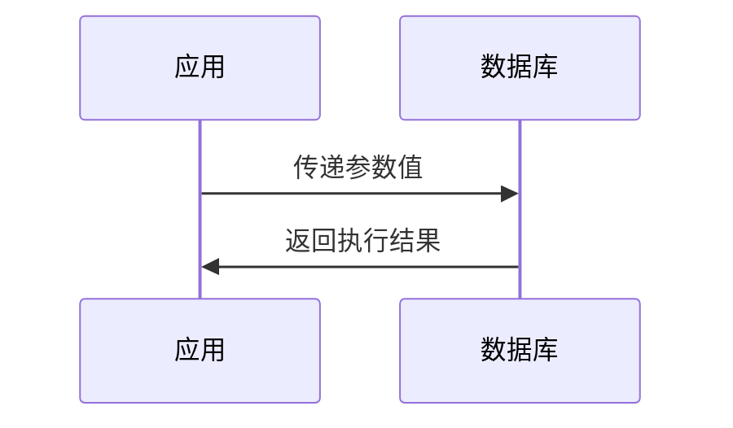
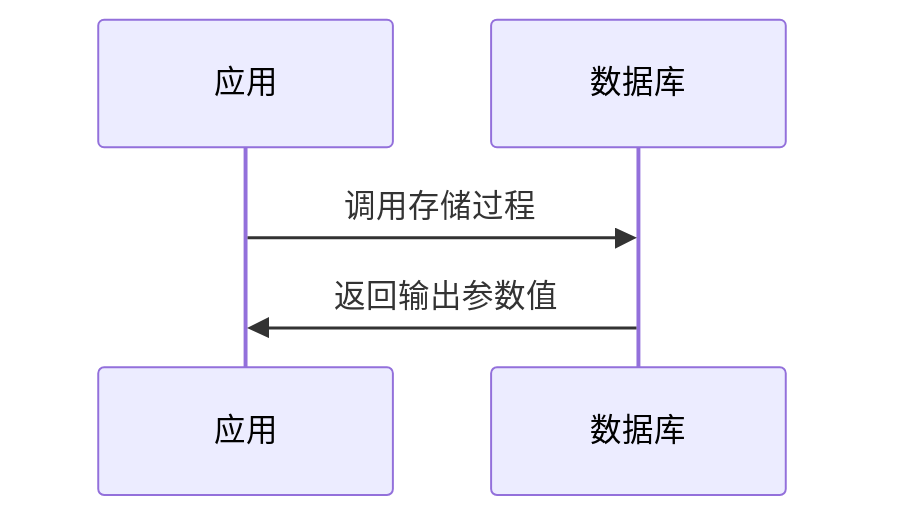

# Jdbc测试任务

> `Jdbc测试任务` 定义一个 Jdbc 协议测试任务，用于 Jdbc 功能、性能、稳定性和自定义测试。

## 主参数清单

| 字段名称          | 类型          | 是否必须 | 长度/范围  | 描述                                                                                                                  |
| ----------------- | ------------- | -------- | ---------- |---------------------------------------------------------------------------------------------------------------------|
| `target`          | enum          | 是       | -          | **任务类型标识**<br>固定值：`JDBC`                                                                                            |
| `name`            | string        | 是       | ≤400 字符  | **任务唯一标识**<br>示例：`用户数据查询`                                                                                           |
| `description`     | string        | 否       | ≤800 字符  | **任务详细说明**<br>描述任务目的和执行内容                                                                                           |
| `enabled`         | boolean       | 是       | -          | **启用状态**<br>`true`：执行任务（默认）<br>`false`：跳过任务                                                                         |
| `beforeName`      | string        | 否       | ≤400 字符  | **前序任务名称**<br>控制任务执行顺序<br>为空时使用流水线上一个任务                                                                             |
| `transactionName` | string        | 否       | ≤400 字符  | **事务名称**<br>关联的事务控制器名称<br>事务中元素必填                                                                                   |
| `type`            | enum          | 是       | -          | **SQL 操作类型**<br>`SELECT`：查询<br>`UPDATE`：更新<br>`CALLABLE`：存储过程<br>`PREPARED_SELECT`：预编译查询<br>`PREPARED_UPDATE`：预编译更新 |
| `sql`             | string        | 是       | ≤8192 字符 | **SQL 语句**<br>支持变量和 Mock 函数<br>注意：仅支持单个 SQL 语句<br>示例：`SELECT * FROM users WHERE id = {userId}`                      |
| `maxResultRows`   | integer       | 否       | 1-10000    | **最大结果行数**<br>限制返回行数（默认：1000）<br>超过的行将被忽略                                                                           |
| `timeoutInSecond` | integer       | 否       | 1-7200     | **执行超时(秒)**<br>默认无超时限制<br>生产环境建议 ≤30 秒                                                                              |
| `arguments`       | array[object] | 否       | -          | **预编译参数**<br>`PREPARED_*`类型必填<br>格式：`{name, type, value}`                                                           |
| `assertions`      | array[object] | 否       | -          | **结果断言**<br>支持：`BODY`内容匹配、`SIZE`行数验证、`DURATION`执行耗时<br>配置参考[Http断言说明](http#响应断言(assertions))                        |
| `variables`       | array[object] | 否       | -          | **结果变量提取**<br>从查询结果提取变量<br>配置参考"参数化-采样提取变量"<br>[查看采样变量定义](../../parameterization)                                   |
| `datasets`        | array[object] | 否       | -          | **测试数据集**<br>驱动参数化测试<br>支持 CSV/JSON 格式<br>配置参考"参数化-数据集"<br>[查看数据集定义](../../parameterization)                        |
| `actionOnEOF`     | enum          | 否       | -          | **数据集结束策略**<br>`RECYCLE`：循环使用（默认）<br>`STOP_THREAD`：停止线程                                                             |
| `sharingMode`     | enum          | 否       | -          | **数据共享模式**<br>`ALL_THREAD`：线程共享（默认）<br>`CURRENT_THREAD`：线程独立副本                                                      |

*Http完整结构示例：*

```yaml
- target: JDBC
  name: queryUser
  description: Query user by select statement
  enabled: true
  beforeName: BusinessTransaction
  transactionName: BusinessTransaction
  sql: SELECT * FROM {table} WHERE username = ?;
  arguments:
    # 预编译参数 ...
  assertions:
    # 断言参数配置 ...
  variables:
    # 变量参数配置 ...
  datasets:
    # 数据集参数配置 ...
  actionOnEOF: RECYCLE
  sharingMode: ALL_THREAD
```

### 查询参数类型(type)

| 类型                | SQL 语句类型 | 使用场景                         | 特点                               |
| ------------------- | ------------ | -------------------------------- | ---------------------------------- |
| **SELECT**          | 标准查询语句 | 简单数据检索<br>不需要参数化     | 直连执行<br>结果集处理             |
| **UPDATE**          | 数据修改语句 | 数据插入/更新/删除<br>表结构修改 | 返回影响行数<br>自动事务提交       |
| **CALLABLE**        | 存储过程调用 | 执行业务逻辑<br>处理复杂操作     | 支持 IN/OUT 参数<br>返回多个结果集 |
| **PREPARED_SELECT** | 预编译查询   | 重复查询优化<br>安全参数化       | 防 SQL 注入<br>执行计划复用        |
| **PREPARED_UPDATE** | 预编译修改   | 批量数据操作<br>安全更新         | 高效执行<br>参数类型安全           |

### 输入输出参数(arguments)

**`输入输出参数`用于配置在预编译 SQL、存储过程或函数中参数信息。**  

::: warning 注意事项
> 预编译语句，存储过程或函数中的参数类型在数量和顺序上必须一致。  
> 如果类型未指定，它们将作为 VARCHAR 进行处理。  
:::

| 字段名称 | 类型 | 必填 | 长度限制 | 描述 |
|----------|------|------|----------|------|
| `type` | string | 否 | ≤80字符 | **参数数据类型**<br>支持：`INTEGER`, `DECIMAL`, `DOUBLE`, `CHAR`, `VARCHAR`, `DATE`, `TIMESTAMP`<br>默认：`VARCHAR` |
| `inout` | enum | 是 | - | **参数传递方向**<br>`IN`：输入参数<br>`OUT`：输出参数<br>`INOUT`：输入输出参数 |
| `value` | string | 是 | - | **参数值**<br>支持常量、变量表达式<br>示例：`123`, `{userId}`, `NOW()` |

输入输出参数类型(inout)：

#### 1. IN 参数（输入）

- **作用**：向SQL传递输入值
- **特点**：
    - 仅用于输入
    - 值在调用前确定
    - 存储过程不能修改其值
- **示例**：
  ```sql
  -- SQL
  SELECT * FROM users WHERE id = ?
  ```
  ```yaml
  arguments:
    - type: "INTEGER"
      inout: "IN"
      value: "1001"
  ```

#### 2. OUT 参数（输出）

- **作用**：从SQL返回结果值
- **特点**：
    - 仅用于输出
    - 调用前无需赋值
    - 存储过程设置其值
- **示例**：
  ```sql
  -- 存储过程
  CREATE PROCEDURE get_count(OUT user_count INT)
  ```
  ```yaml
  arguments:
    - type: "INTEGER"
      inout: "OUT"
      value: ""  # 输出结果接收变量
  ```

#### 3. INOUT 参数（输入输出）

- **作用**：双向传递数据
- **特点**：
    - 输入输出双功能
    - 调用前需赋初始值
    - 存储过程可修改其值
- **示例**：
  ```sql
  -- 存储过程
  CREATE PROCEDURE update_balance(INOUT balance DECIMAL(10,2))
  ```
  ```yaml
  arguments:
    - type: "DECIMAL"
      inout: "INOUT"
      value: "1000.00"
  ```

## 脚本示例(target)

### 查询语句示例

```yaml
- target: JDBC
  name: QueryUser
  description: Query user by select statement
  enabled: true
  type: SELECT
  sql: SELECT * FROM `user` WHERE username = 'JohnDoe'
  maxResultRows: 2
  timeoutInSecond: 60
```

### 修改语句示例

```yaml
- target: JDBC
  name: UpdateUser
  description: Modify user by prepared update statement
  enabled: true
  type: PREPARED_UPDATE
  sql: UPDATE `user` SET password = '@String(32)' WHERE username = 'JohnDoe'
  timeoutInSecond: 60
```

### 调用函数示例

```yaml
- target: JDBC
  name: QueryUser
  description: Query the number of users by function
  enabled: true
  type: CALLABLE
  sql: "{? = CALL func_count_users_with_name(?)}"
  timeoutInSecond: 60
  arguments:
  - type: integer
    inout: OUT
  - type: varchar
    value: JohnDoe
    inout: IN
```

### 调用存储过程示例

```yaml
- target: JDBC
  name: QueryUser
  description: Query the number of users by procedure
  enabled: true
  type: CALLABLE
  sql: "{CALL count_users_with_name(?, ?)}"
  timeoutInSecond: 60
  arguments:
  - type: varchar
    value: JohnDoe
    inout: IN
  - type: integer
    inout: OUT
```

### 预编译查询语句示例

```yaml
- target: JDBC
  name: QueryUser
  description: "Query user by prepared select statement, it is equivalent to static\
    \ statement \"SELECT * FROM `user` WHERE username = 'JohnDoe'\""
  enabled: true
  type: PREPARED_SELECT
  sql: SELECT COUNT(*) FROM `user` WHERE username = ?
  maxResultRows: 1
  timeoutInSecond: 60
  arguments:
  - type: varchar
    value: JohnDoe
    inout: IN
```

### 预编译修改语句示例

```yaml
- target: JDBC
  name: UpdateUser
  description: "Modify user by prepared update statement, it is equivalent to static\
    \ statement \"UPDATE `user` SET password = 'password123' WHERE username = 'JohnDoe'\""
  enabled: true
  type: PREPARED_UPDATE
  sql: UPDATE `user` SET password = ? WHERE username = ?
  timeoutInSecond: 60
  arguments:
  - type: varchar
    value: '@String(32)'
    inout: IN
  - type: varchar
    value: JohnDoe
    inout: IN
```
