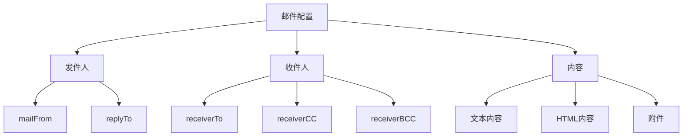

# Smtp测试任务

> `Smtp测试任务` 定义一个 Smtp 协议测试任务，用于 Smtp 功能、性能、稳定性和自定义测试。

## 主参数清单

| 字段名称      | 类型    | 必填 | 长度/范围 | 默认值 | 描述                                                  |
| ------------- | ------- | ---- | --------- | ------ | ----------------------------------------------------- |
| `target`      | enum    | 是   | -         | `SMTP` | **任务类型标识**<br>固定值：SMTP                      |
| `name`        | string  | 是   | ≤400 字符 | -      | **任务唯一标识**<br>示例：`订单通知邮件`              |
| `description` | string  | 否   | ≤800 字符 | -      | **任务描述**<br>详细说明邮件用途                      |
| `enabled`     | boolean | 是   | -         | `true` | **启用状态**<br>`true`：执行任务<br>`false`：跳过任务 |
| `beforeName`  | string  | 否   | ≤400 字符 | -      | **前序任务**<br>控制执行顺序<br>示例：`数据准备任务`  |
| `server`      | object  | 是   | -         | -      | **SMTP 服务器配置**<br>包含连接和认证信息             |
| `mail`        | object  | 是   | -         | -      | **邮件内容配置**<br>包含发件人、收件人、主题、正文等  |

::: tip 注意
支持同时编排多个 Smtp 接口，但每次只允许启用一个 Smtp 进行测试。
:::

*Mail完整结构配置示例：*

```yaml
- target: SMTP
  name: Send mail messages (SMTP)
  description: Using SMTP protocol to send emails
  enabled: true
  server:
    # 邮件服务器配置 ...
  mail:
    # 邮件配置
```

### Smtp服务器配置(server)

| 字段名称         | 类型    | 必填 | 范围/长度  | 默认值 | 说明                                                                                                       |
| ---------------- | ------- | ---- | ---------- | ------ | ---------------------------------------------------------------------------------------------------------- |
| `server`         | string  | 是   | -          | -      | **邮件服务器地址**<br>支持域名/IP<br>示例：`mail.example.com`                                              |
| `port`           | integer | 是   | 1-65535    | -      | **服务端口**<br>标准端口：<br>SMTP:25, POP3:110, IMAP:143<br>加密端口：<br>SMTPS:465, POP3S:995, IMAPS:993 |
| `security`       | object  | 是   | -          | -      | **安全配置对象**<br>详见安全配置说明                                                                       |
| `useAuth`        | boolean | 是   | -          | `true` | **启用认证**<br>`true`：需要用户名密码<br>`false`：匿名访问                                                |
| `username`       | string  | 条件 | ≤400 字符  | -      | **认证账号**<br>`useAuth=true`时必填<br>完整邮箱格式：`user@domain.com`                                    |
| `password`       | string  | 条件 | ≤4096 字符 | -      | **认证凭证**<br>`useAuth=true`时必填<br>支持加密存储                                                       |
| `connectTimeout` | string  | 否   | 1s-24h     | `6s`   | **连接超时**<br>格式：`数字+单位`（如`10s`）<br>建立 TCP 连接最大等待时间                                  |
| `readTimeout`    | string  | 否   | 1s-24h     | `60s`  | **读取超时**<br>格式：`数字+单位`（如`30s`）<br>单次数据读取最大等待时间                                   |

*Smtp服务器结构配置示例：*

```yaml
server:
  server: 192.168.0.211
  port: 993
  security:
    # 安全配置 ...
  useAuth: true
  username: test001@xcan.cloud
  password: test001@xcan
  connectTimeout: 6s
  readTimeout: 60s
```

#### Smtp服务器安全配置(security)


| 参数                      | 类型    | 必填 | 长度限制   | 默认值  | 说明                                                                                     |
| ------------------------- | ------- | ---- | ---------- | ------- | ---------------------------------------------------------------------------------------- |
| `use`                     | enum    | 是   | -          | `NONE`  | **加密类型**<br>`NONE`：明文传输<br>`USE_SSL`：SSL 加密<br>`USE_STARTTLS`：STARTTLS 升级 |
| `trustAllCerts`           | boolean | 否   | -          | `false` | **信任所有证书**<br>`true`：跳过证书验证（危险）<br>`false`：验证证书有效性              |
| `enforceStartTLS`         | boolean | 否   | -          | `false` | **强制 STARTTLS**<br>`true`：拒绝不支持的服务器<br>`false`：降级为明文                   |
| `useLocalTrustStore`      | boolean | 否   | -          | `false` | **使用本地信任库**<br>`true`：使用自定义证书<br>`false`：使用系统默认                    |
| `trustStorePath`          | string  | 条件 | ≤4096 字符 | -       | **信任库路径**<br>本地证书文件路径<br>示例：`/etc/ssl/custom.pem`                        |
| `trustStoreBase64Content` | string  | 条件 | ≤40KB      | -       | **信任库内容**<br>Base64 编码证书内容                                                    |
| `tlsProtocols`            | string  | 否   | ≤80 字符   | -       | **强制协议版本**<br>示例：`TLSv1.2, TLSv1.3`                                             |

::: tip 注意
使用 trustStorePath 时需要确保文件已上传到对应执行节点路径。
:::

*Smtp服务器安全配置示例：*

```yaml
security:
  use: USE_START_TLS
  trustAllCerts: true
  enforceStartTLS: false
  useLocalTrustStore: false
  trustStorePath: ""
  trustStoreBase64Content: VGhpcyBpcyBhIGNlcnRpZmljYXRlIGNvbnRlbnQ=
  tlsProtocols: TLSv1.2
```

### Smtp邮件发送配置(mail)

| 字段名称      | 类型   | 必填 | 长度限制   | 描述                                                                                         |
| ------------- | ------ | ---- | ---------- | -------------------------------------------------------------------------------------------- |
| `mailFrom`    | string | 否   | ≤4096 字符 | **发件人地址**<br>格式：`"显示名 <email@domain.com>"`<br>未设置时使用服务器认证账户          |
| `replyTo`     | string | 否   | ≤4096 字符 | **回复地址**<br>多个地址用英文分号分隔<br>示例：`"support@company.com;feedback@company.com"` |
| `receiverTo`  | string | 是   | ≤4096 字符 | **主送地址**<br>多个地址用英文分号分隔<br>示例：`"user1@example.com;user2@example.com"`      |
| `receiverCC`  | string | 否   | ≤4096 字符 | **抄送地址**<br>多个地址用英文分号分隔<br>示例：`"manager@example.com;team@example.com"`     |
| `receiverBCC` | string | 否   | ≤4096 字符 | **密送地址**<br>多个地址用英文分号分隔<br>示例：`"archive@example.com;audit@example.com"`    |
| `content`     | object | 是   | -          | **邮件内容配置**<br>包含主题、正文、附件等完整内容                                           |

*参数分组与关系示意图：*



*Smtp邮件发送配置示例：*

```yaml
mail:
  mailFrom: test002@xcan.cloud
  replyTo: reply@xcan.cloud
  receiverTo: test001@xcan.cloud
  receiverCC: ccrecipient@xcan.cloud
  receiverBCC: bccrecipient@xcan.cloud
  content:
    subject: The subject of the email
    suppressSubject: false
    message: The main content or body of the email.
    plainBody: true
    includeTimestamp: true
    localAttachFiles:
      - /data/attach1.txt
      - /data/attach2.txt
    localAttachBase64Contents:
      attach1.txt: VGhpcyBpcyBhIGF0dGFjaG1lbnQxIGNvbnRlbnQ=
      attach2.txt: VGhpcyBpcyBhIGF0dGFjaG1lbnQyIGNvbnRlbnQ=
    messageSizeStatistics: true
    headerFields:
      X-MyHeader1: CustomValue1
      X-MyHeader2: CustomValue2
    sendEmlMessage: false
    localEmlMessageFile: /data/test.eml
    localEmlMessageBase64Content: VGhpcyBpcyBhIGVtYWlsIGNvbnRlbnQ=
    enableDebugLogging: true
```

#### Smtp发送邮件内容配置(content)

| 字段名称                       | 类型    | 必填 | 长度/数量限制 | 描述                                                                                                   |
| ------------------------------ | ------- | ---- | ------------- | ------------------------------------------------------------------------------------------------------ |
| `subject`                      | string  | 否   | ≤4096 字符    | **邮件主题**<br>清晰描述邮件内容<br>示例：`订单确认 - #{orderId}`                                      |
| `suppressSubject`              | boolean | 否   | -             | **禁用主题**<br>`true`：发送无主题邮件<br>`false`：包含主题（默认）                                    |
| `message`                      | string  | 否   | ≤2MB          | **邮件正文**<br>支持纯文本/HTML 格式<br>使用`plainBody`指定格式                                        |
| `plainBody`                    | boolean | 否   | -             | **纯文本格式**<br>`true`：纯文本<br>`false`：HTML 格式（默认）                                         |
| `includeTimestamp`             | boolean | 否   | -             | **包含时间戳**<br>`true`：在正文添加发送时间<br>`false`：不添加（默认）                                |
| `localAttachFiles`             | array   | 否   | 1-100 项      | **本地附件路径**<br>多个文件路径数组<br>示例：`["/reports/invoice.pdf", "/data/export.csv"]`           |
| `localAttachBase64Contents`    | map     | 否   | 1-100 项      | **Base64 附件内容**<br>键：文件名<br>值：Base64 编码内容<br>示例：`{"report.xlsx": "base64string..."}` |
| `messageSizeStatistics`        | object  | 否   | -             | **邮件大小统计**<br>包含邮件大小信息<br>示例：`{enabled: true, maxSize: "10MB"}`                       |
| `headerFields`                 | map     | 否   | 1-200 项      | **自定义邮件头**<br>键值对形式<br>示例：`X-Priority: "1"`<br>`X-Mailer: "AngusTester"`                 |
| `sendEmlMessage`               | boolean | 否   | -             | **使用 EML 格式**<br>`true`：发送 EML 格式邮件<br>`false`：标准格式（默认）                            |
| `localEmlMessageFile`          | string  | 否   | ≤4096 字符    | **EML 文件路径**<br>`sendEmlMessage=true`时使用<br>与`localEmlMessageBase64Content`二选一              |
| `localEmlMessageBase64Content` | string  | 否   | ≤2MB          | **Base64 编码 EML 内容**<br>`sendEmlMessage=true`时使用<br>与`localEmlMessageFile`二选一               |
| `enableDebugLogging`           | boolean | 否   | -             | **启用调试日志**<br>`true`：记录详细发送日志<br>`false`：仅错误日志（默认）                            |

::: tip 注意
使用 localAttachFiles 和 localEmlMessageFile 时需要确保文件已上传到对应执行节点路径。
:::

* Smtp发送邮件内容配置示例：*

```yaml
content:
  subject: The subject of the email
  suppressSubject: false
  message: The main content or body of the email.
  plainBody: true
  includeTimestamp: true
  localAttachFiles:
    - /data/attach1.txt
    - /data/attach2.txt
  localAttachBase64Contents:
    attach1.txt: VGhpcyBpcyBhIGF0dGFjaG1lbnQxIGNvbnRlbnQ=
    attach2.txt: VGhpcyBpcyBhIGF0dGFjaG1lbnQyIGNvbnRlbnQ=
  messageSizeStatistics: true
  headerFields:
    X-MyHeader1: CustomValue1
    X-MyHeader2: CustomValue2
  sendEmlMessage: false
  localEmlMessageFile: /data/test.eml
  localEmlMessageBase64Content: VGhpcyBpcyBhIGVtYWlsIGNvbnRlbnQ=
  enableDebugLogging: true
```

## 脚本示例(target)

### 完整参数配置示例

```yaml
- target: SMTP
  name: Send mail messages (SMTP)
  description: Using SMTP protocol to send emails
  enabled: true
  server:
    server: 192.168.0.211
    port: 465
    security:
      use: USE_START_TLS
      trustAllCerts: true
      enforceStartTLS: false
      useLocalTrustStore: false
      trustStoreBase64Content: VGhpcyBpcyBhIGNlcnRpZmljYXRlIGNvbnRlbnQ=
      tlsProtocols: TLSv1.2
    useAuth: true
    username: test001@xcan.cloud
    password: test001@xcan
    readTimeout: 60s
    connectTimeout: 6s
  mail:
    mailFrom: test002@xcan.cloud
    replyTo: reply@xcan.cloud
    receiverTo: test001@xcan.cloud
    receiverCC: ccrecipient@xcan.cloud
    receiverBCC: bccrecipient@xcan.cloud
    content:
      subject: The subject of the email
      suppressSubject: false
      message: The main content or body of the email.
      plainBody: true
      includeTimestamp: true
      localAttachFiles:
        - /data/attach1.txt
        - /data/attach2.txt
      localAttachBase64Contents:
        attach1.txt: VGhpcyBpcyBhIGF0dGFjaG1lbnQxIGNvbnRlbnQ=
        attach2.txt: VGhpcyBpcyBhIGF0dGFjaG1lbnQyIGNvbnRlbnQ=
      messageSizeStatistics: true
      headerFields:
        X-MyHeader1: CustomValue1
        X-MyHeader2: CustomValue2
      sendEmlMessage: false
      localEmlMessageFile: /data/test.eml
      localEmlMessageBase64Content: VGhpcyBpcyBhIGVtYWlsIGNvbnRlbnQ=
      enableDebugLogging: true
```

### 发送纯文本电子邮件

```yaml
- target: SMTP
  name: Send mail plain message (SMTP)
  description: Using SMTP protocol to send plain message email
  enabled: true
  server:
    server: 192.168.0.211
    port: 465
    security:
      use: USE_SSL
      trustAllCerts: true
      enforceStartTLS: false
      useLocalTrustStore: false
    useAuth: true
    username: test001@xcan.cloud
    password: test001@xcan
    readTimeout: 60s
    connectTimeout: 6s
  mail:
    mailFrom: test002@xcan.cloud
    receiverTo: test001@xcan.cloud
    content:
      subject: The subject of the email
      suppressSubject: false
      message: The main content or body of the email.
      plainBody: true
      enableDebugLogging: false
```

### 发送包含附件的文本电子邮件

```yaml
- target: SMTP
  name: Send mail local attachments message (SMTP)
  description: Using SMTP protocol to send local attachments message email
  enabled: true
  server:
    server: 192.168.0.211
    port: 465
    security:
      use: USE_SSL
      trustAllCerts: true
      enforceStartTLS: false
      useLocalTrustStore: false
    useAuth: true
    username: test001@xcan.cloud
    password: test001@xcan
    readTimeout: 60s
    connectTimeout: 6s
  mail:
    mailFrom: test002@xcan.cloud
    receiverTo: test001@xcan.cloud
    content:
      subject: The subject of the email
      suppressSubject: false
      message: The main content or body of the email.
      plainBody: true
      includeTimestamp: true
      localAttachFiles:
        - attach1.txt
        - attach2.txt
      localAttachBase64Contents:
        attach1.txt: VGhpcyBpcyBhIGF0dGFjaG1lbnQxIGNvbnRlbnQ=
        attach2.txt: VGhpcyBpcyBhIGF0dGFjaG1lbnQyIGNvbnRlbnQ=
      enableDebugLogging: false
```

### 发送 eml 格式文件电子邮件

```yaml
- target: SMTP
  name: Send mail eml file message (SMTP)
  description: Using SMTP protocol to send eml file message email
  enabled: true
  server:
    server: 192.168.0.211
    port: 465
    security:
      use: USE_SSL
      trustAllCerts: true
      enforceStartTLS: false
      useLocalTrustStore: false
    useAuth: true
    username: test001@xcan.cloud
    password: test001@xcan
    readTimeout: 60s
    connectTimeout: 6s
  mail:
    mailFrom: test002@xcan.cloud
    receiverTo: test001@xcan.cloud
    content:
      subject: The subject of the email
      suppressSubject: false
      plainBody: false
      sendEmlMessage: true
      localEmlMessageBase64Content: VGhpcyBpcyBhIGVtYWlsIGNvbnRlbnQ=
      enableDebugLogging: false
```
