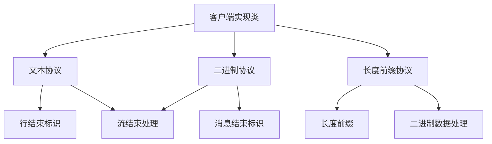

# Tcp测试任务

> `Tcp测试任务` 定义一个 Tcp 协议测试任务，用于 Tcp 功能、性能、稳定性和自定义测试。

## 主参数清单

| 字段名称       | 类型    | 必填 | 长度/范围 | 默认值 | 描述                                                                                           |
| -------------- | ------- | ---- | --------- | ------ | ---------------------------------------------------------------------------------------------- |
| `target`       | enum    | 是   | -         | `TCP`  | **任务类型标识**<br>固定值：TCP                                                                |
| `name`         | string  | 是   | ≤400 字符 | -      | **任务唯一标识**<br>示例：`设备心跳检测`                                                       |
| `description`  | string  | 否   | ≤800 字符 | -      | **任务描述**<br>详细说明通信目的                                                               |
| `enabled`      | boolean | 是   | -         | `true` | **启用状态**<br>`true`：执行任务<br>`false`：跳过任务                                          |
| `beforeName`   | string  | 否   | ≤400 字符 | -      | **前序任务**<br>控制执行顺序<br>示例：`数据准备任务`                                           |
| `server`       | object  | 是   | -         | -      | **服务器配置**<br>包含主机地址和端口信息                                                       |
| `data`         | string  | 是   | ≤2MB      | -      | **发送数据**<br>支持原始内容或 Base64 编码<br>支持变量和函数<br>示例：`@Hex('A0 01 FF')`       |
| `dataEncoding` | enum    | 否   | -         | `none` | **数据编码**<br>`none`：原始数据<br>`base64`：Base64 编码<br>`gzip_base64`：Gzip 压缩后 Base64 |
| `setting`      | object  | 是   | -         | -      | **连接设置**<br>包含超时、缓冲、重试等参数                                                     |

::: tip 注意
支持同时编排多个 Smtp 接口，但每次只允许启用一个 Smtp 进行测试。
:::

*Tcp完整结构配置示例：*

```yaml
- target: TCP
  name: Send tcp plain data
  description: Using tcp protocol to send plain data to server
  enabled: true
  server:
    # 服务器配置 ...
  data: "This is a tcp data content"
  dataEncoding: none
  setting:
    # 请求设置 ...
```

### 服务配置器(server)

| 字段名称          | 类型    | 必填 | 长度/范围 | 默认值 | 描述                                                                              |
| ----------------- | ------- | ---- | --------- | ------ | --------------------------------------------------------------------------------- |
| `server`          | string  | 是   | ≤253 字符 | -      | **服务器地址**<br>支持 IPv4/IPv6 地址或域名<br>示例：`device-gateway.example.com` |
| `port`            | integer | 是   | 1-65535   | -      | **服务端口**<br>标准端口范围<br>示例：`502`（Modbus）                             |
| `connectTimeout`  | string  | 否   | 1s-24h    | `6s`   | **连接建立超时**<br>格式：数字+单位（如`10s`）<br>跨地域连接建议 15-30s           |
| `responseTimeout` | string  | 否   | 1s-24h    | `60s`  | **响应等待超时**<br>格式：数字+单位（如`30s`）<br>大数据传输建议 120-300s         |

*服务配置器示例：*

```yaml
server:
  server: localhost
  port: 8083
  connectTimeout: 6s
  responseTimeout: 60s
```

### 请求设置(setting)

| 字段名称             | 类型    | 必填 | 长度/范围 | 默认值  | 描述                                                                                                                                                          |
| -------------------- | ------- | ---- | --------- | ------- | ------------------------------------------------------------------------------------------------------------------------------------------------------------- |
| `tcpClientImplClass` | enum    | 是   | -         | -       | **TCP 客户端实现类**<br>`TcpClientImpl`：标准文本协议<br>`BinaryTcpClientImpl`：原始二进制协议<br>`LengthPrefixedBinaryTcpClientImpl`：带长度前缀的二进制协议 |
| `reUseConnection`    | boolean | 否   | -         | `true`  | **连接重用**<br>`true`：保持连接复用<br>`false`：每次新建连接<br>高频请求建议启用                                                                             |
| `closeConnection`    | boolean | 否   | -         | `false` | **立即关闭连接**<br>`true`：发送后立即关闭<br>`false`：保持连接打开<br>与`reUseConnection`互斥                                                                |
| `soLinger`           | integer | 否   | 0-65535   | -       | **关闭延迟时间(秒)**<br>设置 TCP 连接的 SO_LINGER 选项<br>`0`：立即关闭<br>`>0`：等待指定秒数                                                                 |
| `tcpNoDelay`         | boolean | 否   | -         | `true`  | **禁用 Nagle 算法**<br>`true`：禁用，减少延迟<br>`false`：启用，提高吞吐量<br>实时系统建议禁用                                                                |
| `tcpCharset`         | string  | 否   | ≤16 字符  | `UTF-8` | **字符编码**<br>支持标准字符集名称<br>示例：`GBK`, `ISO-8859-1`, `UTF-16`                                                                                     |
| `eolByte`            | byte    | 否   | 0-255     | -       | **行结束字节**<br>用于文本协议的行分隔符<br>示例：`10`（`\n`）                                                                                                |
| `eomByte`            | byte    | 否   | 0-255     | -       | **消息结束字节**<br>用于消息结束标识<br>示例：`13`（`\r`）                                                                                                    |
| `binaryPrefixLength` | integer | 否   | 2 或 4    | -       | **长度前缀字节数**<br>二进制协议的消息长度前缀<br>`2`：2 字节（65535 字节）<br>`4`：4 字节（4GB）                                                             |

*请求设置示例：*

```yaml
setting:
  tcpClientImplClass: TcpClientImpl
  reUseConnection: true
  closeConnection: false
  soLinger: 100000
  tcpNoDelay: true
  tcpCharset: UTF-8
  eolByte: 10
  eomByte: 13
  binaryPrefixLength: 2
```

#### 客户端实现类(tcpClientImplClass)

<br><br>


<br><br>

##### 1. **TcpClientImpl (文本协议实现)**
**核心功能**：
- 适用于基于行的文本协议（如Telnet、SMTP）
- 使用`eolByte`参数定义行结束符（如`\n`=10）
- 未设置`eolByte`时读取整个连接流
- 典型应用：命令行接口、日志采集

**企业级配置**：
```yaml
tcpClientImplClass: "TcpClientImpl"
eolByte: 10  # \n换行符
```

##### 2. **BinaryTcpClientImpl (原始二进制实现)**
**核心功能**：
- 适用于无结构的二进制协议
- 使用`eomByte`参数定义消息结束符（如`0x03`=ETX）
- 未设置`eomByte`时读取整个连接流
- 典型应用：工业控制、设备通信

**企业级配置**：
```yaml
tcpClientImplClass: "BinaryTcpClientImpl"
eomByte: 3  # ETX结束符
```

##### 3. **LengthPrefixedBinaryTcpClientImpl (长度前缀协议实现)**
**核心功能**：
- 适用于带长度前缀的二进制协议
- 通过`binaryPrefixLength`指定前缀长度（2或4字节）
- 自动解析长度头并读取精确数据量
- 典型应用：金融支付(ISO8583)、大数据传输

**企业级配置**：
```yaml
tcpClientImplClass: "LengthPrefixedBinaryTcpClientImpl"
binaryPrefixLength: 2  # 2字节长度前缀
```

## 脚本示例(target)

### 完整参数配置示例

```yaml
- target: TCP
  name: Send tcp plain data
  description: Using tcp protocol to send plain data to server
  enabled: true
  server:
    server: localhost
    port: 8083
    connectTimeout: 6s
    responseTimeout: 60s
  data: "This is a tcp data content"
  dataEncoding: none
  setting:
    tcpClientImplClass: TcpClientImpl
    reUseConnection: true
    closeConnection: false
    soLinger: 100000
    tcpNoDelay: true
    tcpCharset: UTF-8
    eolByte: 10
    eomByte: 13
    binaryPrefixLength: 2
```

### 使用 TcpClientImpl 类实现发送 TCP 数据

```yaml
- target: TCP
  name: Send tcp data using eol byte
  description: Send TCP data using the TcpClientImpl class implementation.
  enabled: true
  server:
    server: localhost
    port: 8083
    connectTimeout: 6s
    responseTimeout: 60s
  data: This is a tcp data content
  dataEncoding: none
  setting:
    tcpClientImplClass: TcpClientImpl
    reUseConnection: true
    closeConnection: false
    tcpNoDelay: true
    tcpCharset: UTF-8
    eolByte: 10
```

###  使用 BinaryTcpClientImpl 类实现发送 TCP 数据

```yaml
- target: TCP
  name: Send tcp data using eom byte
  description: Send TCP data using the BinaryTcpClientImpl class implementation.
  enabled: true
  server:
    server: localhost
    port: 8083
    connectTimeout: 6s
    responseTimeout: 60s
  data: This is a tcp data content
  dataEncoding: none
  setting:
    tcpClientImplClass: BinaryTcpClientImpl
    reUseConnection: true
    closeConnection: false
    tcpNoDelay: true
    tcpCharset: UTF-8
    eomByte: 13
```

### 使用 LengthPrefixedBinaryTcpClientImpl 类实现发送 TCP 数据

```yaml
- target: TCP
  name: Send tcp data using length prefixed
  description: Send TCP data using the LengthPrefixedBinaryTcpClientImpl class implementation.
  enabled: true
  server:
    server: localhost
    port: 8083
    connectTimeout: 6s
    responseTimeout: 60s
  data: This is a tcp data content
  dataEncoding: none
  setting:
    tcpClientImplClass: LengthPrefixedBinaryTcpClientImpl
    reUseConnection: true
    closeConnection: false
    tcpNoDelay: true
    tcpCharset: UTF-8
    binaryPrefixLength: 2
```
