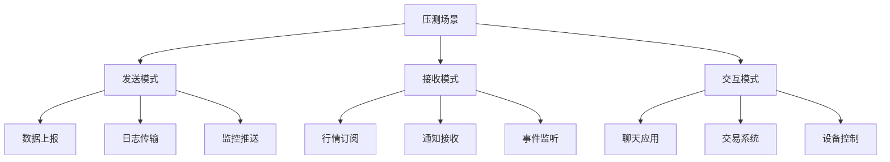
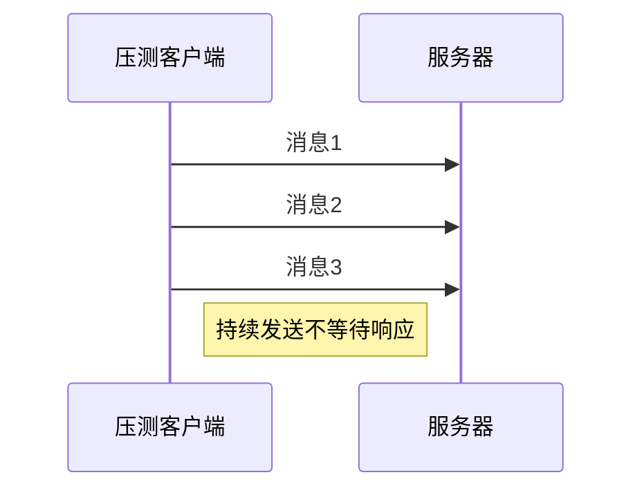
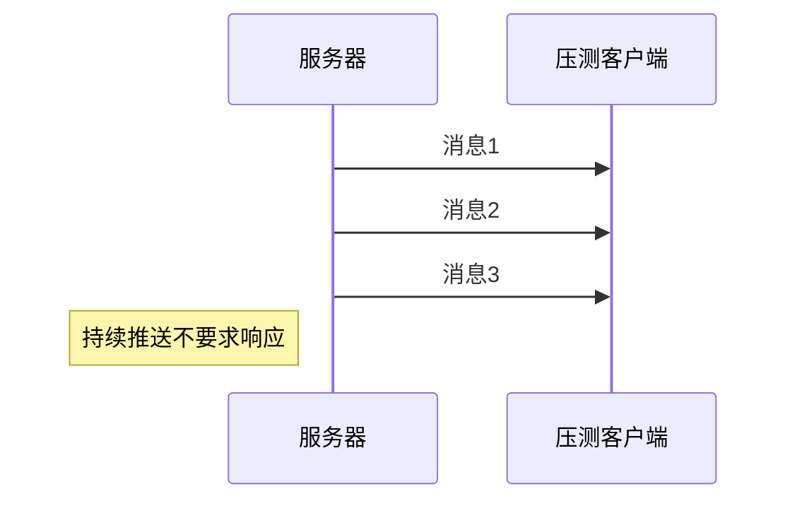
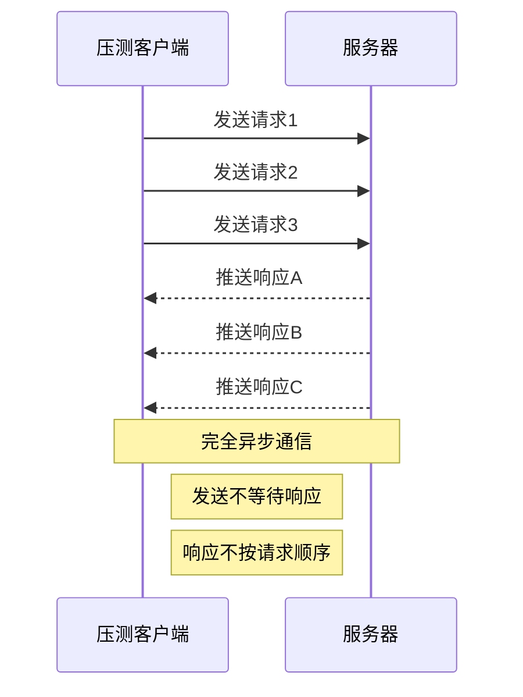

# WebSocket测试任务

> `WebSocket测试任务` 定义一个 WebSocket 协议测试任务，用于 WebSocket 功能、性能、稳定性和自定义测试。

## 主参数清单

| 字段名称          | 类型    | 必填 | 长度/范围  | 描述                                                                                   |
| ----------------- | ------- | ---- | ---------- |--------------------------------------------------------------------------------------|
| `target`          | enum    | 是   | -          | **任务类型标识**<br>固定值：`WEBSOCKET`                                                        |
| `name`            | string  | 是   | ≤400 字符  | **任务唯一标识**<br>示例：`实时股票行情`                                                            |
| `description`     | string  | 否   | ≤800 字符  | **任务描述**<br>详细说明接口功能                                                                 |
| `enabled`         | boolean | 是   | -          | **启用状态**<br>`true`：启用（默认）<br>`false`：禁用                                              |
| `apisId`          | integer(int64) | 否   | -          | **接口关联 ID**<br>关联 AngusTester 接口 ID<br>测试结果将更新到对应接口                                  |
| `url`             | string  | 否   | ≤2000 字符 | **完整请求 URL**<br>优先级高于 server+endpoint 组合<br>示例：`wss://api.example.com/ws`            |
| `server`          | object  | 否   | -          | **服务器配置**<br>包含协议、主机、端口等<br>与`endpoint`组合构成完整 URL                                    |
| `endpoint`        | string  | 否   | ≤800 字符  | **请求端点**<br>与`server`组合构成完整 URL<br>示例：`/market/data`                                 |
| `parameters`      | array[object]   | 否   | 1-7200 项  | **请求参数**<br>包含查询参数、路径参数等<br>配置参考[HTTP请求参数说明](http.md#请求构建(request))                  |
| `mode`            | enum    | 是   | -          | **消息交互模式**<br>`ONLY_SEND`：仅发送<br>`ONLY_RECEIVE`：仅接收<br>`SEND_AND_RECEIVE`：双向交互（默认）   |
| `message`         | string  | 否   | ≤8192 字符 | **发送消息内容**<br>支持变量和 Mock 函数<br>示例：`{"symbol":"{stockSymbol}"}`                       |
| `messageEncoding` | enum    | 否   | -          | **消息编码格式**<br>`none`：原始文本（默认）<br>`base64`：Base64 编码<br>`gzip_base64`：Gzip 压缩后 Base64 |
| `assertions`      | array[object]   | 否   | -          | **响应断言**<br>支持内容、大小、耗时验证<br>配置参考[Http断言说明](http#响应断言(assertions))                    |
| `datasets`        | array[object]   | 否   | -          | **测试数据集**<br>驱动参数化测试<br>支持 CSV/JSON 格式<br>[查看数据集定义](../../parameterization)          |
| `actionOnEOF`     | enum    | 否   | -          | **数据集结束策略**<br>`RECYCLE`：循环使用（默认）<br>`STOP_THREAD`：停止线程                              |
| `sharingMode`     | enum    | 否   | -          | **数据共享模式**<br>`ALL_THREAD`：线程共享（默认）<br>`CURRENT_THREAD`：线程独立副本                       |

::: tip 注意
支持同时编排多个 WebSocket 接口，但每次只允许启用一个 WebSocket 进行测试。
:::

*WebSocket完整结构配置示例：*

```yaml
- target: WEBSOCKET
  name: The `SEND_AND_RECEIVE` mode example
  description:
    "The client and server simultaneously remoting messages with each other,\
    \ default Mode."
  enabled: true
  url: ws://localhost:8082/example/SEND_AND_RECEIVE
  parameters:
    # 请求参数配置 ...
  mode: SEND_AND_RECEIVE
  message: Hi~
  messageEncoding: none
  assertions:
    # 断言配置 ...
  datasets:
    # 数据集配置 ...
  actionOnEOF: RECYCLE
  sharingMode: ALL_THREAD
```

### 消息模式(mode)

*WebSocket 压测消息模式场景解析：*


<br>

#### 1. **ONLY_SEND (仅发送)**
<br>



**压测场景**：
- **数据上报系统**：设备状态、传感器数据持续上报
- **日志采集系统**：分布式系统日志实时传输
- **监控数据推送**：服务器指标批量推送

**压测指标**：
- 消息发送速率（msg/s）
- 连接并发数
- 带宽占用率

#### 2. **ONLY_RECEIVE (仅接收)**
<br>



**压测场景**：
- **行情订阅系统**：股票/加密货币实时行情推送
- **实时通知系统**：系统告警、订单状态变更通知
- **事件广播系统**：赛事比分、新闻实时更新

**压测指标**：
- 消息接收吞吐量（msg/s）
- 消息延迟（ms）
- 连接稳定性

#### 3. **SEND_AND_RECEIVE (发送并接收)**
<br>



**压测场景**：
- **即时通讯**：聊天应用消息交互
- **设备控制**：指令发送与状态反馈

**压测指标**：
- 端到端延迟（ms）
- 事务成功率（%）
- 并发会话数

## 脚本示例(target)

### 完整参数配置示例

```yaml
- target: WEBSOCKET
  name: The `SEND_AND_RECEIVE` mode example
  description:
    "The client and server simultaneously remoting messages with each other,\
    \ default Mode."
  enabled: true
  url: ws://localhost:8082/example/SEND_AND_RECEIVE
  parameters:
    - name: access_token
      in: query
      description: Authentication parameters when connecting to WebSocket.
      enabled: true
      type: string
      value: 17062ee76ea94bd28cf4eccc48a85f0e
    - name: ServerMessage
      in: query
      description:
        This is the simulated test client's expectation for the message to
        be returned by the server.
      enabled: true
      type: string
      value: Hi~ {name}
  mode: SEND_AND_RECEIVE
  message: Hi~
  messageEncoding: none
  assertions:
    - name: Assert that the received content includes SUCCESS.
      enabled: true
      type: BODY
      assertionCondition: CONTAIN
      expected: SUCCESS
    - name: Assert that the length of the received content does not exceed 1 KB.
      enabled: true
      type: SIZE
      assertionCondition: LESS_THAN
      expected: 1024
    - name:
        Assert that the time interval for receiving the latest message does not exceed
        200 milliseconds.
      enabled: true
      type: DURATION
      assertionCondition: EQUAL
      expected: 200
  datasets:
    - name: NameDataset
      parameters:
        - name: name
          value: '@Name()'
  actionOnEOF: RECYCLE
  sharingMode: ALL_THREAD
```

### 客户端仅发送消息到服务端(ONLY_SEND)模式示例

```yaml
- target: WEBSOCKET
  name: The `ONLY_SEND` mode example
  description: Only send custom messages to the server.
  enabled: true
  url: ws://localhost:8082/example/ONLY_SEND
  parameters:
    - name: access_token
      in: query
      description: Authentication parameters when connecting to WebSocket.
      enabled: true
      type: string
      value: 17062ee76ea94bd28cf4eccc48a85f0e
  mode: ONLY_SEND
  message: Hi~
```

### 客户端仅接收服务端消息(ONLY_RECEIVE)模式示例

```yaml
- target: WEBSOCKET
  name: The `ONLY_RECEIVE` mode example
  description: Only receiving messages from the server and asserting them.
  enabled: true
  url: ws://localhost:8082/example/ONLY_RECEIVE
  parameters:
    - name: access_token
      in: query
      description: Authentication parameters when connecting to WebSocket.
      enabled: true
      type: string
      value: 17062ee76ea94bd28cf4eccc48a85f0e
    - name: ServerMessage
      in: query
      description: This is the simulated test client's expectation for the message to be returned by the server.
      enabled: true
      type: string
      value: This is a `SUCCESS` message returned by the server.
    - name: ServerDelay
      in: query
      description: This is the simulated test client's expectation for the delay(milliseconds) in the message returned by the server.
      enabled: true
      type: string
      value: 20-200
  mode: ONLY_RECEIVE
  assertions:
    - name: Assert that the received content includes SUCCESS.
      enabled: true
      type: BODY
      expected: SUCCESS
      assertionCondition: CONTAIN
    - name: Assert that the length of the received content does not exceed 1 KB.
      enabled: true
      type: SIZE
      expected: 1024
      assertionCondition: LESS_THAN
    - name:
        Assert that the time interval for receiving the latest message does not
        exceed 200 milliseconds.
      enabled: true
      type: DURATION
      expected: 200
      assertionCondition: LESS_THAN
```

### 客户端发送消息同时接收服务端消息(SEND_AND_RECEIVE)模式示例

```yaml
- target: WEBSOCKET
  name: The `SEND_AND_RECEIVE` mode example
  description: The client and server simultaneously remoting messages with each other, default Mode.
  enabled: true
  url: ws://localhost:8082/example/SEND_AND_RECEIVE
  parameters:
    - name: access_token
      in: query
      description: Authentication parameters when connecting to WebSocket.
      enabled: true
      type: string
      value: 17062ee76ea94bd28cf4eccc48a85f0e
    - name: ServerMessage
      in: query
      description: This is the simulated test client's expectation for the message to be returned by the server.
      enabled: true
      type: string
      value: Hi~
  mode: SEND_AND_RECEIVE
  message: Hi~
  assertions:
    - name: Assert that the received content includes SUCCESS.
      enabled: true
      type: BODY
      expected: Hi~
      assertionCondition: EQUAL
```
