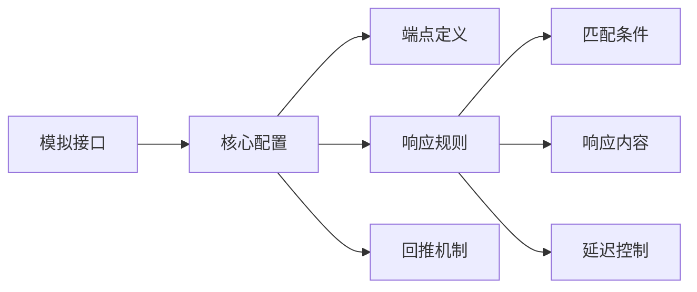
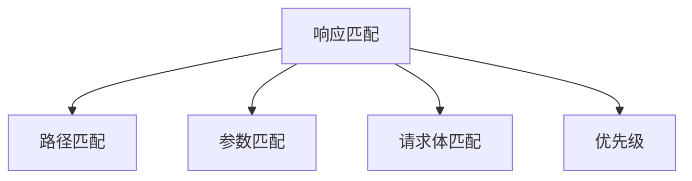
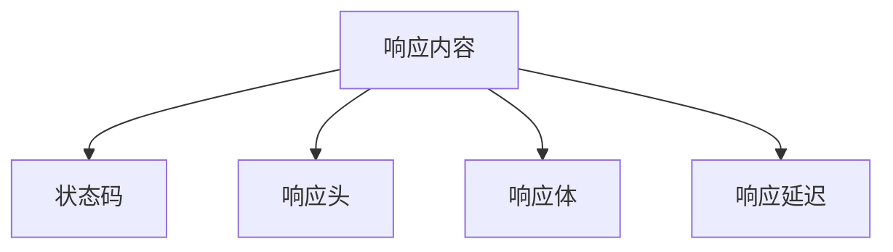
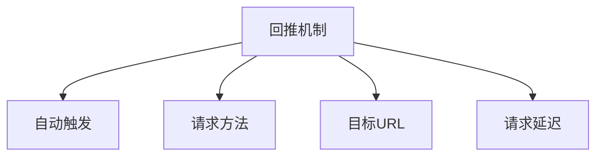

# 模拟接口任务

> `Mock接口` 用于快速生成并模拟您所依赖的 API，使开发和测试先行，通过 Mock 接口测试也可避免直接与生产系统联调造成的脏数据问题。

> **AngusTester模拟接口让您能够：** 
> - **前置开发测试** - 不依赖后端完成联调  
> - **异常场景构建** - 模拟各类错误和延迟  
> - **异步流程验证** - 通过回推机制测试回调逻辑  
> - **安全隔离** - 避免测试脏数据污染生产环境

::: tip 使用提示
使用前需在AngusTester应用`Mock`中创建并启动**Mock服务**，通过**导入接口**功能加载脚本。
:::



## 主参数清单

| 字段名称    | 类型          | 是否必须 | 长度/数量限制 | 描述                                                                    |
| ---------- | ------------- | -------- |---------| ----------------------------------------------------------------------- |
| `name`       | string        | 是       | <=400   | Mock 接口名称。                                                         |
| `description` | string        | 否       | <=800     | Mock 接口描述。                                                         |
| `method`     | enum          | 是       | /       | 请求方法，支持值：POST、GET、PUT、PATCH、DELETE、HEAD、OPTIONS、TRACE。 |
| `endpoint`   | boolean       | 是       | <=800     | 请求端点。                                                              |
| `responses`  | array[object] | 是       | 1 ~ 50  | 响应匹配规则和内容。                                                    |

一个完整的配置示例：

```yaml  
mockApis:
  name: Business processing delay
  description: Mock different business processing delays. Used to return corresponding
    fixed delays based on client's time requirements.
  method: GET
  endpoint: /business
  responses:
    - name: Mock 1 millisecond business processing delay response
      match:
        path:
          condition: REG_MATCH
          expression: \/business
        parameters:
          - name: delay
            in: query
            condition: EQUAL
            expected: 1
        body:
          condition: IS_EMPTY
        priority: 1
      content:
        status: 200
        headers:
          - name: Content-Type
            value: application/json
        content: '{
                    "code": "S",
                    "msg": "Respond with a delay of 1 millisecond."
                }'
        delay:
          mode: FIXED
          fixedTime: 1ms
          minRandomTime: 1ms
          maxRandomTime: 1ms
      pushback:
        autoPush: true
        method: GET
        url: http://serv02-sample.angusmock.cloud:30010/business
        parameters:
          - name: x-pushback-test
            in: header
            enabled: true
            type: string
            value: "true"
        body:
          rawContent: This is a pushback body content
```

## 响应匹配规则和内容(responses)

| 字段名称 | 类型   | 是否必须 | 长度限制 | 描述                                                                                     |
| -------- | ------ | -------- | -------- | ---------------------------------------------------------------------------------------- |
| `name`     | string | 是       | <=400      | 响应名称。                                                                               |
| `match`    | object | 否       | /        | 响应匹配条件，只有满足匹配条件时响应才会被返回，为空时按满足条件处理。                   |
| `content`  | object | 是       | /        | 响应内容，满足匹配条件时返回。                                                           |
| `pushback` | object | 否       | /        | 回推请求配置，用于在接收到 Mock 请求后，自动向指定地址推送一个 Http 请求，如：支付回调。 |

```yaml
responses:
- name: Mock 1 millisecond business processing delay response
  match:
    # 匹配配置条件
  content:
    # 响应内容配置
  pushback:
    # 回推配置
```

### 响应匹配条件(match)

> 匹配规则：指定返回当前响应所需满足的匹配请求条件。

::: warning 注意事项
当满足条件的多个响应匹配时，将返回优先级最高的响应。如果没有配置匹配条件或优先级相同，则返回第一个条件（先配置的条件）。
:::



| 字段名称   | 类型          | 是否必须 | 数量/大小限制 | 描述                                                                 |
| ---------- | ------------- | -------- | ------------- | -------------------------------------------------------------------- |
| `path`       | object        | 否       | /             | 路径匹配，用于根据请求路径进行匹配，具体参数请查看下面“路径匹配”。   |
| `parameters` | array[object] | 否       | 1 ～ 20       | 参数匹配，用于根据请求参数进行匹配，具体参数请查看下面“参数匹配”。   |
| `body`       | object        | 否       | /             | 请求体匹配，用于根据请求体进行匹配，具体参数请查看下面“请求体匹配”。 |
| `priority`   | int           | 否       | <=2147483647    | 匹配优先级，值越大优先级越高，当多个条件匹配时返回高优先级响应。     |

如下示例，当路径匹配正则`\/business`且查询参数`delay=1`且请求体`为空`才返回响应内容：

```yaml
match:
  path:
    condition: REG_MATCH
    expression: \/business
  parameters:
  - name: delay
    in: query
    condition: EQUAL
    expected: 1
  body:
    condition: IS_EMPTY
  priority: 1
```

#### 路径匹配(path)

| 字段名称   | 类型   | 是否必须 | 长度限制 | 描述                                                 |
| ---------- | ------ | -------- | -------- | ---------------------------------------------------- |
| `condition`  | enum   | 是       | /        | 匹配条件，值范围和上面“断言条件”相同。               |
| `expression` | string | 否       | <=1024     | 匹配表达式，条件为正则匹配、XPath、JSONPath 时必须。 |
| `expected`   | string | 否       | <=4096     | 匹配期望值，在非空值条件时必须。                     |

如下示例，当路径匹配正则`\/business`才返回响应内容：

```yaml
path:
  condition: REG_MATCH
  expression: \/business
```

#### 参数匹配(parameters)

| 字段名称   | 类型   | 是否必须 | 长度限制 | 描述                                                   |
| ---------- | ------ | -------- | -------- | ------------------------------------------------------ |
| `name`       | string | 是       | <=400      | 匹配参数名称。                                         |
| `in`         | enum   | 是       | /        | 匹配参数位置，支持位置 QUERY、PATH、COOKIE 和 HEADER。 |
| `condition`  | enum   | 是       | /        | 匹配条件，值范围和上面“断言条件”相同。                 |
| `expression` | string | 否       | <=1024     | 匹配表达式，条件为正则匹配、XPath、JSONPath 时必须。   |
| `expected`   | string | 否       | <=4096     | 匹配期望值，在非空值条件时必须。                       |

如下示例，当查询参数`delay=1`才返回响应内容：

```yaml
parameters:
- name: delay
  in: query
  condition: EQUAL
  expected: 1
```

#### 请求体匹配(body)

| 字段名称   | 类型   | 是否必须 | 长度限制 | 描述                                                 |
| ---------- | ------ | -------- | -------- | ---------------------------------------------------- |
| `condition`  | enum   | 是       | /        | 匹配条件，值范围和上面“断言条件”相同。               |
| `expression` | string | 否       | <=1024     | 匹配表达式，条件为正则匹配、XPath、JSONPath 时必须。 |
| `expected`   | string | 否       | <=4096     | 匹配期望值，在非空值条件时必须。                     |

如下示例，当请求体`为空`时才返回相应：

```yaml
body:
  condition: IS_EMPTY
```

### 响应内容(content)



| 字段名称        | 类型          | 是否必须 | 长度/数量限制 | 描述                                                                       |
| --------------- | ------------- | -------- | ------------- | -------------------------------------------------------------------------- |
| `status`          | integer       | 是       | /             | 响应状态码。                                                               |
| `headers`         | array[object] | 否       | 1 ～ 200      | 响应头。                                                                   |
| `contentEncoding` | string        | 否       | <=4096          | 请求体内容编码格式，支持 base64 和 gzip_base64，请求体内容为二进制时必须。 |
| `content`         | string        | 否       | /             | 响应内容，原始内容或 base64 和 gzip_base64 编码后总大小不超过 20MB。       |
| `delay`           | object        | 否       | /             | 响应延迟配置。                                                             |

如下示例，当接收到请求后延迟固定`1ms`后再返回`content`响应内容：

```yaml
content:
  status: 200
  headers:
  - name: Content-Type
    value: application/json
  content: '{
                "code": "S",
                "msg": "Respond with a delay of 1 millisecond."
            }'
  delay:
    mode: FIXED
    fixedTime: 1ms
```

#### 响应延迟(delay)

| 字段名称      | 类型   | 是否必须 | 大小限制      | 描述                                    |
| ------------- | ------ | -------- | ------------- | --------------------------------------- |
| `mode`          | enum   | 是       | /             | 延迟模式，支持值：NONE, FIXED, RANDOM。 |
| `fixedTime`     | string | 否       | 1 ~ 7200000ms | 固定延迟时长，当模式为 FIXED 时必须。   |
| `minRandomTime` | string | 否       | 1 ~ 7200000ms | 最小延迟时长，当模式为 RANDOM 时必须。  |
| `maxRandomTime` | string | 否       | 1 ~ 7200000ms | 最大延迟时长，当模式为 RANDOM 时必须。  |

如下示例，当接收到请求后延迟固定`1ms`后再返回响应：

```yaml
delay:
  mode: FIXED
  fixedTime: 1ms
```

### 回推请求配置(pushback)



| 字段名称   | 类型    | 是否必须 | 长度/数量限制 | 描述                                                                         |
| ---------- | ------- | -------- | ------------- | ---------------------------------------------------------------------------- |
| `autoPush`   | boolean | 是       | /             | 接收到请求后是否自动触发推送，不开启时需要在页面上点击“手动推送”来回推请求。 |
| `method`     | enum    | 是       | /             | 请求方法，支持值：POST、GET、PUT、PATCH、DELETE、HEAD、OPTIONS、TRACE。      |
| `url`        | string  | 是       | <=800           | 回推接口 URL。                                                               |
| `parameters` | object  | 否       | 1 ～ 200      | 回推请求参数，具体请查看上面 Http 请求“参数”配置说明。                       |
| `body`       | object  | 否       | /             | 回推请求体，具体请查看上面 Http “请求体”配置说明。                           |
| `delay`      | object  | 否       | /             | 回推延迟配置，具体请查看上面 Mock 响应内容中“响应延迟”配置说明。             |

如下示例，当接收到请求后自动发送一个回推请求：
- 请求方法：`POST`
- 接口：`http://serv02-sample.angusmock.cloud:30010/business`
- 请求内容：`This is a pushback body content`。

```yaml
pushback:
  autoPush: true
  method: POST
  url: http://serv02-sample.angusmock.cloud:30010/business
  parameters:
  - name: x-pushback-test
    in: header
    enabled: true
    type: string
    value: "true"
  body:
    rawContent: This is a pushback body content
```

#### 典型应用场景
- 支付成功回调验证
- 消息通知测试
- 异步任务状态更新
