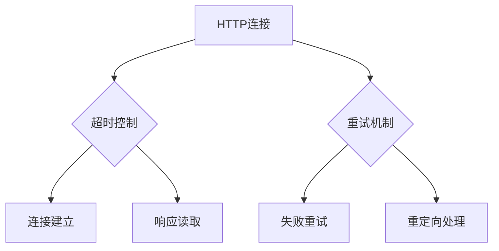
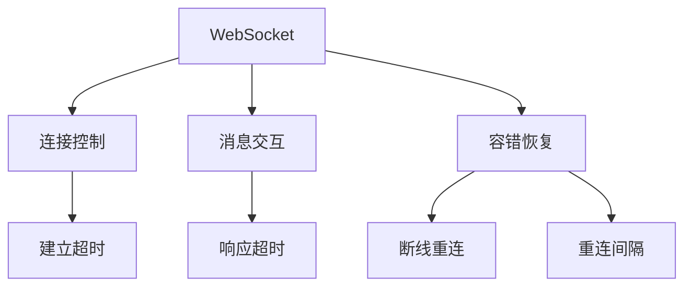

# 插件配置参数

> `插件配置参数` 用于为当前执行脚本指定插件所依赖的外部参数和制动控制参数。

## 主参数清单

| 参数 | 类型 | 必填 | 说明 |  
|------|------|------|------|  
| `ignoreAssertions` | boolean | 否 | **断言处理策略**<br> true：忽略断言错误（默认）<br> false：断言失败记为采样错误 |  
| `updateTestResult` | boolean | 否 | **测试结果更新**<br> true：同步更新API/用例/场景记录<br> false：保持原有记录（默认） |  
| `httpSetting` | object | 否 | **HTTP协议配置**<br>当测试HTTP接口时生效 |  
| `webSocketSetting` | object | 否 | **WebSocket协议配置**<br>测试WS协议时生效 |  
| `jdbcSetting` | object | 否 | **数据库连接配置**<br>测试数据库协议时必须配置 |  

::: tip 配置提示
仅当脚本中使用特定协议时才需要配置对应参数
:::

一个完整的配置示例：

```yaml
task:
  arguments: 
    ignoreAssertions: false
    updateTestResult: false
    httpSetting:
      connectTimeout: 6s
      readTimeout: 60s
      retryNum: 0
      maxRedirects: 1
    webSocketSetting:
      connectTimeout: 6s
      responseTimeout: 60s
      maxReconnections: 0
      reconnectionInterval: 200ms
    jdbcSetting:
      type: MYSQL
      driverClassName: com.mysql.cj.jdbc.Driver
      jdbcUrl: jdbc:mysql://localhost:3306/db
      username: root
      password: '******'
      pool:
        name: hikari
        maximumPoolSize: 32
        minimumIdle: 10
        maxWaitTimeoutMillis: 60000
```

## HTTP插件配置(httpSetting)



| 参数 | 类型 | 范围 | 默认值 | 说明 |  
|------|------|------|------|------|  
| `connectTimeout` | string | `1s ～ 24h` | 3s | 建立TCP连接最大等待时间 |  
| `readTimeout` | string | `1s ～ 24h` | 60s | 服务器响应最大等待时间 |  
| `retryNum` | integer | `0～6` | 0 | 请求失败自动重试次数 |  
| `maxRedirects` | integer | `0～10` | 1 | 3xx重定向最大跟随次数 |  

**推荐配置：**
```yaml  
httpSetting:  
  connectTimeout: 5s    # 生产环境建议1-3秒  
  readTimeout: 30s       # API服务建议30秒内  
  retryNum: 0            # 关键业务启用重试  
  maxRedirects: 3        # 网页测试适当增加  
```

## WebSocket插件配置(webSocketSetting)



| 参数 | 类型 | 范围 | 默认值 | 说明 |  
|------|------|------|------|------|  
| `connectTimeout` | string | `1s ～ 24h` | 3s | 连接建立最大等待 |  
| `responseTimeout` | string | `1s ～ 24h` | 60s | 消息响应最大等待 |  
| `maxReconnections` | integer | `0～100` | 0 | 断线最大重连次数 |  
| `reconnectionInterval` | string | `1ms～30m` | 200ms | 重连尝试间隔 |  

**场景优化建议：**
```yaml  
webSocketSetting:  
  connectTimeout: 3s       # 内网环境可缩短至1秒  
  responseTimeout: 10s      # 即时通讯建议5-10秒  
  maxReconnections: 3       # 建议关闭  
  reconnectionInterval: 1s  # 重试间隔1秒  
```

## JDBC插件配置(jdbcSetting)

| 字段名称        | 类型   | 是否必须 | 长度限制 | 描述                                                                                                                                                                      |
| --------------- | ------ | -------- | -------- |-------------------------------------------------------------------------------------------------------------------------------------------------------------------------|
| `type`            | enum   | 是       | /        | 数据库类型，支持数据库类型：H2、HSQLDB、SQLITE、POSTGRES、MARIADB、MYSQL、ORACLE、SQLSERVER、DB2。                                                                                             |
| `driverClassName` | string | 否       | 200      | 数据库驱动类名，如：com.mysql.cj.jdbc.Driver。                                                                                                                                     |
| `jdbcUrl`         | string | 否       | 2048     | 数据库连接 URL，如：jdbc:mysql://localhost:3306/mydatabase。                                                                                                                     |
| `username`        | string | 否       | 200      | 数据库用户名。                                                                                                                                                                 |
| `password`        | string | 否       | 1024     | 数据库密码。                                                                                                                                                                  |
| `isolation`       | enum   | 否       | /        | 事务隔离级别：<br/>- TRANSACTION_READ_UNCOMMITTED(读未提交)、<br/>- TRANSACTION_READ_COMMITTED(读已提交)、<br/>- TRANSACTION_REPEATABLE_READ(可重复读)、<br/>- TRANSACTION_SERIALIZABLE(串行化)。 |
| `pool`            | object | 否       | /        | 连接池配置。                                                                                                                                                                  |

```yaml
jdbcSetting:
  type: MYSQL
  driverClassName: com.mysql.cj.jdbc.Driver
  jdbcUrl: jdbc:mysql://localhost:3306/db
  username: root
  password: root123
  pool:
    name: hikari
    maximumPoolSize: 32
    minimumIdle: 1
    maxWaitTimeoutMillis: 60000
```

###  Jdbc 连接池配置(pool)

| 参数 | 范围 | 必填 | 说明 |  
|------|------|------|------|  
| `name` | - | 是 | 连接池类型：`hikari`/`druid`等 |  
| `maximumPoolSize` | `1～10000` | 是 | 最大连接数 |  
| `minimumIdle` | `1～10000` | 是 | 最小空闲连接 |  
| `maxWaitTimeoutMillis` | `0～2.1亿` | 否 | 获取连接超时(ms) |  

```yaml
pool:
  name: hikari
  maximumPoolSize: 32
  minimumIdle: 10
  maxWaitTimeoutMillis: 60000
```
