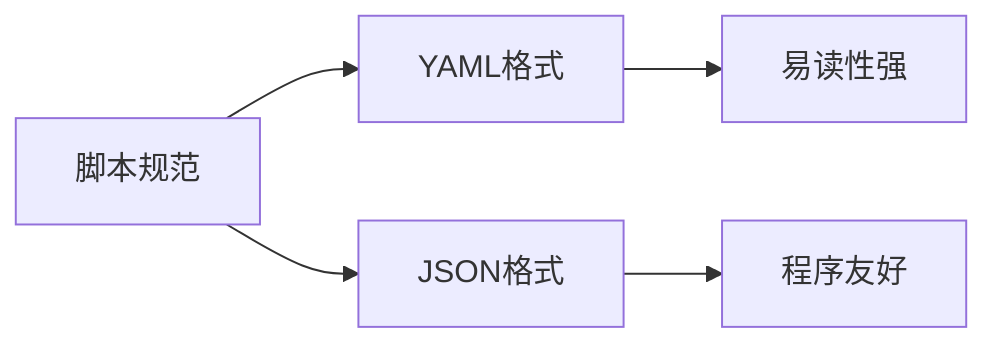

# AngusTester 脚本规范

> 统一规范助力高效脚本开发，YAML/JSON双格式支持



## 规范概述
AngusTester 脚本规范定义了自动化测试的标准格式，确保测试脚本的：  
- **一致性** - 团队协作统一标准  
- **可维护性** - 清晰结构便于维护  
- **可扩展性** - 灵活适配未来需求
- **兼容性** - 具备版本控制和兼容特性

支持 YAML 和 JSON 两种主流格式，满足不同场景需求。

## 格式示例对比

### YAML 格式示例
```yaml
specification: angus/1.0.0          #规范版本
apiVersion: api/v1                  #Api版本
info:                               #元信息
  name: This is an example of a basic script structure.
tags:                               #标签信息
- BenchmarkTesting
type: TEST_PERFORMANCE              #测试类型
plugin: Http                        #插件
configuration:                      #执行配置
  iterations: 100000
  duration: 30s
  thread:
    threads: 100
  onError:
    action: CONTINUE
    sampleError: true
    sampleErrorNum: 10
  priority: 1000
  reportInterval: 5s
task:                                #任务
  pipelines:
  - target: HTTP
    request:
      method: GET
      url: http://serv01-sample.angusmock.cloud:30010/benchmark
```

### JSON 格式示例
```json
{
   "specification": "angus/1.0.0",
   "apiVersion": "api/v1",
   "info": {
      "name": "This is an example of a basic script structure."
   },
   "tags": [
      "BenchmarkTesting"
   ],
   "type": "TEST_PERFORMANCE",
   "plugin": "Http",
   "configuration": {
      "iterations": 100000,
      "duration": "30s",
      "thread": {
         "threads": 100
      },
      "onError": {
         "action": "CONTINUE",
         "sampleError": true,
         "sampleErrorNum": 10
      },
      "priority": 1000,
      "reportInterval": "5s"
   },
   "task": {
      "pipelines": [
         {
            "target": "HTTP",
            "request": {
               "method": "GET",
               "url": "http://serv01-sample.angusmock.cloud:30010/benchmark"
            }
         }
      ]
   }
}
```

## 格式选择建议

| 场景 | 推荐格式 | 优势 |  
|------|----------|------|  
| 手动编写脚本 | YAML | 可读性强，结构清晰 |  
| 程序生成脚本 | JSON | 程序处理友好，兼容性好 |  
| 复杂场景脚本 | YAML | 支持注释，便于维护 |  
| 接口数据传递 | JSON | 通用标准，传输方便 |  
