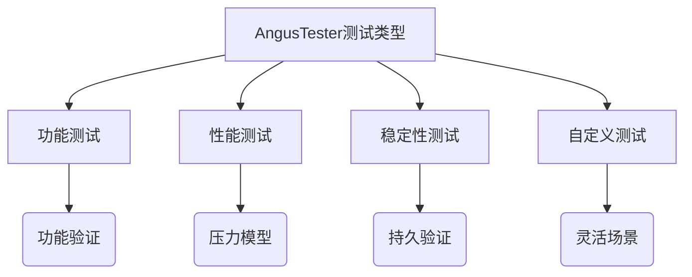
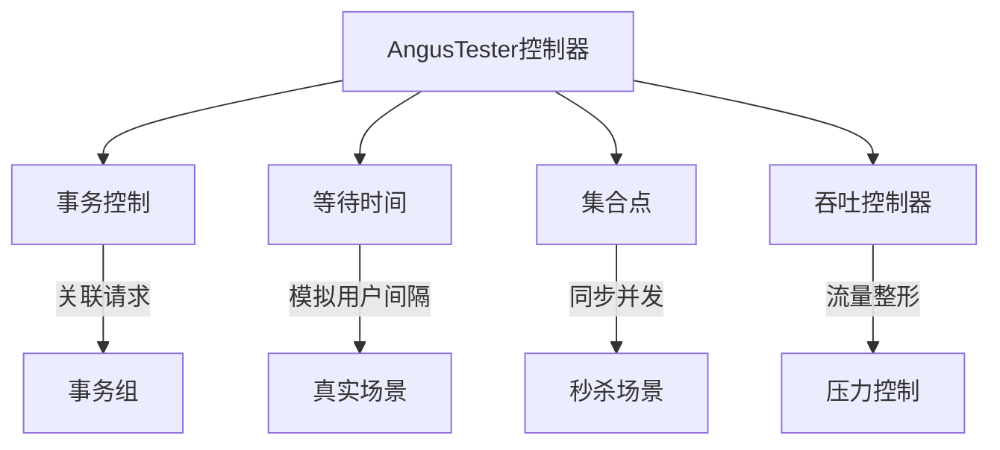

# 测试类型定义

> 清晰定义4种测试类型，精准满足不同质量验证需求

## 四大测试类型

| **测试类型** | **核心目标** | **典型场景** | **关键配置** |  
|--------------|--------------|--------------|--------------|  
| **功能测试** | 基础功能验证 | 冒烟测试 接口功能校验 | 1并发，短时执行 |  
| **性能测试** | 系统承压能力 | 容量规划 性能优化 | 阶梯加压(100↑/min) 最高5000并发 |  
| **稳定性测试** | 长时运行能力 | 生产环境验证 可靠性检测 | 200并发 30分钟持续 |  
| **自定义测试** | 特殊场景覆盖 | 临时验证 特殊业务流程 | 完全自定义参数 |  

## 核心指标模型

### 黄金指标定义
| **指标** | **说明** | **衡量维度** |  
|----------|----------|--------------|  
| TPS | 每秒事务数 | 系统吞吐能力 |  
| 响应时间 | 请求处理延时 | 用户体验 |  
| 错误率 | 失败请求占比 | 系统稳定性 |  
| 资源使用率 | CPU/内存等消耗 | 资源效率 |  

### 测试模型指标

| **类型** | **并发数** | **时长** | **TPS** | **响应时间** | **错误率** |  
|----------|------------|----------|---------|--------------|------------|  
| 功能测试 | 1 | 秒级 | - | - | - |  
| 性能测试 | 100-5000 | 50分钟 | ≥500 | ≤500ms(P90) | ≤0.01% |  
| 稳定性测试 | 200 | 30分钟 | ≥500 | ≤500ms(P90) | ≤0.01% |  

## 高级场景控制

### 五大流程控制器

### 控制器要点说明
1. **事务控制**：
  - 必须成对使用`TRANS_START/TRANS_END`
  - 任一请求失败则整个事务失败

2. **等待时间**：
  - 以`WAITING_TIME`为标识符
  - 支持固定/随机两种模式
  - 模拟真实用户操作间隔

3. **集合点**：
  - 以`THROUGHPUT`为标识符
  - 用于突发流量测试（如秒杀）
  - 集合足够用户后同时发起请求

4. **吞吐控制器**：
  - 以`RENDEZVOUS`为标识符
  - 精确控制每秒请求量
  - 可设置最长等待时间
