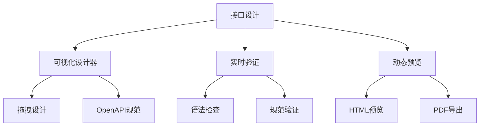
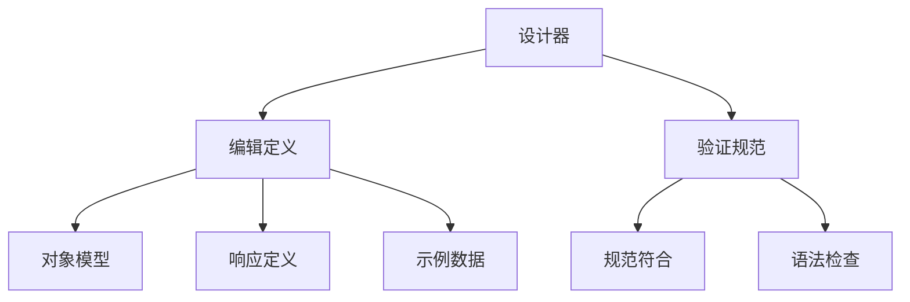
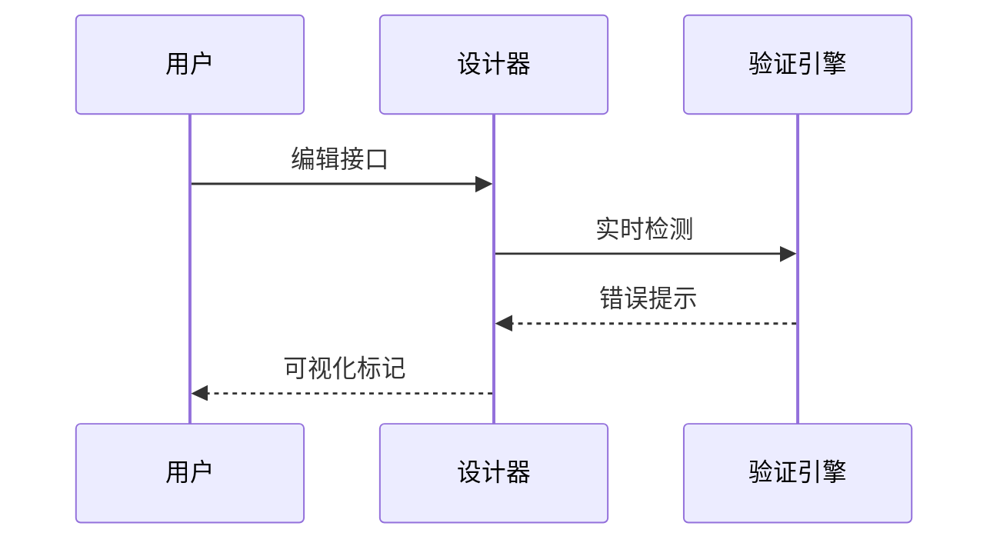
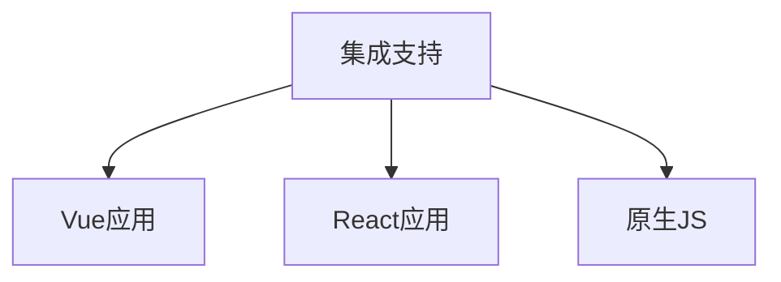
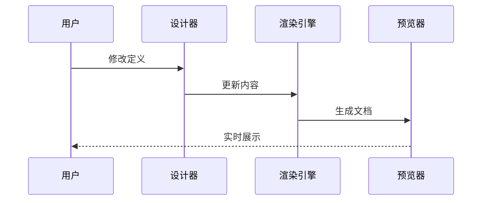

# 接口设计介绍

> AngusTester接口设计功能`提供符合OpenAPI标准的可视化设计环境`，通过拖拽式编辑、实时验证，让用户高效创建规范化的API文档，提升团队协作效率50%+。

## 应用场景

1. **敏捷开发**：快速迭代API设计
2. **微服务架构**：统一服务接口规范
3. **API产品化**：创建专业开发者门户
4. **团队协作**：实时协同设计接口
5. **文档即代码**：设计文档同步生成

## 核心功能

### 1. 可视化API规范设计器
 

- **拖拽式设计**：直观创建API路径、参数和响应
- **模型构建**：图形化定义数据结构与对象关系
- **实时生成**：自动生成符合OpenAPI 3.0规范的YAML/JSON
- **企业价值**：设计效率提升60%，规范符合率100%

### 2. 实时OpenAPI模式验证
 

- **即时反馈**：编辑时实时检查语法错误
- **规范验证**：确保符合OpenAPI 3.0标准
- **错误定位**：精准标记问题位置并提供修复建议
- **企业价值**：减少规范错误率90%，提升文档质量

### 3. 多框架集成支持

- **Vue集成**：提供专用组件库，无缝嵌入Vue项目
- **React支持**：开箱即用的React Hooks和组件
- **原生JS**：纯JavaScript API支持灵活集成
- **企业价值**：降低集成成本70%，适配现有技术栈

[点击查看开源组件](https://github.com/xcancloud/OpenAPIDesigner)

### 4. 动态API文档预览

- **即时渲染**：设计变更实时反映在文档
- **多格式预览**：HTML/PDF即时查看
- **交互式文档**：支持"Debug"功能测试接口
- **企业价值**：文档交付时间缩短75%

## 设计信息

| 参数              | 字段名               | 类型     | 是否必须 | 长度限制 | 说明                                                                                                               |
| ----------------- | -------------------- | -------- | -------- | -------- | ------------------------------------------------------------------------------------------------------------------ |
| **设计 ID**       | `id`                 | long     | 否       | /        | 接口设计唯一标识                                                                                                   |
| **项目 ID**       | `projectId`          | long     | 是       | /        | 关联项目 ID                                                                                                        |
| **设计名称**      | `name`               | string   | 是       | ≤100     | 接口设计名称                                                                                                       |
| **发布状态**      | `released`           | boolean  | 否       | /        | 是否已发布                                                                                                         |
| **OpenAPI 版本**  | `openapiSpecVersion` | string   | 是       | /        | **支持版本**: • 3.0.0 • 3.0.1 • 3.0.2 • 3.0.3 • 3.1.0                                               |
| **OpenAPI 规范**  | `openapi`            | string   | 否       | /        | OpenAPI 规范内容                                                                                                   |
| **设计来源**      | `designSource`       | enum     | 否       | /        | **来源枚举**: • `SYNCHRONOUS_SERVICE` - 同步服务 • `FILE_IMPORT` - 文件导入 • `MANUAL_CREATED` - 手动创建 |
| **来源 ID**       | `designSourceId`     | long     | 否       | /        | 设计来源对象 ID                                                                                                    |
| **来源名称**      | `designSourceName`   | string   | 否       | /        | 设计来源名称                                                                                                       |
| **租户 ID**       | `tenantId`           | long     | 否       | /        | 所属租户 ID                                                                                                        |
| **创建人 ID**     | `createdBy`          | long     | 否       | /        | 创建人 ID                                                                                                          |
| **创建人**        | `createdByName`      | string   | 否       | /        | 创建人姓名                                                                                                         |
| **创建时间**      | `createdDate`        | datetime | 否       | /        | 创建时间                                                                                                           |
| **最后修改人 ID** | `lastModifiedBy`     | long     | 否       | /        | 最后修改人 ID                                                                                                      |
| **最后修改人**    | `lastModifiedByName` | string   | 否       | /        | 最后修改人姓名                                                                                                     |
| **最后修改时间**  | `lastModifiedDate`   | datetime | 否       | /        | 最后修改时间                                                                                                       |
