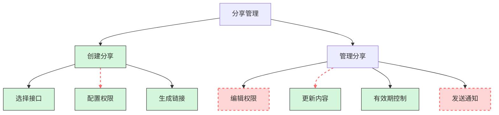
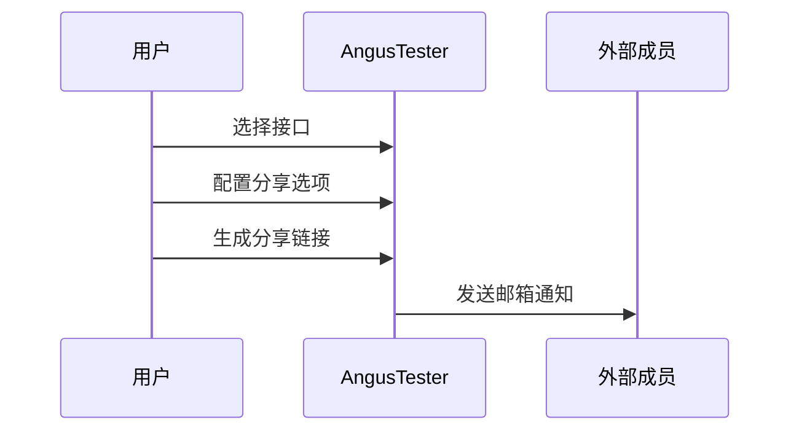
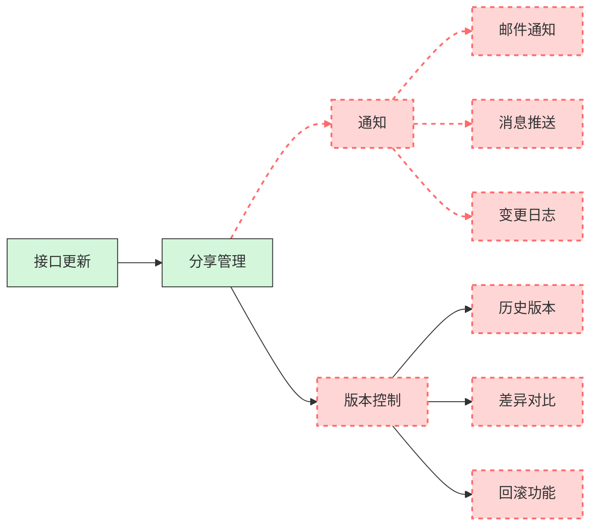

# 接口分享介绍

> AngusTester分享管理功能支持一键生成接口文档链接，安全共享完整接口规范（含服务器、认证、请求/响应格式），确保内外团队协作信息一致，减少沟通成本50%+。

> **图例说明**：  
>  已支持功能  
>  ❌ 暂不支持功能

## 主要价值

AngusTester分享管理可以帮助企业：
> ✅ 减少集成沟通时间70%  
> ✅ 降低文档传递错误率90%  
> ✅ 提升合作伙伴满意度40%  
> ✅ 确保100%合规数据共享

## 核心功能

### 1. 一键创建分享

- **分享内容**：
    - 完整接口定义
    - 请求/响应示例
    - 认证信息（可选）
    - 测试用例（可选）
- **权限控制**：
    - 只读/调试权限
    - 有效期设置（1天/7天/30天/永久）
- **生成方式**：
    - 加密分享链接
    - 可下载的PDF文档
    - API形式对接

### 2. 实时协作与更新

**协作优势**：
- 接口变更自动通知所有分享成员
- 保留历史版本供随时查看
- 支持变更内容差异对比
- 一键回滚到指定版本

## 分享信息

| 参数              | 字段名               | 类型     | 是否必须 | 长度限制 | 说明                                                                                                  |
| ----------------- | -------------------- | -------- | -------- | -------- | ----------------------------------------------------------------------------------------------------- |
| **分享 ID**       | `id`                 | long     | 否       | /        | 分享记录唯一标识                                                                                      |
| **分享名称**      | `name`               | string   | 是       | ≤100     | 分享配置名称                                                                                          |
| **分享备注**      | `remark`             | string   | 否       | ≤400     | 分享说明，显示在分享页面                                                                              |
| **过期时间**      | `expiredDate`        | datetime | 否       | /        | 分享链接过期时间                                                                                      |
| **显示选项**      | `displayOptions`     | object   | 是       | /        | 分享页面显示配置                                                                                      |
| **分享范围**      | `shareScope`         | enum     | 是       | /        | **范围枚举**: • `SERVICES` - 整个服务 • `PARTIAL_APIS` - 多个接口 • `SINGLE_APIS` - 单个接口 |
| **服务 ID**       | `servicesId`         | long     | 是       | /        | 关联的服务 ID                                                                                         |
| **接口 ID 集合**  | `apisIds`            | set      | 条件     | /        | 当 shareScope 为接口时必填                                                                            |
| **分享页面地址**  | `baseUrl`            | string   | 是       | ≤2000    | 前端分享页面基础 URL                                                                                  |
| **创建人 ID**     | `createdBy`          | long     | 否       | /        | 创建人 ID                                                                                             |
| **创建人**        | `createdByName`      | string   | 否       | /        | 创建人姓名                                                                                            |
| **创建时间**      | `createdDate`        | datetime | 否       | /        | 创建时间                                                                                              |
| **最后修改人 ID** | `lastModifiedBy`     | long     | 否       | /        | 最后修改人 ID                                                                                         |
| **最后修改人**    | `lastModifiedByName` | string   | 否       | /        | 最后修改人姓名                                                                                        |
| **最后修改时间**  | `lastModifiedDate`   | datetime | 否       | /        | 最后修改时间                                                                                          |
