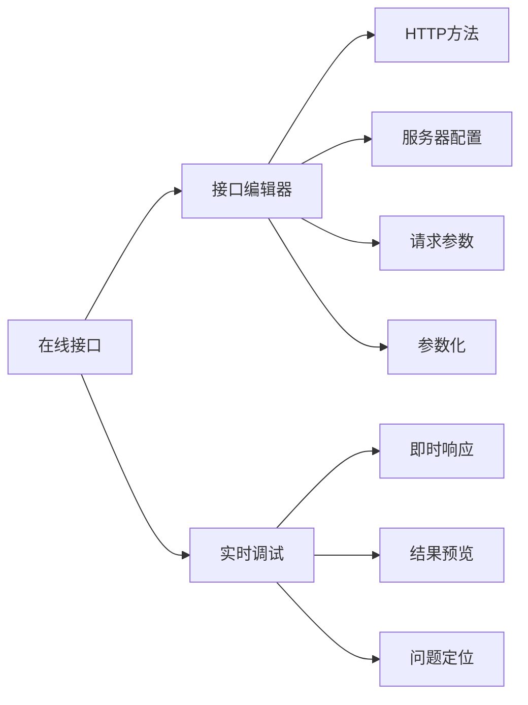
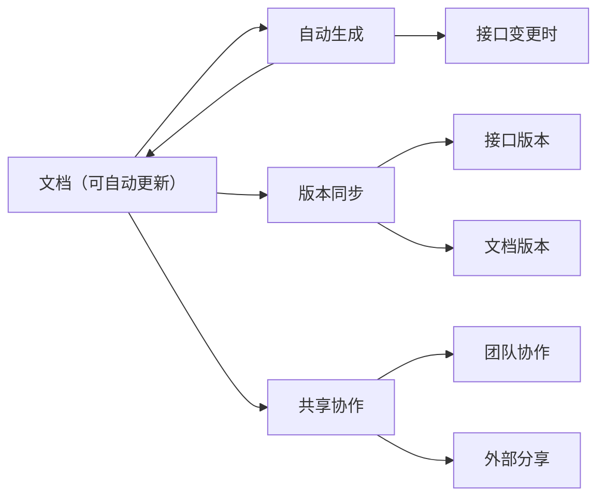
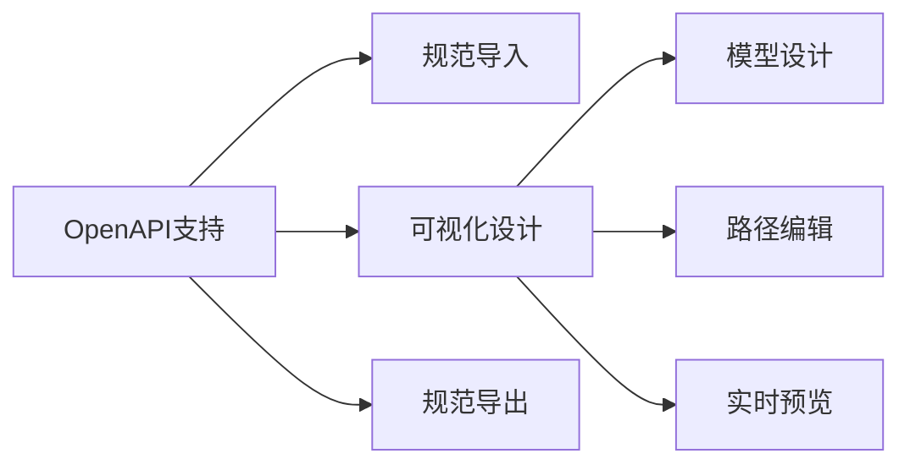
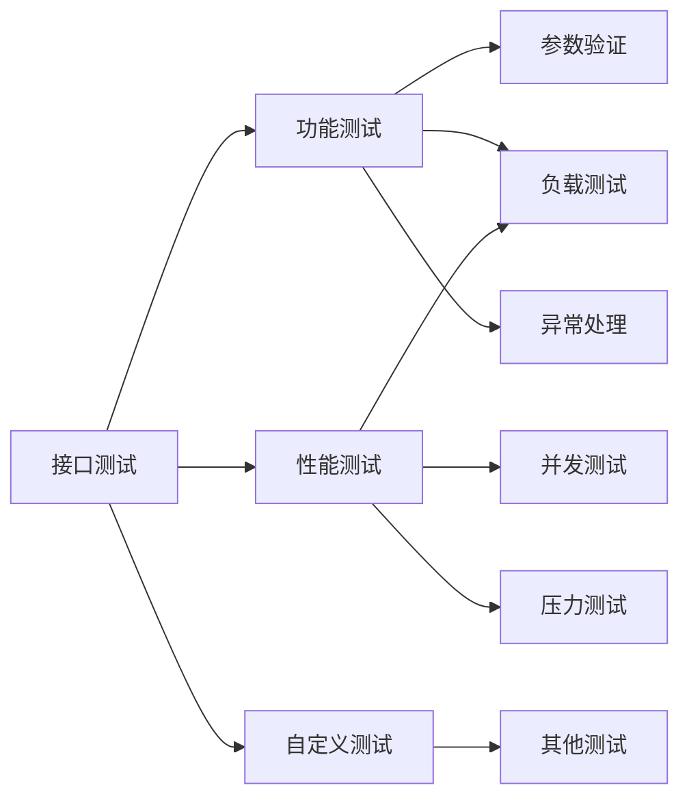
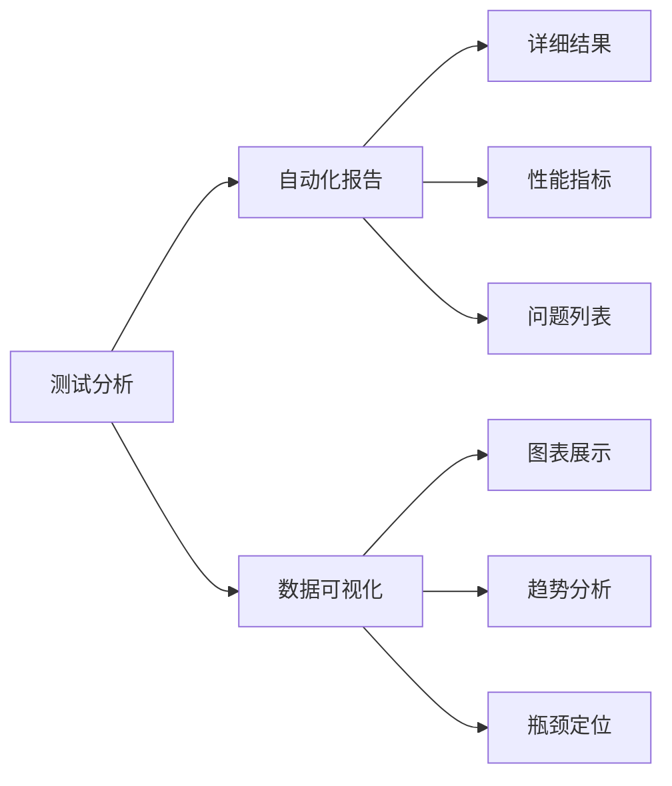
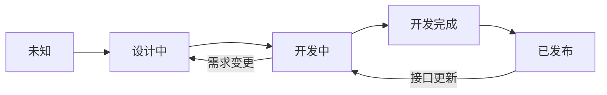

# 接口介绍

> AngusTester 的接口模块赋能开发测试人员高效管理测试API，支持在线编辑调试及全类型测试，`助力企业实现API资产化，提升交付质量与性能`，大幅提高效率并降低成本。

## 关于接口

`接口` 作为软件研发核心交付物和能力资产，其质量和性能对用户体验影响较大。通过接口模块，您可以：
- ✅ **接口开发与调试**：提供在线编辑和实时调试功能，帮助用户快速创建和验证接口。
- ✅ **接口管理**：支持对接口的集中管理，包括分类、版本控制和文档化，提升团队协作效率。
- ✅ **接口测试**：提供功能测试、参数化测试、性能测试和稳定性测试，全面验证接口质量。
- ✅ **接口设计**：提供基于OpenAPI规范图形化界面设计，API设计效率提升60%，文档维护成本降低45%。
- ✅ **测试任务管理**：支持创建、分配和跟踪测试任务，确保接口充分测试。
- ✅ **测试结果分析**：自动生成测试报告并提供数据可视化，帮助团队分析测试结果和性能指标

## 核心优势

| 优势        | 说明          | 用户收益          |
|-----------|-------------|---------------|
| **标准化支持** | OpenAPI规范兼容 | 无缝对接现有API开发生态 |
| **文档自动化** | 设计与文档同步     | 减少文档维护成本50%+  |
| **协作增强**  | 文档共享与权限控制   | 提升团队协作效率40%   |
| **可视化设计** | 图形化接口设计     | 降低API设计门槛     |
| **质量可观性** | 质量结果化和图表化   | 随时查阅接口质量报告    |

## 应用场景

- **API设计**：使用图形化工具创建符合OpenAPI规范的接口
- **微服务开发**：确保服务契约与实现一致
- **文档门户**：生成专业开发者门户网站
- **团队协作**：统一管理接口设计与文档
- **全面测试**：开展各类接口测试活动

[立即体验 AngusTester 接口功能 →](https://tester.xcan.cloud/apis)

## 核心功能

### 1. 接口开发与调试
 

- **可视化编辑**：直观界面配置接口参数
- **即时调试**：实时查看响应数据，快速验证接口逻辑
- **服务器配置**：多环境切换（开发/测试/生产）

### 2. 文档化与分享支持
 

- **文档自动生成**：接口配置后自动生成标准化文档
- **文档版本控制**：文档随接口版本同步更新
- **多格式分享**：支持HTML/PDF/Markdown等格式导出
- **团队协作**：设置文档访问权限，实时协作编辑

### 3. OpenAPI 图形化设计
 

- **可视化设计器**：拖拽式创建和修改OpenAPI规范
- **双向兼容**：无缝导入/导出OpenAPI 3.0+规范文件
- **规范验证**：实时检查OpenAPI规范完整性
- **文档同步**：设计修改自动更新接口文档

### 4. 全面测试能力
 

- **功能验证**：测试各种输入条件下的接口行为
- **性能压测**：模拟高并发场景，发现性能瓶颈
- **稳定性测试**：长时间运行验证系统可靠性
- **自定义测试**：满足各类其他业务关注点测试

### 5. 测试自动分析
 

- **智能报告**：自动生成包含关键指标的测试报告
- **数据洞察**：可视化展示性能趋势和瓶颈
- **问题定位**：精准定位接口问题根源

## 接口信息

| 参数         | 字段名                           | 类型                  | 必填     | 长度限制 | 说明                                                                                                         |
|------------|--------------------------------|-----------------------|--------|----------|-------------------------------------------------------------------------------------------------------------|
| **接口 ID**  | **id**                         | `long`               | **条件** | /        | 接口唯一标识，修改时必须                                                                                                  |
| **服务 ID**  | **serviceId**                  | `long`               | **是**  | /        | 所属服务 ID                                                                                                  |
| **协议类型**   | **protocol**                   | `enum`               | **是**  | /        | **协议枚举**: • `http` • `https` • `ws` • `wss`                                                  |
| **请求方法**   | **method**                     | `enum`               | **是**  | /        | **方法枚举**: • `GET` • `HEAD` • `POST` • `PUT` • `PATCH` • `DELETE` • `OPTIONS` • `TRACE` |
| **端点路径**   | **endpoint**                   | `string`             | **是**  | ≤800     | API 路径（不含查询参数），如：/api/v1/users/{id}                                                             |
| **接口名称**   | **summary**                    | `string`             | **是**  | /        | 接口摘要或名称                                                                                                |
| 接口描述       | **description**                | `string`             | 否      | ≤20000   | 详细描述，支持 CommonMark 富文本                                                                               |
| 标签         | **tags**                       | `list`               | 否      | /        | OpenAPI 标签列表                                                                                            |
| 操作 ID      | **operationId**                | `string`             | 否      | ≤400     | OpenAPI 操作标识符                                                                                           |
| 外部文档       | **externalDocs**               | `object`             | 否      | /        | 关联外部文档                                                                                                  |
| 请求参数       | **parameters**                 | `list`               | 否      | ≤100     | 请求参数列表                                                                                                  |
| 请求体        | **requestBody**                | `object`             | 否      | /        | 请求体定义                                                                                                   |
| 响应定义       | **responses**                  | `map`                | 否      | /        | 响应定义集合                                                                                                  |
| 弃用状态       | **deprecated**                 | `boolean`            | 否      | /        | 是否已弃用（默认`false`）                                                                                     |
| 安全要求       | **security**                   | `list`               | 否      | /        | 安全要求列表                                                                                                  |
| 扩展属性       | **extensions**                 | `map`                | 否      | /        | OpenAPI 扩展字段                                                                                            |
| 认证方案       | **authentication**             | `object`             | 否      | /        | 安全认证方案                                                                                                  |
| 断言配置       | **assertions**                 | `list`               | 否      | ≤100     | 接口执行结果断言                                                                                              |
| **接口状态**   | **status**                     | `enum`               | **是**  | /        | **状态枚举**: • `UNKNOWN` - 未知 • `IN_DESIGN` - 设计中 • `IN_DEV` - 开发中 • `DEV_COMPLETED` - 开发完成 • `RELEASED` - 已发布 |
| **负责人 ID** | **ownerId**                    | `long`               | **是**  | /        | 接口负责人 ID                                                                                                |
| 负责人        | **ownerName**                  | `string`             | 否      | /        | 负责人姓名                                                                                                   |
| 授权控制       | **auth**                       | `boolean`            | 否      | /        | 是否启用授权控制                                                                                              |
| 服务授权       | **serviceAuth**                | `boolean`            | 只读     | /        | 是否继承服务级授权                                                                                             |
| 安全标记       | **secured**                    | `boolean`            | 否      | /        | 是否启用安全机制                                                                                              |
| 功能测试       | **testFunc**                   | `boolean`            | 否      | /        | 是否启用功能测试（默认`true`）                                                                                 |
| 功能测试通过     | **testFunc Passed**        | `boolean`            | 只读      | /        | 功能测试是否通过                                                                                              |
| 功能不通过原因    | **testFunc FailureMessage** | `string`             | 只读      | /        | 功能测试不通过或失败原因                                                                                      |
| 性能测试       | **testPerf**                   | `boolean`            | 否      | /        | 是否启用性能测试（默认`true`）                                                                                 |
| 性能测试通过     | **testPerf Passed**         | `boolean`            | 只读      | /        | 性能测试是否通过                                                                                              |
| 性能不通过原因    | **testPerf FailureMessage** | `string`             | 只读      | /        | 性能测试不通过或失败原因                                                                                      |
| 稳定性测试      | **testStability**              | `boolean`            | 否      | /        | 是否启用稳定性测试（默认`true`）                                                                               |
| 稳定性测试通过    | **testStability Passed**    | `boolean`            | 只读      | /        | 稳定性测试是否通过                                                                                            |
| 稳定性不通过原因   | **testStability FailureMessage** | `string`       | 只读      | /        | 稳定性测试不通过或失败原因                                                                                     |
| 数据集结束策略    | **datasetAction OnEOF**     | `enum`               | 否      | /        | 数据集读取结束策略（默认`RECYCLE`）                                                                            |
| 数据集共享模式    | **datasetSharing Mode**     | `enum`               | 否      | /        | 多线程数据集共享模式（默认`ALL_THREAD`）                                                                      |
| 可用服务器      | **availableServers**           | `list`               | 否      | /        | 可用服务器列表                                                                                               |
| 标签模型       | **tagSchemas**                 | `map`                | 否      | /        | 标签模型定义                                                                                                 |
| 收藏状态       | **favourite**                  | `boolean`            | 否      | /        | 是否收藏                                                                                                    |
| 关注状态       | **follow**                     | `boolean`            | 否      | /        | 是否关注                                                                                                    |
| 同步名称       | **syncName**                   | `string`             | 只读      | /        | 同步配置名称                                                                                                 |
| 解析引用模型     | **resolvedRef Models**      | `map`                | 只读      | /        | 解析后的引用模型                                                                                             |
| 租户 ID      | tenantId                   | `long`               | 只读      | /        | 所属租户 ID                                                                                                 |
| 创建人        | **createdBy Name**          | `string`             | 只读      | /        | 创建人姓名                                                                                                  |
| 创建时间       | **createdDate**                | `datetime`           | 只读      | /        | 创建时间                                                                                                    |
| 最后修改人      | **lastModified ByName**     | `string`             | 只读      | /        | 最后修改人姓名                                                                                              |
| 最后修改时间     | **lastModified Date**       | `datetime`           | 只读      | /        | 最后修改时间                                                                                                |

### 接口状态流转

### 关键字段说明

1. **接口设计阶段**：
>    - 设置`status`="设计中"
>    - 完善`summary`和`description`
>    - 定义`parameters`和`requestBody`
>    - 设置`ownerId`明确负责人

2. **开发阶段**：
>    - 更新`status`="开发中"
>    - 配置`assertions`验证逻辑

3. **测试阶段**：
>    - 启用`testFunc`/`testPerf`/`testStability`
>    - 验证接口功能与性能
>    - 更新`status`="开发完成"

4. **发布阶段**：
>    - 设置`status`="已发布"
>    - 配置`auth`安全策略
>    - 添加`tags`方便检索管理

5. **维护阶段**：
>    - 通过`lastModified*`跟踪变更
>    - 使用`deprecated`标记废弃接口
>    - 定期审查接口状态
>

## OpenAPI规范扩展

AngusTester 扩展了 OpenAPI 规范字段，提供更灵活的 API 配置能力，支持精细化控制 API 行为。

### 通用配置字段
- `x-xc-id`：API 或资源的唯一标识符
- `x-xc-value`：参数/配置项的存储值
- `x-xc-type`：数据类型定义
- `x-xc-status`：资源/API 的当前状态
- `x-xc-enabled`：功能开关（`true`=启用，`false`=禁用）
- `x-xc-projectId`：关联的项目 ID
- `x-xc-projectName`：关联的项目名称

### 请求配置字段
- `x-xc-url`：请求目标 URL（支持内部/外部地址）
- `x-xc-isFile`：文件上传标识（`true`=文件请求）
- `x-xc-fileName`：上传文件名称（`x-xc-isFile=true`时生效）
- `x-xc-requestId`：请求唯一 ID（用于跟踪调试）
- `x-xc-serverSource`：请求来源服务器标识（区分环境）
- `x-xc-messageMode`：传输模式（`sync`=同步，`async`=异步）
- `x-xc-requestSetting`：请求设置（超时/重试策略等）

### 内容格式字段
- `x-xc-contentType`：内容类型（如 `application/json`）
- `x-xc-contentEncoding`：内容编码方式（如 `gzip`）
- `x-xc-wsMessage`：WebSocket 消息体内容

### 安全认证字段
- `x-xc-apiKey`：API 密钥（用于认证鉴权）
- `x-xc-oauth2-authFlow`：OAuth2 流程类型（`authorization_code`等）
- `x-xc-oauth2-token`：OAuth2 访问令牌
- `x-xc-oauth2-clientId`：客户端 ID
- `x-xc-oauth2-clientSecret`：客户端密钥
- `x-xc-oauth2-newToken`：是否获取新令牌（`true`=强制刷新）
- `x-xc-oauth2-in`：令牌传递位置（请求头/查询参数）
- `x-xc-oauth2-callbackUrl`：认证回调 URL
- `x-xc-oauth2-username`：用户名（密码模式）
- `x-xc-oauth2-password`：密码凭证（密码模式）
- `x-xc-oauth-extensionName`：OAuth2 扩展功能标识

### 关联关系字段
- `x-xc-apisId`：关联 API 的唯一标识
- `x-xc-serviceId`：关联服务的唯一标识

