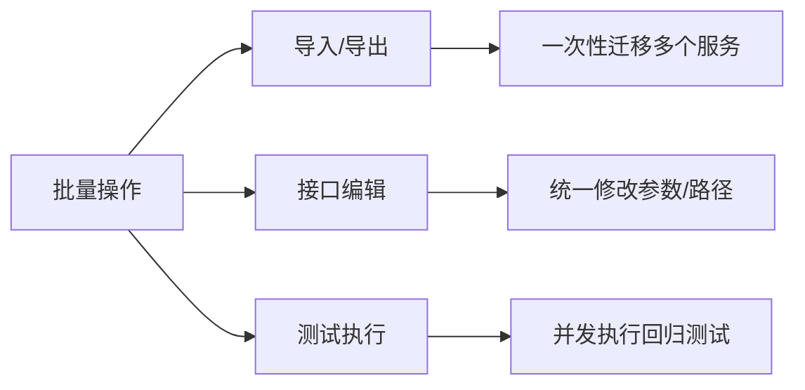
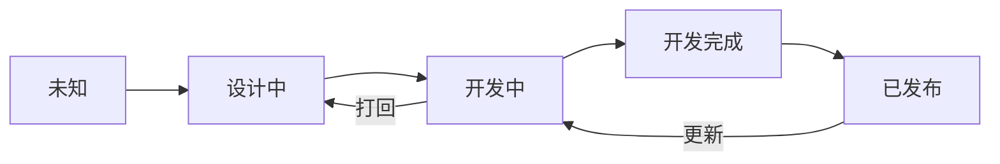

# 服务介绍

> AngusTester 的服务管理模块帮助团队高效组织和管理微服务接口，`实现API资产化并构建清晰API架构`，提升接口的可维护性与协作效率。

## 关于服务

`服务` 是 API 管理的核心单元，每个服务对应一个微服务实体。通过服务模块，您可以：
- ✅ **结构化组织**：将接口按服务分类，明确边界与依赖关系
- ✅ **资产化管理**：集中管理服务下的所有接口，提升可追踪性
- ✅ **团队协作优化**：统一服务规范，加速开发测试流程

> **示例场景**：为订单微服务创建独立服务单元，集中管理订单创建、查询、支付等接口

## 价值收益

通过 AngusTester 的服务管理模块，团队可获得：
- 🚀 **效率提升**：减少 60% 的接口维护时间
- 🔍 **一致性保障**：确保服务内接口规范统一
- ⚙️ **架构优化**：清晰映射微服务依赖关系
- 📊 **质量可控**：通过批量测试快速验证服务健康度

> **最佳实践建议**：
> 1. 为每个微服务创建独立服务单元
> 2. 通过 OpenAPI 规范同步接口定义
> 3. 定期执行服务级批量回归测试

[立即体验 AngusTester 服务管理功能 →](https://tester.xcan.cloud/apis#services)

## 核心功能

### 1. 接口管理：灵活创建与导入
支持多种接口创建方式，适配不同工作场景：

| 方式        | 支持格式               | 核心优势                          |  
|-------------|------------------------|-----------------------------------|  
| **手动创建** | -                      | 自由定义接口细节，满足定制需求    |  
| **文件导入** | Swagger/OpenAPI        | 自动同步文档，减少手动输入错误    |  
| **工具同步** | Postman 集合           | 无缝迁移现有接口，保留历史配置    |  

### 2. 批量操作：高效处理接口资产
通过批量功能显著提升维护效率：

- **批量导入/导出**：快速迁移服务资产（支持 JSON/YAML 格式）
- **批量编辑**：同时修改多个接口的路径/参数/响应设置
- **批量测试**：一键执行服务下全部接口的自动化测试

## 服务信息

| 参数      | 字段名                    | 类型       | 是否必须 | 长度限制  | 说明                                                                                                                                                 |
| -------- |------------------------| ---------- | -------- |-------| ---------------------------------------------------------------------------------------------------------------------------------------------------- |
| **ID**  | **id**                   | `bigint`   | **条件**       | /     | 服务 ID，系统唯一标识，修改时必须                                                                                                                                |
| **项目ID** | **projectId**            | `bigint`   | **是**       | /     | 关联项目 ID，创建服务时必填                                                                                                                          |
| **服务名称** | **name**                 | `string`   | **是**       | <=100   | 服务名称，如：用户中心                                                                                                                               |
| 授权控制    | **auth**                 | `boolean`  | 否       | /     | 是否启用授权控制，默认禁用                                                                                                                           |
| 服务来源    | **source**               | `enum`     | 否       | /     | **服务来源枚举值**: • `CREATED` - 创建 • `EDITOR` - 编辑器 • `IMPORT` - 导入 • `SYNC` - 同步                                            |
| 导入来源    | **importSource**         | `enum`     | 否       | /     | **当 source=导入时有效**: • `OPENAPI` - OpenAPI • `POSTMAN` - Postman • `ANGUS` - Angus                                                    |
| 服务状态    | **status**               | `enum`     | 否       | /     | **当前状态枚举值**: • `UNKNOWN` - 未知 • `IN_DESIGN` - 设计中 • `IN_DEV` - 开发中 • `DEV_COMPLETED` - 开发完成 • `RELEASED` - 已发布 |
| 包含接口    | **hasApis**              | `boolean`  | 否       | /     | 是否已创建接口                                                                                                                                       |
| Mock服务ID | **mockServiceId**        | `bigint`   | 否       | /     | 关联 Mock 服务 ID                                                                                                                                    |
| 接口数量    | **apisNum**              | `bigint`   | 否       | /     | 服务下接口总数                                                                                                                                       |
| 接口用例数   | **apisCaseNum**          | `bigint`   | 否       | /     | 服务下用例总数                                                                                                                                       |
| OpenAPI规范 | **schema**               | `object`   | 否       | /     | OpenAPI 规范详情                                                                                                                                     |
| 租户 ID      | **tenantId**            | `long`               | 否       | /        | 所属租户 ID                                                                                                 |
| 创建人ID   | **createdBy**            | `bigint`   | 否       | /     | 创建人 ID                                                                                                                                            |
| 创建人     | **createdBy Name**        | `string`   | 否       | <=100 | 创建人姓名                                                                                                                                           |
| 创建时间    | **createdDate**          | `datetime` | 否       | /     | 服务创建时间                                                                                                                                         |
| 最后修改人ID | **lastModified By**       | `bigint`   | 否       | /     | 最后修改人 ID                                                                                                                                        |
| 最后修改人   | **lastModified ByName** | `string`   | 否       | <=100 | 最后修改人姓名                                                                                                                                       |
| 最后修改时间  | **lastModified Date**     | `datetime` | 否       | /     | 最后修改时间                                                                                                                                         |

### 状态流转图

### 关键字段说明

1. 创建新服务时：
>    - 必填字段：`projectId`, `name`
>    - 推荐初始化值：`status`="设计中"
>    - 默认值：`auth`=false, `hasApis`=false

2. 导入OpenAPI服务：
>    - 设置 `source`="导入"
>    - 设置 `importSource`="OpenAPI"
>    - 自动填充 `schema` 对象

3. 服务发布流程：  
>    设计中 → 开发中 → 开发完成 → 已发布

4. 权限控制：  
>    启用 `auth` 后需配置数据权限授权，建议在测试验证通过或发布后启用

