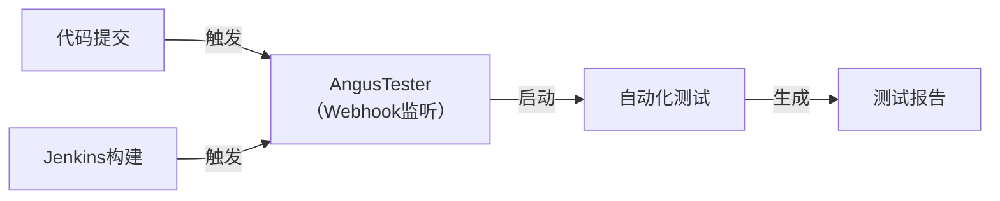

# 服务管理

> `AngusTester服务管理`能支持团队全生命周期管理API服务，涵盖服务创建、导入导出、测试任务管理到质量验证等核心流程。

## 一、服务基础操作

### 1. 添加服务
**功能**：创建新服务框架  
**步骤**：
1. 导航至 `接口 → 服务`
2. 点击服务列表上方「添加服务」按钮
3. 输入唯一服务名称后自动保存

> ⚠️ **注意事项**：确保服务名称唯一，避免与现有服务冲突

### 2. 重命名服务
**功能**：修改服务标识名称  
**步骤**：
1. 在服务列表中`右键点击`目标服务
2. 选择「重命名」操作项
3. 输入新名称后自动保存

### 3. 导入服务
**功能**：导入外部接口定义文件  
**步骤**：
1. `右键点击`目标服务
2. 选择「本地导入」操作项
3. 选择来源类型（`OpenAPI`/`Postman`/`Angus`）
4. 上传文件并配置导入策略
5. 在右侧「接口列表」查看导入结果

### 4. 导出服务
**功能**：导出服务用于迁移或备份  
**步骤**：
1. `右键点击`目标服务
2. 选择「导出接口」操作项
3. 选择导出格式和接口范围
4. 确认后文件自动下载到本地

### 5. 删除服务
**功能**：移除不再需要的服务  
**步骤**：
1. `右键点击`目标服务
2. 选择「删除」操作项
3. 确认删除操作

> ⚠️ **注意事项**：
> - 被删服务可在`接口回收站`找回
> - 清除回收站会永久删除服务及关联资源（除测试任务外）

### 6. 克隆服务
**功能**：快速复制服务及接口  
**步骤**：
1. `右键点击`目标服务
2. 选择「克隆」操作项
3. 系统自动创建新服务副本

### 7. 修改状态
**功能**：更新服务生命周期状态  
**支持状态**：`设计中` → `开发中` → `开发完成` → `已发布`  
**步骤**：
1. `右键点击`目标服务
2. 选择「修改状态」操作项
3. 选择新状态并确认

> ⚠️ **权限要求**：修改为`已发布`状态需具备「发布」权限

## 二、修改接口参数

**功能**：统一批量修改服务下所有接口配置  
**支持操作类型**：
- 添加/修改/删除参数
- 启用/禁用参数
- 修改认证配置
- 关联/解关联变量或数据集

**典型场景操作步骤**：
1. **批量修改认证头**：
    - 选择「批量修改认证」操作项
    - 设置认证类型为`Bearer`
    - 配置变量值`{accessToken}`
2. **批量引用变量**：
    - 选择「批量引用变量」操作项
    - 选择目标变量并确认

## 三、测试管理

### 1. 生成接口测试脚本
**前置条件**：已完成接口调试  
**步骤**：
1. 选择「接口测试脚本→生成测试脚本」
2. 选择脚本类型（`功能`/`性能`/`安全`等）
3. 配置执行参数
4. 在`脚本`模块查看生成结果

> ⚠️ **限制说明**：
> - 每种测试类型仅允许存在一个脚本
> - 重新生成需先删除旧脚本

### 2. 删除接口测试脚本
**功能**：移除不再需要的测试脚本  
**步骤**：
1. 选择「接口测试脚本→删除测试脚本」
2. 勾选要删除的脚本类型
3. 确认删除操作

> ⚠️ **注意事项**：删除后不可恢复

### 3. 批量启用/禁用测试
**功能**：统一管理接口测试开关  
**步骤**：
1. 选择「启用或禁用接口测试」操作项
2. 为各测试类型设置`启用`或`禁用`状态
3. 确认应用更改

### 4. 执行服务冒烟测试
**功能**：快速验证接口基本功能  
**步骤**：
1. 选择「执行服务测试→执行冒烟测试」
2. 配置`接口服务器`（如切换环境变量）
3. 系统自动生成/执行测试脚本
4. 在`执行`模块查看测试报告

> ⚠️ **前提条件**：
> - 需先生成冒烟测试用例
> - 仅验证基本功能

### 5. 执行服务安全测试
**功能**：验证接口安全控制  
**步骤**：
1. 选择「执行服务测试→执行安全测试」
2. 配置`接口服务器`
3. 系统自动生成/执行测试脚本
4. 在`执行`模块查看测试结果

> ⚠️ **前提条件**：需先生成安全测试用例

### 6. 执行接口功能测试
**功能**：验证接口功能是否符合预期  
**步骤**：
1. 选择「执行接口测试→执行功能测试」
2. 配置`接口服务器`
3. 系统自动生成/执行测试脚本
4. 在`执行`模块查看测试报告

### 7. 执行接口稳定性测试
**功能**：验证高负载下接口稳定性  
**步骤**：
1. 选择「执行接口测试→执行稳定性测试」
2. 配置`接口服务器`
3. 系统自动生成/执行测试脚本
4. 在`执行`模块查看测试结果

### 8. 执行接口性能测试
**功能**：测试响应时间与吞吐量  
**步骤**：
1. 选择「执行接口测试→执行性能测试」
2. 配置`接口服务器`
3. 系统自动生成/执行测试脚本
4. 在`执行`模块查看性能报告

### 9. 查看测试结果
**步骤**：
1. 打开`测试结果`标签页
2. 查看接口测试情况统计

## 四、测试任务管理

### 1. 生成接口测试任务
**功能**：创建接口测试任务用于跟踪  
**步骤**：
1. 选择「接口测试任务→生成测试任务」
2. 填写`所属迭代`、`测试类型`、`经办人`、`截止时间`
3. 在`任务`模块查看生成的任务

### 2. 重新打开接口测试任务
**功能**：将任务状态重置为"待处理"  
**步骤**：
1. 选择「接口测试任务→重新打开测试任务」
2. 系统更新任务状态

> ⚠️ **注意事项**：
> - 仅适用于`已完成`或`已取消`的任务
> - 任务指标不会被清除

### 3. 重新开始接口测试任务
**功能**：重新启动任务并清除历史数据  
**步骤**：
1. 选择「接口测试任务→重新开始测试任务」
2. 系统重置任务状态和指标

> ⚠️ **注意事项**：
> - 仅适用于结束状态的任务
> - 任务指标会被重置

### 4. 删除接口测试任务
**功能**：移除不再需要的测试任务  
**步骤**：
1. 选择「接口测试任务→删除测试任务」
2. 确认删除操作

## 五、配置管理

### 1. 编辑服务信息
**功能**：更新基础服务信息  
**步骤**：
1. 点击服务名称打开`服务信息`标签页
2. 点击各字段旁的「编辑」按钮
3. 修改后保存

### 2. 编辑文档信息
**功能**：更新OpenAPI文档信息  
**步骤**：
1. 点击服务名称打开`文档信息`标签页
2. 编辑字段后保存

> 规范参考：[OpenAPI信息对象](https://swagger.io/specification/#info-object)

### 3. 接口同步配置
**功能**：设置外部API自动同步  
**步骤**：
1. 打开`同步配置`标签页
2. 点击「编辑」图标修改配置项
3. 配置`同步地址`、`同步策略`等
4. 保存设置

> ⚠️ **数量限制**：最多添加10个同步配置

### 4. 安全方案配置
**功能**：定义统一认证方案  
**步骤**：
1. 打开`安全方案配置`标签页
2. 配置安全策略和认证方式
3. 保存设置

> 规范参考：[OpenAPI安全模型](https://swagger.io/specification/#security-scheme-object)

### 5. 服务器配置
**功能**：管理API部署环境  
**步骤**：
1. 打开`服务器配置`标签页
2. 点击「添加服务器」
3. 配置`URL`、`描述`和`变量`
4. 使用「服务器示例」快速插入模板

> ⚠️ **数量限制**：最多添加50个服务器配置

## 五、企业级集成

### 1. Mock服务集成

**操作流程**：
1. `服务详情 → Mock配置`
2. 选择创建方式：
    - 生成新Mock服务
    - 关联现有Mock
3. 完成配置

> **最佳实践**：开发阶段使用Mock，测试阶段切换真实环境

### 2. 持续集成流程 （TODO）
 

## 六、其他功能

### 1. 查看活动
**功能**：审计操作记录  
**步骤**：
1. 打开`活动`标签页
2. 查看服务及接口操作历史

### 2. 请求代理配置
**功能**：设置我的请求代理绕过跨域限制  
**步骤**：
1. 打开`服务代理`标签页
2. 选择代理类型
3. 配置`代理服务地址`

> ⚠️ **生效范围**：仅对当前用户生效

### 3. 查看标签
**功能**：管理接口分类标签  
**步骤**：
1. 打开`标签`标签页
2. 查看/管理标签分类

> 规范参考：[OpenAPI标签对象](https://swagger.io/specification/#tag-object)

### 4. 编辑组件
**功能**：管理可重用对象组件  
**步骤**：
1. 打开`组件`标签页
2. 编辑组件信息

> 规范参考：[OpenAPI组件对象](https://swagger.io/specification/#components-object)
